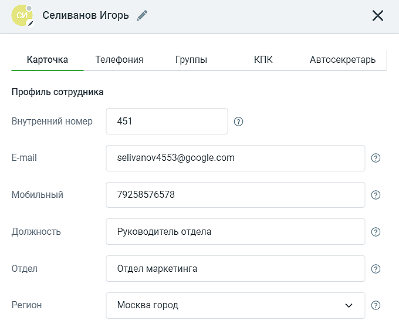
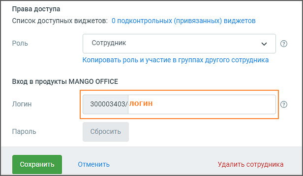

# 4.4.6.1.1. Вкладка «Карточка»

> Трассировка: PDF §4.4.6.1.1 · сквозные стр. 146-151 · источники: ч.2 `kb/mango-product-docs/sources/mango-lk-manual/LK_manual_v-121часть-2.pdf` с.45-50.

Вид карточки представлен на рисунке ниже.

Карточка может содержать информационные пиктограммы:

— не заполнено обязательное поле, необходимое для использования телефонии.

— заполнение поля не обязательно, но рекомендуется для дополнительного удобства и надежности.

— все рекомендованные настройки выполнены правильно. После обновления страницы метка исчезнет. Аватар сотрудника На вкладке «Карточка» рекомендуется загрузить аватар/фото сотрудника. Функция редактирования аватара доступна для пользователя с правом доступа "Редактировать аватар". При клике на любое место аватара в карточке открывается стандартное окно загрузки файлов Windows. Ограничения по загрузке файла для аватара: • Максимально допустимый размер изображения: 2048x2048px • Минимальный размер изображения 200x200px. • Максимальный размер файла 20 Мб • Допустимые типы изображений: PNG, JPEG, BMP Регион На вкладке «Карточка» рекомендуется указывать регион сотрудника, чтобы корректно определять часовой пояс его работы. Указание отдела и должности сотрудника не является обязательным.

Права доступа Права доступа разграничивают возможности управления Виртуальной АТС для различных категорий пользователей.

Список доступных виджетов. Для некоторых сотрудников, например, менеджеров рекламных агентств, имеющих доступ к различным проектам своих клиентов, предусмотрена возможность задать список групп каналов (виджетов) «Текстовые комункации» , по которым им доступна статистика и настройки. В случае, если у сотрудника есть доступ на задание списка подконтрольных (привязанных) виджетов, то в карточке сотрудника отображается поле «Список доступных виджетов» и ссылка на количество виджетов. Нажатие на ссылку открывает выпадающий список всех ЛК ВАТС. Доступен выбор одного или нескольких виджетов (групп каналов «Текстовые коммуникации» ).

Роль. Клик по пиктограмме открывает выпадающий список базовых и пользовательских (если в ЛК ВАТС подключена соответствующая услуга) ролей. Копировать роль и участие в группах другого сотрудника. Нажатие на ссылку открывает окно выбора сотрудника, чья роль будет скопирована. Эта опция позволяет ускорить процесс настройки карточки сотрудника. В случае необходимости изменений в права доступа большой группы сотрудников можно внести изменения в одну «мастер»- карточку. Ссылающиеся на нее карточки сотрудников изменятся соответственно. В Личном кабинете предусмотрены базовые и пользовательские роли. Базовые роли - стандартные роли, имеющие предустановленный набор настроек; пользовательские роли – это роли, созданные клиентом.

Базовые роли включают: • Нет доступа — доступ в Личный кабинет полностью запрещен; • Сотрудник — Просмотр адресной книги сотрудников и контрагентов, доступ к истории своих вызовов и прослушиванию записей своих разговоров (если записываются). Возможность использования M.TALKER; • Старший сотрудник — Доступ к истории вызовов и записям разговоров сотрудников всех групп, в которых состоит сам. Также все права роли Сотрудник; • Руководитель группы — Доступ к истории вызовов и записям разговоров сотрудников подконтрольных групп. Возможность изменять настройки распределения звонков подконтрольных групп, добавлять и исключать из них сотрудников, изменять телефоны подконтрольных сотрудников. Персональные настройки средств приема звонков. • Маркетолог — Полный доступ к Коллтрекингу и виджетам для сайта. Возможность просматривать отчеты Аналитики и Мониторинга по звонкам, прослушивать записи разговоров всех сотрудников. Персональные настройки средств приема звонков. Также все права роли Сотрудник; • Бухгалтер — Доступ к финансовым документам (счетам, актам сверки), просмотру баланса и пополнению лицевого счета. Также все права роли Сотрудник.; • Руководитель компании — Полный доступ ко всем разделам и возможностям Виртуальной АТС, за исключением нескольких технических настроек; • Администратор — Полный доступ ко всем разделам, настройкам и возможностям Виртуальной АТС. Рекомендуем присваивать эту категорию только руководящему персоналу. внимание Создание и редактирование ролей пользователей осуществляется на вкладке «Настройка доступа» раздела «Безопасность и ограничения». Для сотрудников «старших» ролей, предполагающих наличие подконтрольных групп сотрудников, допускается редактирование списка подконтрольных групп. Для редактирования списка следует щелкнуть по ссылке «Подконтрольные группы». В зависимости от выбранной настройки «Выбор подконтрольных групп» на вкладке «Настройка доступа» раздела «Безопасность и ограничения» реализовано следующее поведение: • только те, в которых состоит — контроль осуществляется над теми группами, участником которых является сотрудник. Вручную список не настраивается; • все группы — контроль осуществляется над всеми группами обзвона, созданными в текущей ВАТС. Вручную список не настраивается. • индивидуальный список — по умолчанию контроль не осуществляется ни над одной группой. Список подконтрольных групп настраивается индивидуально.

Логин и пароль. При выборе категорий, позволяющих осуществлять доступ в Личный кабинет и Контакт-центр, на форме отображаются дополнительные опции входа по логину/паролю. Логин указывается после цифрового префикса, являющегося номером текущего продукта. Пример: 123456789/oleg. На указанный при регистрации e-mail сотруднику отправляется письмо с информацией по завершению регистрации и самостоятельному установлению пароля в Личном кабинете. Таким образом образом это снимает возможную проблему компрометации паролей, так как Администратор не знает пароль создаваемого пользователя. При присвоении сотруднику роли «Нет доступа» заданные логин, пароль сохраняются в Личном кабинете. Также логин и пароль не удаляются при снятии галочки «Создать отдельные логин/пароль для Личного кабинета и Контакт-центра».

