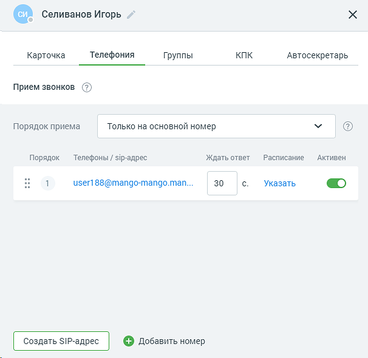
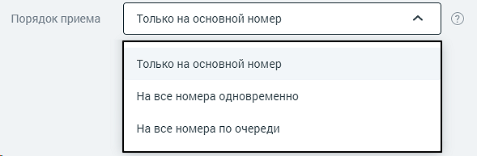
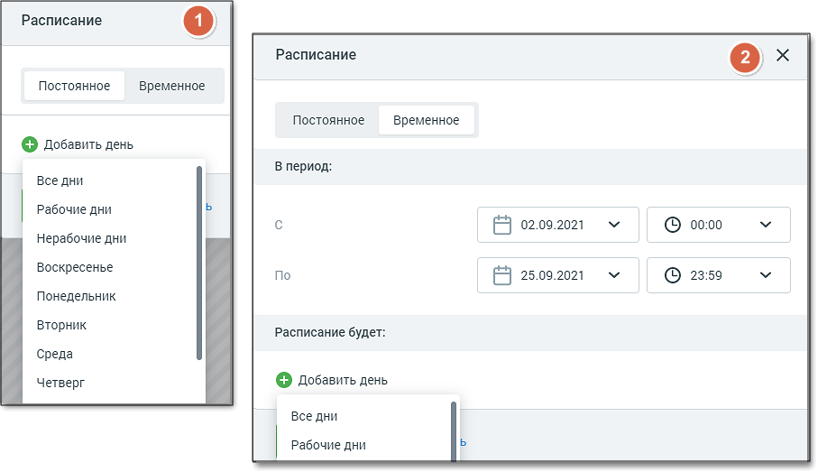
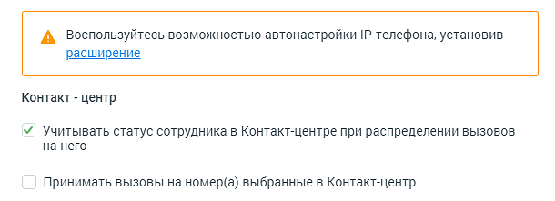
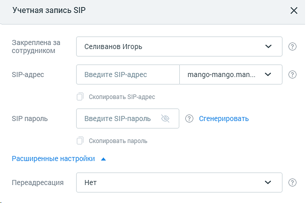
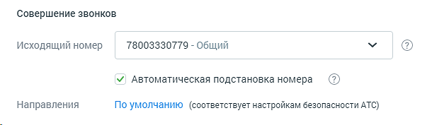

# 4.4.6.1.2. Вкладка «Телефония»

> Трассировка: PDF §4.4.6.1.2 · сквозные стр. 151-156 · источники: ч.2 `kb/mango-product-docs/sources/mango-lk-manual/LK_manual_v-121часть-2.pdf` с.50-55.

Вид вкладки представлен на рисунке ниже.

Данные абонента АТС Внутренний номер сотрудника можно использовать для переадресации вызовов на остальные средства связи. Для этого в списке «Порядок приема» следует выбрать нужный пункт.

совет Рекомендованная минимальная длина внутреннего номера составляет две цифры во избежание возникновения конфликтов с номерами пунктов голосового меню. Основной номер сотрудника — это первый номер со статусом «Активный» (см. рис. ниже). Если указать «На все номера по очереди», можно установить порядок, в котором входящий вызов на внутренний номер будет поступать на них. Для изменения очередности наведите курсор на строку со способом связи в области столбца «Порядок». Появится стрелка (см. рис. ниже). Удерживая левую кнопку мыши, перетащите строку в нужную позицию и отпустите кнопку. Повторяйте всю процедуру, пока не получите нужную последовательность. Средства приема звонков В этой части вкладки указаны все контакты для дозвона, порядок их использования и расписание. В заголовке блока дублируются предупреждения и рекомендации по заполнению карточки сотрудника:

• — не указано ни одного средства для приема звонков;

• — рекомендуется добавить альтернативное средство для приема звонков;

• — основные возможности настроены. После обновления страницы данная пиктограмма не отображается. Для добавления еще одного средства связи нажмите соответствующую кнопку и выберите нужный способ. По умолчанию для каждого номера устанавливается статус «Активен». Это означает, что данное средство связи используется для приема вызовов. Если добавленный номер телефона соответствует формату мобильного номера (11 цифр, начинается с +79, +79, +89), он отобразится на вкладке «Карточка» в поле «Мобильный» (если это поле не было заполнено ранее). При редактировании или удалении такого номера соответствующие изменения будут произведены и на вкладке «Карточка».

Если требуется изменить время ожидания ответа для номера, введите нужное значение в поле «Ждать ответ». По умолчанию при создании нового сотрудника с указанным средством приема звонков, а также при добавлении нового средства приема звонков в данном поле указывается значение, установленное в настройке "Время ожидания ответа по умолчанию, сек.:". Подробнее о настройке см. в подразделе «Настройки дозвона по умолчанию». внимание Если указать значение «0», то цифра заменяется на знак бесконечности, что расценивается как "бесконечно ожидать ответ". Можно указать Постоянное (1) и Временное (2) расписание работы номера, для этого выберите соответствующую вкладку в окне по ссылке «Расписание». Задайте период, дату, день недели или время. Используя дополнительные параметры списка «Добавить день», вы можете установить максимально подробное и точное расписание для каждого из номеров.

Данные в Контакт-центре Если вы хотите, чтобы статус сотрудника Контакт-центра оказывал влияние на готовность этого сотрудника к приему и обслуживанию звонков, установите соответствующую галочку. В этом случае если оператор находится в группе, для которой в Контакт-центре MANGO OFFICE заданы настройки поствызывной обработки звонков, после завершения вызова к оператору будут применяться правила поствызывной обработки, указанные в Контакт- центре.

При установленном флаге Принимать вызовы на номер(а), выбранные в Контакт- центре, выбор номеров обслуживания в Контакт-центре будет недоступен. Учетные записи SIP При создании учетной записи SIP в Карточке сотрудника доступны поля:

В поле «Закреплена за сотрудником» следует указать имя сотрудника, для которого создается учетная запись SIP.

Имя новой учетной записи SIP указывается в поле «SIP-адрес». Вы можете использовать уже имеющуюся учетную запись. Для этого в данном поле укажите ее полное имя, включая домен, например, my_sip@sipnet.ru. При необходимости выберите нужный домен SIP, используя выпадающий список. По умолчанию выбирается автоматически созданный для используемой Виртуальной АТС поддомен с именем вида vpbxXXXXXXX.mangosip.ru, где XXXXXXX — уникальный системный идентификатор текущего продукта. В каждой Виртуальной АТС может быть до трех доменов SIP, включая mangosip.ru. Если необходимо создать новый при трех уже существующих, потребуется удалить автоматически сгенерированный либо созданный вами домен. Подробнее о доменах в разделе. Укажите пароль для создаваемой учетной записи SIP или сгенерируйте его, нажав соответствующую ссылку. Если сотрудник находится в отпуске или по другим причинам не может отвечать на вызовы, можно использовать автоматическую переадресацию на его заместителя или другого сотрудника. Для этого нажмите ссылку «Расширенные настройки» и выберите целевую учетную запись SIP в списке «Переадресация». Если выбрано «нет», то переадресации поступившего звонка не происходит. Сохраните все изменения. внимание Изменения будут применены спустя некоторое время после сохранения карточки (около 2 минут). После сохранения изменений необходимо самостоятельно внести их в настройки всех IP-телефонов и софтфонов, на которых используется данная учетная запись SIP. совет Для пользователей браузера Google Chrome предусмотрена возможность установки расширения Mango Helper, предназначенного для автоматической настройки SIP- оборудования. Для установки расширения следует щелкнуть по ссылке «Расширение». Совершение звонков Если к текущей Виртуальной АТС подключено несколько номеров, в списке «Исходящий номер» можно указать тот, который должен определяться у вызываемого абонента. Если у компании есть филиалы в разных регионах, есть возможность выбрать номер в нужном. Кроме номеров MANGO OFFICE в списке также отображаются SIP-адреса с активным режимом работы. Описание активного режима см. в разделе Активный.

При выборе значения «Не указан номер – Нет исходящей связи» для сотрудника не указывается исходящий номер, что приводит к отсутствию возможности внешней исходящей связи. Если в Личном кабинете пользователя ВАТС подключена услуга «Автоматическая подстановка номера», то в карточке сотрудника отображается соответствующий чекбокс. Сотрудники, для которых чекбокс проставлен, в списке сотрудников отмечены

пиктограммой . Если сотрудник включен хотя бы в одну карусель номеров на вкладке Телефония также отображается ссылка Настроить, по которой открывается вкладка «Карусель номеров» с уже установленным фильтром поиска по данному сотруднику. внимание В соответствии с законодательством РФ номер 8-800 недоступен для использования в качестве исходящего номера. совет Устанавливайте для исходящих звонков номер в регионе присутствия, чтобы платить по тарифам местной связи и экономить средства.
