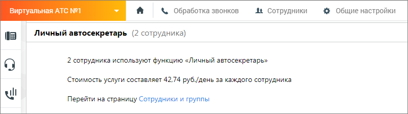
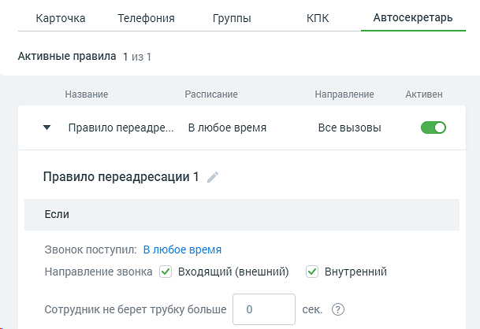
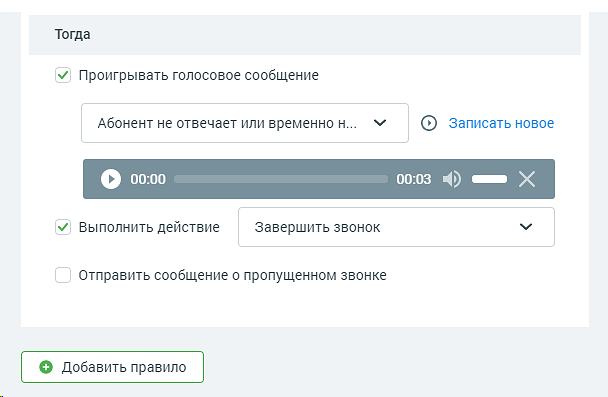

# 4.4.6.1.5. Вкладка «Автосекретарь»

> Трассировка: PDF §4.4.6.1.5 · сквозные стр. 157-162 · источники: ч.2 `kb/mango-product-docs/sources/mango-lk-manual/LK_manual_v-121часть-2.pdf` с.56-61.

Для работы модуля на продукте должна быть подключена услуга "Личный автосекретарь". Для подключения перейдите в раздел Общие настройки/Управление услугами. Выберите из списка дополнительных услуг "Личный автосекретарь" и ознакомьтесь с условиями подключения.

После подключения услуги она отображается в списке доступных модулей ВАТС.

Личный автосекретарь позволяет настроить индивидуальные условия обработки вызовов для сотрудников. Автосекретарь устанавливает правила переадресации в случае: • при использовании в Контакт-Центре – если статус сотрудника указан как "Не в сети" или "Перерыв", то есть сотрудник недоступен для вызовов. • при использовании в ином программном обеспечении MANGO OFFICE – если сотрудник не доступен для вызова, не отвечает на вызов или сбрасывает вызов. После подключения услуги в карточке сотрудников, использующих функцию "Личный автосекретарь" отображается вкладка "Автосекретарь". Вкладку видят пользователи, обладающие правом «Настраивать индивидуальные правила обработки звонков (Автосекретарь)». См. подраздел Настройка доступа.

На вкладке пользователю доступны следующие настройки:

Переключатель Правила переадресации – в положении «включен» открывает доступ к редактированию параметров правила. Для каждого правила можно задать параметры условий (Если) и действий (Тогда): 1. Звонок поступил - настройка периода, дня и времени поступления звонка. Расписание настраивается аналогично вкладке Телефония; 2. Направление звонка (входящий внешний и/или внутренний) - настройка условия направления звонка для обработки; 3. Если сотрудник не берет трубку больше __ сек - время в секундах, в течение которого ожидается ответ сотрудника. Максимальное время ожидания - 100 секунд. Если параметр равен 0, время ожидания ответа сотрудника принимается согласно правил для сотрудников, установленных в Настройки дозвона по умолчанию. При этом также действует настройка ожидания ответа, установленная во вкладке «Телефония» Телефония. Таким образом, ожидание ответа сотрудника принимается, как наименьшее из установленных • во вкладке «Телефония»

• во вкладке «Автосекретарь»

4. Проигрывать голосовое сообщение - выберите из выпадающего списка голосовое сообщение, которое будет проигрываться, если в течение установленного в п.2 времени ответа от сотрудника не поступило. Выбранное голосовое сообщение можно прослушать при помощи встроенного плеера,

кликнув по пиктограмме . Нажатие на ссылку «Записать новое» открывает окно выбора способа добавления голосового сообщения. Подробнее о доступных голосовых сообщениях в зависимости от роли пользователя узнайте в подразделе Аудиофайлы. Этот параметр не является обязательным для настройки. 5. Выполнить действие - после воспроизведения голосового сообщения Автосекретарь выполнит одно из указанных в настройках действий: • завершить звонок • принять голосовую почту - абонент сможет записать и отправить голосовое сообщение на e-mail сотрудника, после чего звонок завершается. По умолчанию, в поле указан e-mail сотрудника, для которого настраивается правило обработки. • переадресовать на группу - звонок будет переадресован на указанную группу. Далее звонок обрабатывается по правилам, настроенным для обработки

звонков группой. Если в рамках алгоритма распределения для группы вызов должен быть переадресован на данного сотрудника, то автосекретарь не обрабатывает звонок повторно.

| Переадресовать на сотрудника - звонок будет переадресован на указанного |
| --- |
| сотрудника. |

дозвона, указанные в карточке данного сотрудника. Если в процессе прохождения звонка, звонок поступил на сотрудника, для которого уже сработали индивидуальные правила переадресации, то автосекретарь не обрабатывает звонок повторно. • Переадресовать на номер телефона - звонок будет переадресован на указанный номер. При переадресации используется время ожидания ответа, указанное в поле ниже. Таким образом, в рамках одного вызова для одного сотрудника правило автосекретаря может сработать только один раз. ВНИМАНИЕ Автосекретарь не работает для групповых вызовов с последующим распределением на сотрудника. 6. Отправить сообщение о пропущенном звонке • СМС на номер – чекбокс открывает поле для ввода мобильного телефона в формате "+79", "79" или "89". По умолчанию заполняется номером из карточки сотрудника. • E-mail по адресу – чекбокс открывает поле для ввода адреса электронной почты. По умолчанию заполняется e-mail из карточки сотрудника. Пример 1: Если включен чек-бокс «СМС на номер», то на указанный номер приходит СМС со следующим текстом: "<текущая дата> в <текущее время> сотрудником <ФИО сотрудника, для которого сработало правило> пропущен звонок с номера <номер, с которого поступил звонок>". Пример 2: Если включен чек-бокс «E-mail по адресу», то на указанный адрес электронной почты приходит сообщение со следующим текстом: "<текущая дата> в <текущее время> сотрудником <ФИО сотрудника, для которого сработало правило> пропущен звонок с номера <номер, с которого поступил звонок>". Тема письма "Пропущенный звонок от <текущая дата> в <текущее время>". При включенных чекбоксах поля являются обязательными для заполнения.

Кнопка «Добавить правило» - максимальное количество правил для одного сотрудника – 5. Если для сотрудника создано несколько правил, у которых пересекаются условия, то срабатывает первое правило из списка. Сохраните настройки кнопкой Сохранить. Нажатие на ссылку Отменить отменяет изменения и возвращает настройки обработки звонков к последнему сохраненному значению. Нажатие на кнопку Удалить правило приводит к удалению правила Автосекретаря из карточки сотрудника. Если правило единственное, кнопка не отображается.
