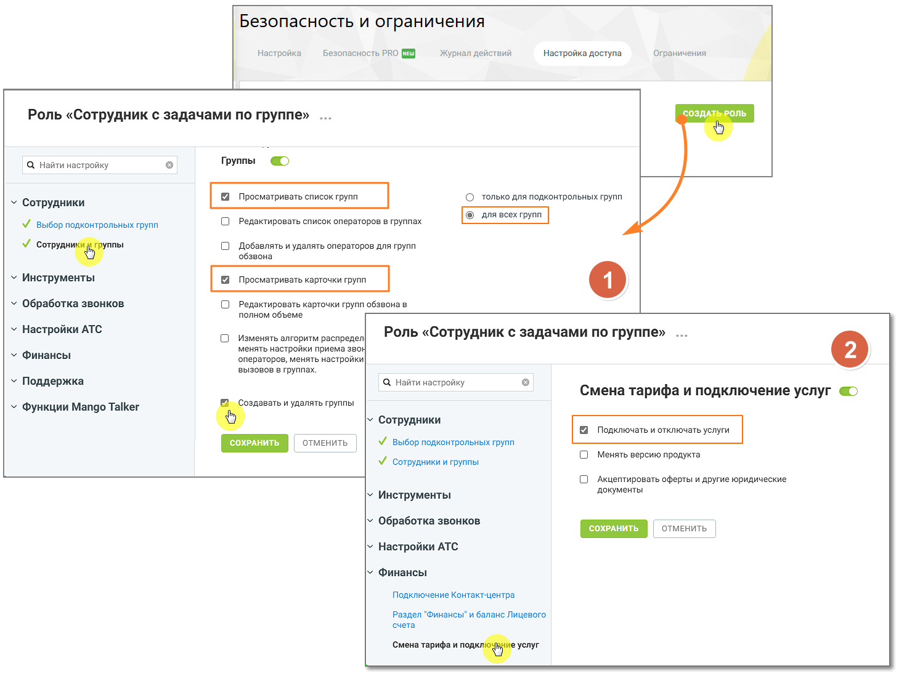

# 4.4.6.2. Работа с группами

> Трассировка: PDF §4.4.6.2 · сквозные стр. 162-164 · источники: ч.2 `kb/mango-product-docs/sources/mango-lk-manual/LK_manual_v-121часть-2.pdf` с.61-63.

Для добавления группы воспользуйтесь одноименной ссылкой. Откроется карточка группы, содержащая три вкладки. внимание Чтобы сотрудник с пользовательской ролью мог создавать, изменять или удалять группы, помимо прав в разделе Группы, необходимо в разделе Финансы включить разрешение «Смена тарифа и подключение услуг». Без этого действия с группами будут недоступны.

Для изменения настроек группы нажмите на ссылку Настроить группу. Для удаления группы откройте настройки группы и нажмите кнопку Удалить группу на любой из вкладок. При удалении выполняется проверка, задействована ли группа: • в схемах переадресации; • в переадресации по номеру клиента; • в настройках виджетов "Обратный звонок"; • в кампаниях исходящего обзвона Контакт-центра в статусах «Завершена», «Запланирована», «Остановлена» - в этом случае группа исключается из списка групп операторов и удаляется. Если группа указана хотя бы в одной схеме, переадресации по номеру клиента, настройке либо кампании в статусе, отличном от «Завершена», «Запланирована», «Остановлена», на экране отображается предупреждение примерного вида. Группа при этом не удаляется.

Из удаленной группы исключаются все сотрудники. Сохраните внесенные в карточку изменения нажатием на кнопку Сохранить или клавишей [Enter] на клавиатуре. Название группы сохраняется отдельно, независимо от сохранения данных внутри карточки группы.

Нажатие на кнопку Отменить, пиктограмму или клавишу [Esc] на клавиатуре закрывает карточку группы без сохранения изменений.

