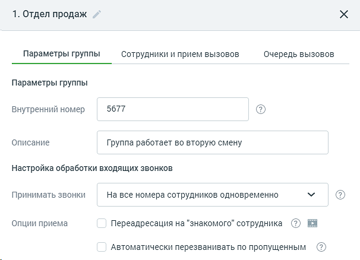
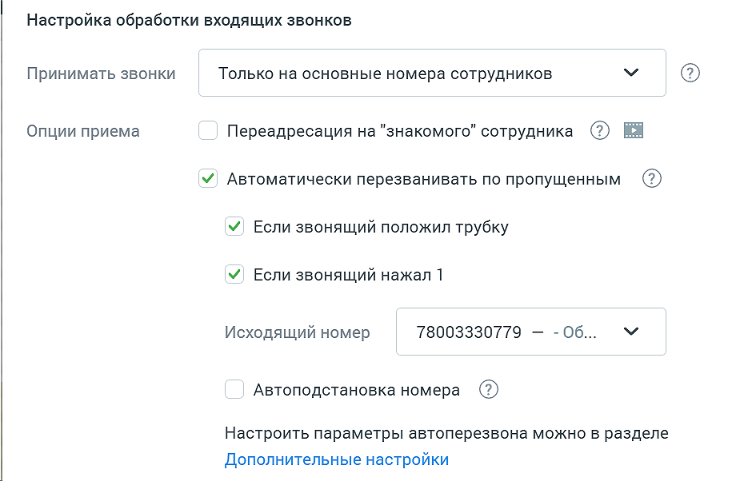
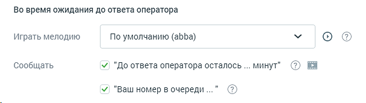
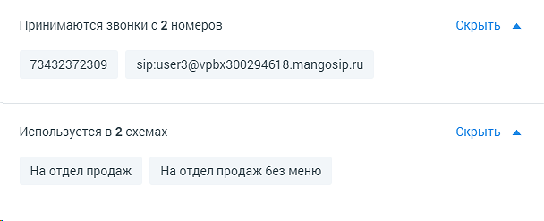

# 4.4.6.2.1. Вкладка «Параметры группы»

> Трассировка: PDF §4.4.6.2.1 · сквозные стр. 164-170 · источники: ч.2 `kb/mango-product-docs/sources/mango-lk-manual/LK_manual_v-121часть-2.pdf` с.63-69.

Вид вкладки представлен на рисунке ниже.

Название группы указывается в заголовке на любой вкладке и может быть

отредактировано при клике по иконке карандаша . Параметры группы При создании новой группы следует указать внутренний номер, который может использоваться для переадресации и перевода вызовов и должен содержать от одной до пяти цифр. Также можно указать дополнительное описание для группы.

совет Рекомендованная минимальная длина внутреннего номера составляет две цифры во избежание возникновения конфликтов с номерами пунктов голосового меню. Настройка обработки входящих звонков Принимать звонки. В зависимости от способа, выбранного из списка «Принимать звонки», вызов будет перенаправлен на соответствующий номер сотрудника, если он активен и не ограничен расписанием. При выборе значения «Как настроено в карточке сотрудника» звонок при его переводе на соответствующего сотрудника будет принят в соответствии с настройками средств приёма звонков, установленными в карточке сотрудника. Переадресация на «знакомого» сотрудника. Если в течение рабочего дня после своего предыдущего звонка клиент перезванивает, то Виртуальная АТС может автоматически перенаправить его на специалиста, с которым он уже общался. Для этого следует установить галочку «Переадресация на «знакомого» сотрудника». Если «знакомый» сотрудник по какой-либо причине не может принять звонок, вызов будет переведен на другого работника в соответствии с заданным в группе алгоритмом. У одного и того же клиента может быть несколько «знакомых» сотрудников в различных группах. Виртуальная АТС идентифицирует звонящего по номеру. Если номер невозможно определить (а также если он совпадает с одним из стандартных номеров, предоставляемых «Манго Телеком»), то система не сможет подобрать абоненту «знакомого» сотрудника. После выборе этого чекбокса система проинформирует о стоимости услуги.

Автоматически перезванивать по пропущенным. При установленном флаге «Автоматически перезванивать по пропущенным звонкам» подключается услуга автоматического перезвона на входящие звонки от клиентов, пропущенные группой, а затем и компанией с несколькими условиями: • Чекбокс «Если звонящий положил трубку» включен – если звонок был пропущен группой, создается задача на автоперезвон; • Чекбокс «Если звонящий нажал 1» включен – звонящему дополнительно проигрывается фраза «Нажмите 1 и Вам перезвонит первый свободный оператор». Если звонящий нажал 1, создается задача на автоперезвон, проигрывается фраза «Спасибо. Вам перезвонит первый свободный оператор». Далее звонок завершается. Перезвон по внутренним звонкам и входящим звонкам от сотрудников не выполняется. При перезвоне используются алгоритмы, настроенные в подразделе Автоперезвон Личного кабинета. В случае, если в схеме распределения настроено несколько групп, и звонок пропущен всеми, перезвоны совершаются от каждой из групп, на которых включена опция автоматического перезвона. Пример 1. Входящий звонок был принят секретарем компании и переведен на группу. Группа пропустила входящий вызов. В этом случае перезвон не выполняется, так как изначально вызов был принят секретарем. Пример 2. Входящий звонок был принят группой подстраховки и переведен на основную группу. Основная группа пропустила входящий вызов. В этом случае

перезвон не выполняется, так как изначально вызов был принят группой подстраховки. Одновременно предусмотрено только одно задание на перезвон на один номер клиента. Таким образом, если клиент попытался перезвонить несколько раз подряд, каждый его пропущенный звонок не будет сопровождаться отдельным перезвоном. После выбора этого чекбокса система проинформирует об условиях подключения и стоимости услуги. Далее следует выбрать из списка (DID-линии ВАТС, номера 8800 и SIP-UAC линии) исходящий номер, с которого будет совершаться атоперезвон. Если на ВАТС подключена услуга Автоподстановка номера, то при выборе чекбокса «Автоматически перезванивать по пропущенным» также доступен чекбокс «Автоподстановка номера». При выборе чекбокса, автоматические перезвоны будут совершаться с номеров, указанных на вкладке Автоподстановка. Если для номера, на который требуется перезвонить, не задано ни одно правило автоподстановки по маске или номеру, звонок будет совершен с номера, указанного по умолчанию. Для настройки автоподстановки перейдите в пункт меню «Общие настройки», раздел «Дополнительные настройки», вкладка «Автоподстановка номера». Нажатие на кнопку «Дополнительные настройки» открывает вкладку Автоперезвон. Во время ожидания до ответа оператора Выберите из списка «Играть мелодию» звуковой фрагмент, который будет звучать для абонентов, пока кто-то из сотрудников не ответит на вызов. По умолчанию используется аудиофайл, заданный в разделе настроек «Ожидание ответа» в меню «Обработка входящих звонков».

Автоинформатор о времени до ответа оператора Укажите, будет ли Виртуальная АТС сообщать внешним абонентам, находящимся в очереди, расчетное время ожидания ответа. Для этого установите галочку «До ответа оператора осталось … минут». Услуга настраивается для каждой группы индивидуально.

совет Наглядное представление о работе услуги вы можете получить, просмотрев видеоурок «Автоинформатор о времени до ответа оператора». Услуга подключается дополнительно. После выборе этого чекбокса система проинформирует об условиях подключения и стоимости услуги. Также для использования автоинформатора необходимо соблюсти следующие условия: • В случае использования общих настроек удержания вызовов: в разделе настроек «Ожидание ответа» должен быть установлен флаг «Ставить в очередь звонящего, если все сотрудники заняты»; • В случае использования специальных настроек удержания вызовов для группы: в карточке группы на вкладке «Очередь вызовов» должен быть установлен флаг «Удерживать вызовы (ставить в очередь), если все операторы заняты». При переключении настроек со специальных на общие выполняется проверка на наличие установленного флага «Ставить в очередь звонящего, если все сотрудники заняты» в разделе настроек «Ожидание ответа». Если флаг не установлен, то на экране отображается сообщение об отключении автоинформатора. После сохранения изменений уведомление о времени до ответа оператора будет отключено. Аналогичное сообщение об отключении автоинформатора будет получено в случае, если на вкладке «Очередь вызовов» снять флаг «Удерживать вызовы (ставить в очередь), если все операторы заняты». Автоинформатор о номере в очереди Укажите, будет ли Виртуальная АТС сообщать внешним абонентам, находящимся в очереди, номер их позиции в общей очереди на группу. Для этого установите галочку «Ваш номер в очереди …». Услуга настраивается для каждой группы индивидуально. Услуга подключается дополнительно. После выборе этого чекбокса система проинформирует об условиях подключения и стоимости услуги. Для использования автоинформатора необходимо соблюсти следующее условие: • В случае использования специальных настроек удержания вызовов для группы: в карточке группы на вкладке «Очередь вызовов» должен быть установлен флаг «Удерживать вызовы (ставить в очередь), если все операторы заняты». При переключении настроек со специальных на общие выполняется проверка на наличие установленного флага «Ставить в очередь звонящего, если все сотрудники заняты» в разделе настроек «Ожидание ответа». Если флаг не установлен, то на экране отображается сообщение об отключении автоинформатора. После сохранения изменений уведомление о позиции в очереди на группу будет отключено. Аналогичное сообщение об отключении автоинформатора будет получено в случае, если на вкладке «Очередь вызовов» снять флаг «Удерживать вызовы (ставить в очередь), если все операторы заняты».

Принимаются звонки с __ номеров. Блок элементов отображается в случае, если для данной группы есть номера, в схемах распределения которых есть переадресация на данную группу. Используется в __ схемах. Блок элементов отображается в случае, если данная группа участвует в схеме распределения. совет Если ранее вы не подключали сервис переадресации по номеру клиента, то в процессе настройки вам будет предложено согласиться с условиями его использования. Установите галочку «Я принимаю условия подключения». Для

настройки сервиса перейдите на главную страницу Виртуальной АТС и в блоке «Инструменты» выберите «Переадресация по номеру клиента».
