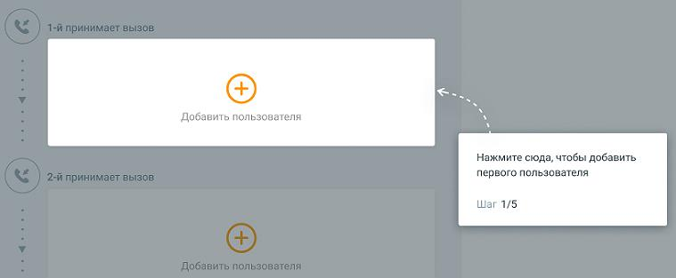
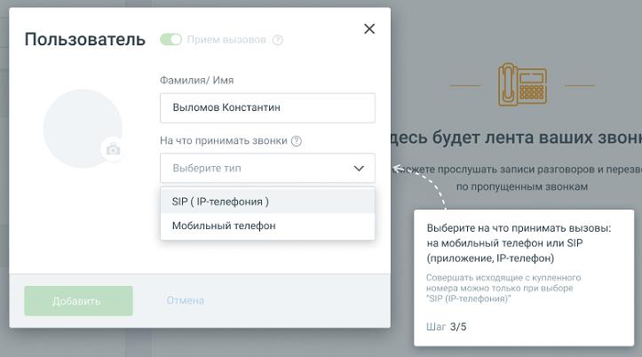

# 1.8.1.2. Добавление сотрудников.

> Трассировка: PDF §1.8.1.2 · сквозные стр. 15-17 · источники: ч.1 `kb/mango-product-docs/sources/mango-lk-manual/LK_manual_v-121часть-1.pdf` с.15-17.

Шаг 1. Добавление пользователя. Клик по пиктограмме открывает карточку добавления пользователя.

Шаг 2. Укажите имя нового пользователя. Указанное имя будет отображаться в списке сотрудников. Шаг 3. Выберите способ приема звонков: • мобильный телефон – укажите номер мобильного телефона сотрудника • SIP (IP-телефония) – sip-адрес и пароль сотрудника генерируются автоматически

Шаг 4. Подтверждение добавления пользователя и проверка правильности ввода данных. Отредактировать данные пользователя вы можете после прохождения онбординга

нажав на пиктограмму .

Чтобы удалить сотрудника, откройте карточку сотрудника, кликните по кнопке Удалить пользователя, подтвердите удаление.

Клик по пиктограмме прерывает работу обучающего модуля Онбординг.
