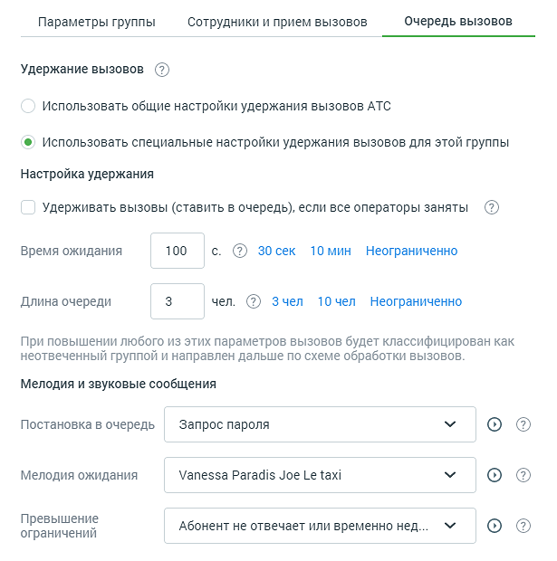

# 4.4.6.2.3. Вкладка «Очередь вызовов»

> Трассировка: PDF §4.4.6.2.3 · сквозные стр. 172-174 · источники: ч.2 `kb/mango-product-docs/sources/mango-lk-manual/LK_manual_v-121часть-2.pdf` с.71-73.

Вид вкладки представлен на рисунке ниже.

Удержание вызовов Общие для всех групп настройки удержания вызовов устанавливаются в разделе «Настройки дозвона по умолчанию». Если необходимо задать иные параметры, установите переключатель в положение «Использовать специальные настройки удержания вызовов для этой группы». Станут активными следующие блоки этой вкладки:

Настройки удержания По умолчанию вызовы удерживаются Виртуальной АТС даже если все внутренние номера заняты. Абонент остается в очереди в течение периода, заданного значением параметра «Время ожидания» (по умолчанию 600 секунд). Значение параметра «Длина очереди» устанавливает максимальное количество вызовов, ожидающих распределения на оператора. Если оно достигает указанной величины, дальнейшие поступающие звонки классифицируются как не отвеченные. При переадресации из голосового меню они будут перенаправлены в соответствии с настройками активной схемы, в ином случае передается сигнал «Занято». Значение параметра по умолчанию — 0, это означает, что длина очереди не ограничена и звонок будет в очереди, пока на него не ответят или вызывающий абонент не повесит трубку. Мелодии и звуковые сообщения При необходимости можно задать звуковые фрагменты, которые будут проигрываться абоненту в зависимости от ситуации: при постановке в очередь, удержании вызова или превышении максимальных времени ожидания и длины очереди. Возврат к общим настройкам удержания вызовов При возврате к общим настройкам удержания вызовов возможно отключение некоторых функций, установленных только для данной группы. В случае, если на странице «Настройки дозвона по умолчанию» для группы не установлена опция «Ставить в очередь звонящего, если все сотрудники заняты», при этом: • в карточке группы на вкладке «Очередь вызовов» включена опция «Удерживать вызовы (ставить в очередь), если все операторы заняты»; • в карточке группы на вкладке «Прием вызовов» включена опция «Сообщать «До ответа оператора осталось ... минут», либо • в карточке группы на вкладке «Прием вызовов» включена опция «Сообщать «Ваш номер в очереди ...», либо • включены обе перечисленные опции, то при переводе переключателя в положение «Использовать общие настройки удержания вызовов» или отключении настройки удержания «Удерживать вызовы (ставить в очередь), если все операторы заняты» опции автоинформатора будут отключены. Сохраните внесенные в карточку изменения кликом по кнопке Сохранить или клавишей [Enter] на клавиатуре.

Нажатие на кнопку Отменить, пиктограмме или клавише [Esc] на клавиатуре закрывает карточку группы без сохранения изменений.

