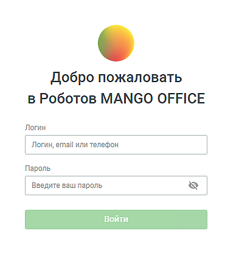
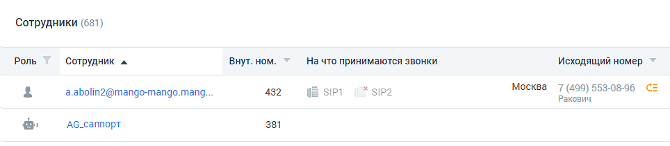

# 4.4.6.3. Роботы

> Трассировка: PDF §4.4.6.3 · сквозные стр. 174-175 · источники: ч.2 `kb/mango-product-docs/sources/mango-lk-manual/LK_manual_v-121часть-2.pdf` с.73-74.

Модуль Роботы - инструмент для автоматизации приема входящих звонков и исходящего обзвона. Доступ к модулю осуществляется по адресу http://robot.mango- office.ru. Авторизуйтесь в системе, заполнив поля формы авторизации:

При первом входе в модуль открывается форма покупки робота-оператора. Ознакомьтесь с условиями, введите необходимое количество роботов и нажмите кнопку Купить робота. Роботы-сотрудники отображаются в Личном кабинете в списке сотрудников с иконкой

, служебная роль – «Робот».

По клику на имени робота в списке открывается карточка робота.

