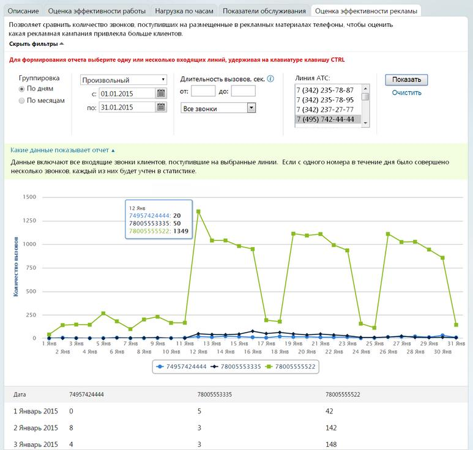

# 4.5.1.4. Оценка эффективности рекламы

> Трассировка: PDF §4.5.1.4 · сквозные стр. 182-184 · источники: ч.2 `kb/mango-product-docs/sources/mango-lk-manual/LK_manual_v-121часть-2.pdf` с.81-83.

Выберите тип группировки, используя одноименный переключатель. Ограничения по периодам действуют следующим образом: • с группировкой по дням: не более одного месяца; • с группировкой по месяцам: не более одного года. При необходимости укажите период (по умолчанию предлагается «Произвольный»), или даты, нажимая на значок календаря или вводя их в формате дд.мм.гггг в соответствующие поля.

Далее при необходимости задайте продолжительность вызовов, используя соответствующие поля в блоке «Длительность вызовов, сек.». В этом же блоке предусмотрен выбор звонков, по которым будет сформирован отчет: • все входящие звонки - отображение всех входящих звонков (принятых и пропущенных); • уникальные клиенты – звонки (принятые и пропущенные), совершенные с уникальных номеров телефонов. Отчет формируется только по входящим вызовам. Предусмотрена возможность указать одну или несколько входящих линий (по умолчанию выбраны все), используя одноименный список. В качестве Линии АТС указываются номера MANGO OFFICE, номера сторонних операторов, номера 8-800 либо виджеты «Звонок с сайта» или «Обратный звонок». Выбрать/отменить выбор можно кликом мышки при зажатой клавише CTRL на клавиатуре. Для формирования отчета нажмите Показать.

Для получения более подробной информации наведите курсор на график на гистограмме. Нажмите на элемент цветовой легенды, чтобы включить или отключить отображение соответствующих данных на гистограмме.

