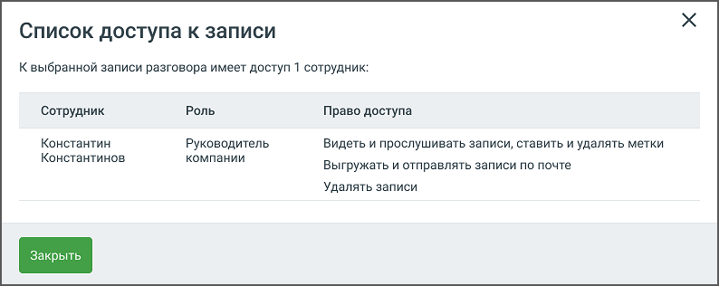
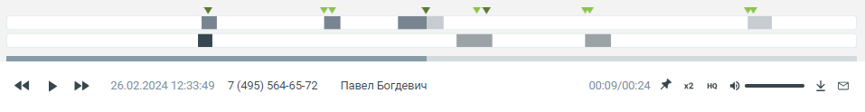
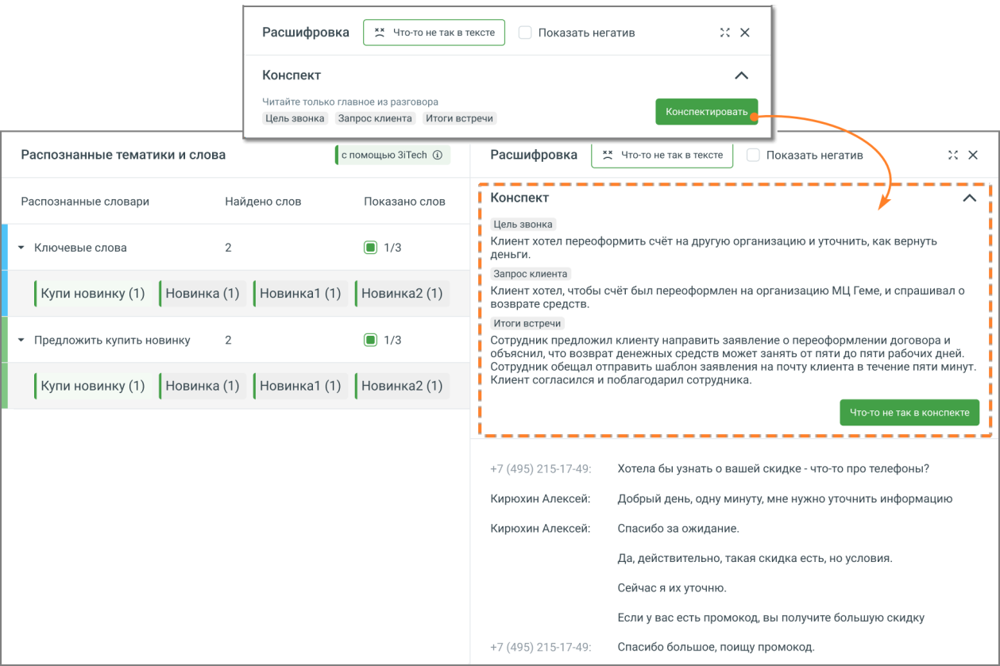

# 4.5.3.1. Записанные разговоры

> Трассировка: PDF §4.5.3.1 · сквозные стр. 194-202 · источники: ч.2 `kb/mango-product-docs/sources/mango-lk-manual/LK_manual_v-121часть-2.pdf` с.93-101.

В этой вкладке можно просмотреть и отсортировать информацию, а также прослушать и скачать записанные разговоры. Для поиска записанных разговоров воспользуйтесь фильтрами: 1) Из выпадающего списка выберите период отчета либо укажите произвольный; 2) Укажите значение в поле «Кто звонил»: Клиент либо Сотрудник; • Для значения «Клиент» укажите часть номера или номер, с которого звонил клиент; • Для значения «Сотрудник» выберите группу, конкретного сотрудника либо выберите значение «Любой сотрудник»; 3) Аналогичным образом укажите значения для поля «С кем говорил»; 4) Укажите номер или виджет «Текстовых коммуникаций» , на который осуществился дозвон; 5) При необходимости укажите длительность беседы: предусмотрена возможность выбора определенной длительности либо ввода произвольной длины разговора в формате мм:сс.; Дополнительные фильтры Речевой аналитики: 6) Поиск по распознанным записям разговоров. Введите ключевое слово или словосочетание, которое вы хотите найти в разговоре (например, "акция", "доставка", "оплата"). Нажмите кнопку "Enter", чтобы слово, которое вы ввели, стало поисковым тегом. Разрешенные для ввода в данное поле символы: • Кавычки. "" и «» • Дефис (тире) • Запятая • Буквы (кириллица, латиница) • Пробел Поиск доступен, если на ВАТС подключена услуга «Распознавание разговоров». ПРИМЕР: Требуется выяснить интерес покупателей к акции Скоро лето. Вводим в поле поиска запрос “скоро лето”, выбираем канал Клиент и получаем список распознанных записей разговоров, где клиенты интересовались акцией. Далее можно прослушать записи и выяснить степень заинтересованности клиента и другую информацию. 7) Выберите, кто говорил эти слова: клиент или сотрудник. Также доступен вариант "никто не говорил". 8) Выберите тематику разговора (например, "продажи", "поддержка", "технические вопросы"). Подробнее о тематиках читайте в Руководстве пользователя по Речевой аналитике. 9) Выберите, хотите ли вы найти разговоры, относящиеся или не относящиеся к данным тематикам:

• Если выбрано Говорили, будут отображены записи разговоров, в которых были затронуты хотя бы одна из выбранных тематик. • Если выбрано Не говорили, будут показаны только те записи разговоров, в которых не была затронуто ни одна из выбранных тематик. Эта функция может быть полезна, например, для выявления сотрудников, которые упускают возможность предложить акционные продукты в разговоре с клиентами. 10) Выберите эмоции, которые были выражены в разговоре: "любые эмоции", "негативные", "нейтральные". Эмоции разговоров определяет специальный алгоритм искусственного интеллекта, который анализирует как акустические (тембр, громкость), так и лингвистические характеристики. 11) Если выбраны "негативные" или "нейтральные" эмоции, можно указать, кто именно - клиент или сотрудник - проявил эти эмоции в ходе разговора. 12) Укажите длительность тишины. Изучение интервалов тишины может помочь руководителю выявить узкие места в рабочих процессах и процедурах обслуживания клиентов. Нажмите Показать отчет для формирования списка записанных разговоров, удовлетворяющего условиям фильтров. Нажатие кнопки Очистить фильтры сбрасывает выбранные фильтры. Если пользователь имеет ограниченные права доступа на прослушивание записей разговоров (например, “прослушивать только свои записи”), то в результатах поиска по ключевым словам будут только его записи.

При выборе одной или нескольких записей становятся доступными следующие действия: • Экспорт аудио – скачать выбранные записи на компьютер пользователя (не более 1 ГБ единоразово);

• Конспектировать – в окне расшифровки звонка выполняется автоматическое формирование краткого резюме разговора с помощью искусственного интеллекта. В верхней части страницы, над текстом диалога, появляется блок «Конспект» – сжатое содержание разговора, созданное на основе анализа распознанной речи. При отключённой Речевой аналитике нажатие на кнопку открывает окно подключения, где пользователь может активировать полную версию РА и выбрать движок распознавания речи. внимание Функция подключения Речевой аналитики доступна только при наличии у пользователя прав «Просматривать и изменять настройки», «Подписывать оферты», а также «Подключать и отключать услуги». • Удалить – удалить выбранные записи без возможности восстановления.

Под пиктограммой доступны следующие опции: • Отправить на e-mail – отправить выбранные записи на e-mail; • Расшифровать – отправить выбранные записи на расшифровку «Речевой аналитикой». После подключения Речевой аналитики пользователю не нужно дожидаться, пока накопятся записи разговоров для распознавания. Кнопка «Расшифровать» дает возможность сразу отправить на распознавание из ЛК ВАТС уже накопленные в облачном хранилище записи. • Экспорт расшифровок – скачать текстовую расшифровку записей (доступно, если на ВАТС подключена услуга Распознавание разговоров и запись расшифрована); Также при выборе одной или нескольких записей выполняется подсчет общей длительности разговоров и объем файлов.

Для того, чтобы добавить запись разговора в список «избранных» или проставить метку

записи, следует в строке щелкнуть в области столбца с пиктограммой и выбрать один из следующих вариантов:

• – метка «Хороший звонок»;

• – метка «Плохой звонок»;

• – метка «В избранное». Кликните по метке, чтобы ее снять.

Клик по пиктограмме в строке записи открывает окно действий с выбранной записью: Экспорт аудио, Расшифровать, Экспорт расшифровки, Отправить, Удалить, Список доступа к записи, Копировать ссылку. Возможные действия с записью зависят от прав, предоставленных пользователю в ЛК ВАТС.

Прослушивание записей

Для прослушивания записи следует щелкнуть по пиктограмме напротив наименования нужной записи. Одновременно в плеер допускается добавить не более одной записи. Также запись может быть обозначена следующими пиктограммами:

– на данный момент запись воспроизводится.

– воспроизведение записи приостановлено.

– запись прослушана.

– запись отправлена на расшифровку «Речевой аналитикой».

– доступна только текстовая расшифровка звонка.

– запись хранится на ftp-сервере. Существуют два возможных варианта: • если запись хранится исключительно на FTP, то на вкладке с ней нельзя совершать никаких действий;

• если запись хранится как на FTP, так и на файловом облачном хранилище MANGO OFFICE, то на вкладке с ней можно совершать любые необходимые действия.

– запись зашифрована, просмотр текстовой расшифровки и прослушивание записи на продуктах MANGO OFFICE недоступны.

– запись не обнаружена, вероятно, она была удалена другим пользователем. Строка записи исчезнет при перезагрузке списка. Для управления прослушиванием используется встроенный плеер. Для отображения результатов поиска в распознанных записях разговоров используется осциллограмма на встроенном плеере, с выделенными фрагментами разговора.

В области плеера на тех участках разговора, где были вхождения ключевых слов, отображаются метки:

1) для ключевых слов, найденных из строки ввода поисковых запросов

2) для ключевых слов (терм) из пользовательских тематик

3) для ключевых слов (терм) из AI-тематик Если в левом блоке «Распознанные словари и слова» отметить какой-либо чекбокс, то в правом блоке «Текст разговора» ключевые слова будут визуально выделяться. Метки на осциллограмме, соответствующие выбранному чекбоксу, также будут визуально

выделяться более темным цветом: (см. пример 1 на рисунке ниже)

Если чекбокс не отмечен (см. пример 2 на рисунке ниже), метка не меняет цвет.

Результаты поиска ключевых слов, заданных в строке поиска, с учетом тематик (инструмент расшифровки разговора включен).

Иконкой в блоке Распознанные тематики и слова обозначаются AI тематики.

При наведении курсора на метки плеера отображается всплывающее окно с указанием канала, в рамках которого была распознаны ключевые слова, а также сами ключевые слова.

Выбор метки на плеере переводит воспроизведение записи разговора на участок, соответствующий метке. Если разговор содержит несколько одинаковых терм или ключевых слов, пиктограммы

позволяют быстро переключаться между фрагментами, содержащими выбранные термы/ключевые слова. Предварительно в левом блоке «Распознанные тематики и слова» необходимо отметить соответствующие чекбоксы.

Если разговор содержит интервалы тишины, заданные в фильтрах, они отобразятся в

соответствующем месте расшифровки разговора: Если услуга «Расшифровка разговоров» отключена, тексты разговоров на плеере не отображаются.

Клик по пиктограмме сворачивает окно записи разговора в компактный формат. Для

отображения окна в полной форме следует нажать на пиктограмму . При отметке чек-боксов «Показать негатив» в транскрибации и на плеере разговора, определенные, как содержащие негатив, будут выделяться фоновым цветом.

При закрытии ВАТС аудиозаписи разговоров становятся недоступны пользователю, но все еще находятся в файловом хранилище. Через 30 календарных дней аудиозаписи полностью удаляются из файлового хранилища. Плеер содержит основную информацию о звонке: • ФИО клиента; • Дата и время звонка; • Длительность записи. При необходимости нажмите:

• – приостановить/продолжить воспроизведение; переключиться на предыдущую/следующую запись;

• – добавить запись в список «избранных» и установить метку;

• – изменить скорость воспроизведения. Варианты – 1х / 1,5х / 2х;

• – включение функции шумоподавления. Наличие функции записит от текущего тарифного плана ВАТС. Включение функции возможно только при установленном флаге «Подавлять шумы при прослушивании» на закладке «Настройки»;

• – изменить громкость воспроизведения;

• – скачать запись;

• – отправить запись на e-mail. AI Конспекты Если у пользователя подключена Речевая аналитика и в ее настройках включена услуга AI Конспекты, в разделе Запись разговоров становится доступна функция просмотра автоматически сформированных резюме звонков. внимание Функция доступна пользователям с доступом «Настройки распознавания сотрудников и номеров». Доступ настраивается в ЛК ВАТС → Безопасность и ограничения → Настройка доступа → [выбрать роль] → Речевая аналитика. Чтобы открыть конспект: 1. Перейдите в раздел Запись разговоров. Откройте нужный звонок. Нажмите кнопку Конспектировать.

2. В окне расшифровки звонка над текстом разговора сформируется Конспект — краткое содержание диалога, подготовленное AI. В нём будут выделены: • цель звонка, • запрос клиента, • итоги встречи. 3. Персональные данные клиентов из Конспекта исключены.

Если в содержании конспекта что-то не соответствует реальному разговору, нажмите кнопку «Что-то не так в конспекте». Откроется форма, в которой можно: • оставить комментарий; • предложить, что добавить или изменить; • указать контактные данные для обратной связи.

<!-- изображение на стр. 202: байты не извлечены (PyMuPDF недоступен) -->

<!-- изображение на стр. 202: байты не извлечены (PyMuPDF недоступен) -->

Также вы можете предложить свой вариант оформления резюме – собственный промт. Это полезно, если в стандартном конспекте не хватает информации или структура не соответствует задачам вашего бизнеса. Промт — это текстовая инструкция, по которой AI формирует краткое содержание разговора. Вы можете указать, какие элементы должны быть включены, что стоит убрать или изменить. Это позволяет настраивать конспекты под особенности вашего бизнеса, например, добавить причины отказа клиента, эмоциональную реакцию или этапы обработки запроса. Чтобы отправить предложение, откройте расшифровку любого звонка и нажмите кнопку Что-то не так в конспекте. Откроется форма обратной связи. В ней укажите, что именно вы хотите изменить, оставьте контактные данные и отметьте удобное время для связи. Отправленные заявки поступают в команду продукта и сохраняются в системе. На основе пользовательских предложений разрабатываются новые шаблоны, которые могут быть добавлены в список доступных форматов конспектов. Таким образом, вы получаете возможность влиять на работу AI и адаптировать резюме разговоров под потребности вашей компании.
