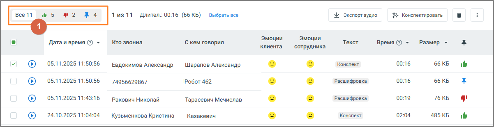

# 4.5.3.2. Избранное

> Трассировка: PDF §4.5.3.2 · сквозные стр. 203 · источники: ч.3 `kb/mango-product-docs/sources/mango-lk-manual/LK_manual_v-121часть-3.pdf` с.1.

Вкладка “Избранное” содержит список записей разговоров, отмеченных метками. Все помеченные записи приводятся в порядке, который соответствует времени определенной записи. Таким образом, последняя по времени запись отображается в верхней части списка. И наоборот – самая ранняя запись отображается последней в списке.

Предусмотрена фильтрация записей по меткам. Для этого следует выбрать соответствующую метку в области фильтров (1). Предусмотрена сортировка по убыванию/возрастанию записей в столбцах: Дата и время, Длительность, Размер. Для сортировки необходимо нажать на

соответствующую пиктограмму или .

Действия по прослушиванию, удалению и экспорту записей и их расшифровок аналогичны описанным действиям в предыдущем подразделе.
