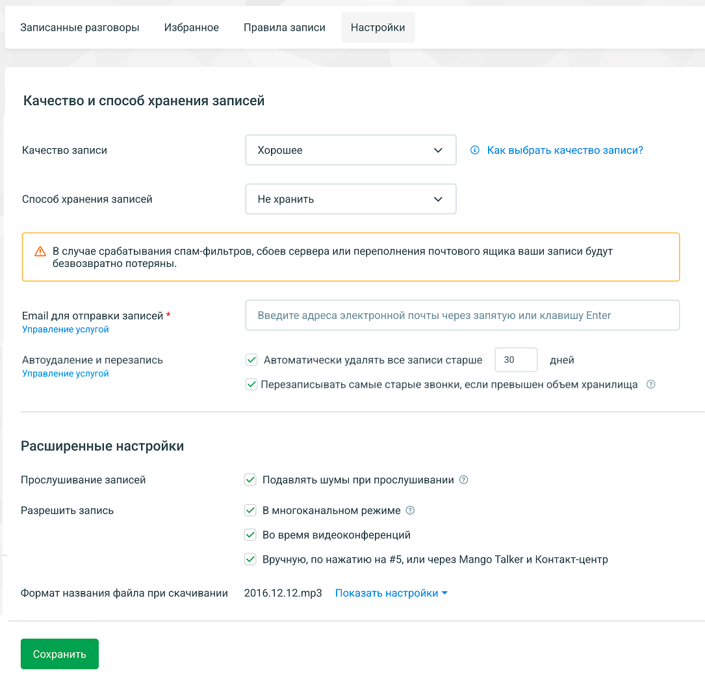
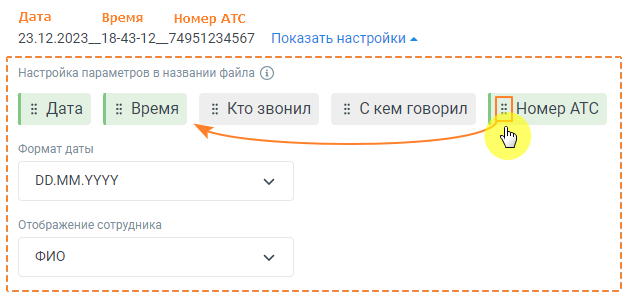

# 4.5.3.4. Настройки

> Трассировка: PDF §4.5.3.4 · сквозные стр. 209-213 · источники: ч.3 `kb/mango-product-docs/sources/mango-lk-manual/LK_manual_v-121часть-3.pdf` с.7-11.

В этой вкладке можно управлять параметрами осуществления, хранения и пересылки, а также изменить формат имени файла записи разговора.

Если в процессе настройки будет обнаружено, что какая-либо услуга в Личном кабинете ВАТС не подключена, и выбранные настройки не могут быть сохранены, система выведет сообщение о необходимости подключения данной услуги. Качество записи Пользователь может выбрать желаемое качество записи из предложенных вариантов: Низкое, Среднее, Хорошее, Высокое. Это определит уровень четкости и детализации записанных разговоров.

Для получения дополнительной информации о каждом варианте качества следует нажать на кнопку "Как выбрать качество записи?", которая перенаправит на инструкцию по выбору подходящего качества записи. Способ хранения Пользователь может выбрать хранилища файлов из нескольких предложенных вариантов: В облачном хранилище — записи разговоров хранятся в том же облачном хранилище (и только в нем), где находятся все сообщения, а также созданные вами звуковые фрагменты. Если свободного места для сохранения новой записи не хватает, то запись не будет сохранена. На внешнем ftp-сервере — доступно только если на ВАТС подключена услуга «Хранение записей разговоров на внешнем ftp-сервере». При выборе этого варианта укажите параметры: • IP-адрес или доменное имя – здесь необходимо ввести имя или IP-адрес FTP- сервера. Поле является обязательным для заполнения. • Порт – порт для ftp-сервера, значение по умолчанию: 22. Поле является обязательным для заполнения. • Учетная запись – имя пользователя для доступа к ftp-серверу. Поле является обязательным для заполнения. • Пароль – пароль доступа к ftp-серверу. Поле является обязательным для заполнения. • Режим работы ftp – допустимые варианты FTP, FTPS, SFTP. • Каталог на ftp-сервере для сохранения записей разговоров. Не обязательно для заполнения. • Шаблон – шаблон каталога на ftp-сервере, в который будут сохраняться файлы с записями разговоров. Не обязательно для заполнения. • Скачивать записи длительностью – выбор длительности записей, которые будут скачиваться с ftp-сервера. Кнопка "Проверить подключение" - по клику на кнопке выполняется проверка доступа к ftp-серверу. Не хранить — в этом режиме записи разговоров не сохраняются. Во встроенном плеере будет доступна только расшифровка разговора.

Внимание Многие пользовательские FTP-сервера не поддерживают кириллицу. В этом случае записи разговоров на сервере будут отображаться в транслитерации. Пример наименования файла на латинице: 2021.03.30__10-33- 20__Poljhzovateljh1(SipCmd)__Poljhzovateljh2(SipCmd)_11322899185_266132 2.mp3 Email для отправки записей Если в данном поле указан адрес(а) электронной почты, записи разговоров и их расшифровки будут отправляться по указанному адресу. Поле обязательно для заполнения при выборе способа хранения записей «Не хранить». Автоудаление и перезапись Автоматически удалять все записи старше: установите период, после которого старые записи будут автоматически удалены (максимум 365 дней). Перезаписывать самые старые звонки, если превышен объем хранилища: при достижении максимального объема хранилища, старые записи будут перезаписаны. При заполнении хранилища система автоматически удаляет самые старые записи, чтобы освободить место для новых. Например, если размер новой записи разговора составляет 6 КБ, система удалит старые записи общим объемом, равным или превышающим 6 КБ. Для автоудаления и перезаписи действуют следующие правила: • "Избранные" записи не подвергаются перезаписи или автоматическому удалению и остаются сохраненными. • Записи разговоров всегда удаляются вместе с текстовыми расшифровками. • Записи, хранящиеся на ftp-серверах, не удаляются. • Изменять настройки автоудаления может пользователь, обладающий правом «Редактировать настройки записей разговоров». При наличии у пользователя только права «Просматривать настройки записей разговоров», настройка автоудаления недоступна. • Процесс автоматического удаления запускается в 21:00 по Московскому времени, а перезапись происходит один раз в 10 минут. Расширенные настройки Ключ шифрования – поле для ввода ключа шифрования доступно при подключенной в ЛК ВАТС соответствующей услуге. Ключ можно ввести вручную или загрузить из файла. При отключении услуги шифрования ранее введенное значение ключа сохраняется. Подавлять шумы при прослушивании — устранение нежелательного шума и треска при прослушивании записей разговоров в Личном кабинете и через Контакт-центр.

Записывать в многоканальном режиме — запись каждого участника разговора на отдельную звуковую дорожку. • При выборе данного режима записи аудиофайлы сохраняются в стерео с раздельными звуковыми каналами для каждого уха. • При отключении данного режима записи сохраняются в двухканальном формате для улучшения качества, а затем автоматически объединяются в единый файл для воспроизведения в обоих наушниках одновременно. Опция предназначена для повышения точности обработки записей системой распознавания речи и доступна только на определенных тарифных планах ВАТС. Во время видеоконференций — функция позволяет активировать запись во время проведения видеоконференций. Вручную, по нажатию на #5, или через Mango Talker и Контакт-центр — функция позволяет сотрудникам включать запись во время разговора, набрав команду #5 на телефоне, а также записывать разговоры в Mango Talker и Контакт-центре. Формат имени файла при скачивании Расшифровка записей разговоров рассылается в формате pdf. Можно установить формат имен файлов для аудиозаписей разговоров. Для изменения формата нажмите кнопку Показать настройки и при помощи переключателей выберите нужный формат файла.

Нажимая кнопки данных пользователь может установить, какие данные будут включены в название файла при скачивании записи разговора: Дата, Время, Кто звонил, С кем говорил, Номер АТС. Активные кнопки выделены цветом. При нажатии на активную кнопку она становится неактивной, и наоборот. Также можно изменять порядок отображения данных в имени

файла, зафиксировав указатель мыши на пиктограмме кнопки и переместив кнопку в нужное место. Дополнительные данные можно выбрать в выпадающих списках: Формат даты, Отображение сотрудника (варианты отображения - ФИО, учетная запись SIP, внутренний номер). Сохраните настройки кнопкой Сохранить. Нажатие на кнопку Отменить внесенные изменения отменяет изменения и возвращает настройки к последнему сохраненному значению.
