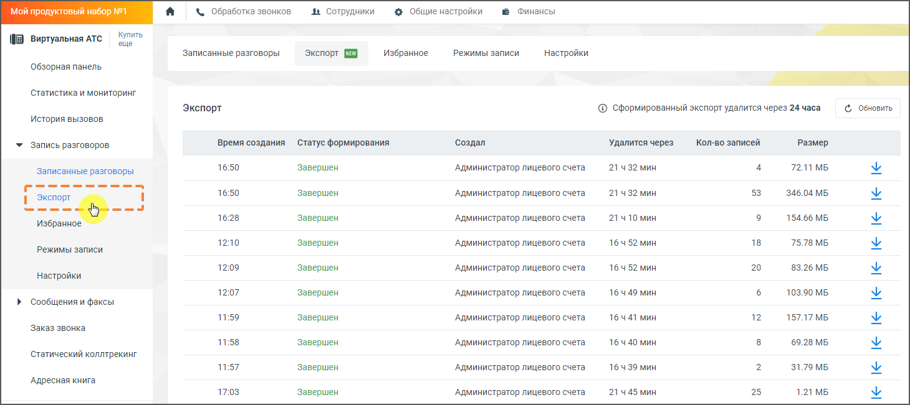

# 4.5.3.5. Экспорт

> Трассировка: PDF §4.5.3.5 · сквозные стр. 213-215 · источники: ч.3 `kb/mango-product-docs/sources/mango-lk-manual/LK_manual_v-121часть-3.pdf` с.11-13.

Вкладка "Экспорт" в Личном Кабинете Виртуальной АТС предоставляет возможность выгрузки записей разговоров для последующего хранения и анализа. Данная функция предназначена для руководителей и супервизоров, которым необходимо регулярно выгружать записи для хранения в собственных системах. Функционал позволяет создавать архивы звонков, скачивать их, а также управлять уже сформированными выгрузками.

Основные функции вкладки "Экспорт": 1. Формирование и выгрузка записей разговоров: Пользователь может выбрать записи разговоров для экспорта, после чего начинается процесс формирования архива. Статус формирования можно отслеживать в реальном времени. 2. Статусы выгрузки: • Создан: Запрос на выгрузку создан. • Отправлен на выгрузку: Выгрузка началась. • Начал формироваться: Архив записей формируется. • Завершен: Архив готов к скачиванию. • Ошибка формирования: Произошла ошибка при создании архива.

3. Ограничения выгрузки: • При отсутствии подключенной услуги "Выгрузка до 50 Гб" выгрузка ограничена 1 Гб записей. • При наличии подключенной услуги возможно выгружать до 10 Гб записей (порядка 200 тысяч разговоров). 4. Как подключить услугу: • Если у вас есть права на подключение услуг в ЛК ВАТС, на вкладке "Экспорт" появится уведомление со ссылкой "Снять ограничение". Нажмите на нее, чтобы открыть окно подключения услуги "Выгрузка до 50 Гб" и следуйте инструкциям для завершения процесса. • Если у вас нет прав на подключение, обратитесь к администратору ЛК с запросом на подключение услуги. 5. Скачивание выгрузки: После завершения формирования архива, пользователю предоставляется возможность скачать его. Сформированные архивы доступны для скачивания в течение 24 часов, после чего они удаляются автоматически. 6. Интеграция с аналитикой: События по выгрузке данных отправляются в систему Яндекс.Метрика для последующего анализа активности пользователей. 7. Обработка данных: • Система не поддерживает выгрузку данных по FTP. • При наличии файлов из FTP, информация о них будет отображена в выгрузке, но сами файлы не будут включены в архив. Как пользоваться вкладкой "Экспорт": 1. Создание выгрузки: • Войдите в Личный Кабинет Виртуальной АТС. • Перейдите во вкладку "Экспорт" в разделе "Запись разговоров". • Нажмите на кнопку создания новой выгрузки и выберите необходимые звонки. 2. Отслеживание статуса выгрузки: На странице "Экспорт" можно отслеживать текущее состояние всех выгрузок. По завершении формирования архива, вы

сможете скачать его, нажав на иконку скачивания . 3. Управление выгрузками: • Вы можете удалять архивы, которые больше не нужны. • Для удаления выгрузки нажмите на соответствующую кнопку рядом с архивом. Обратите внимание, что через 24 часа выгрузка удалится автоматически. 4. Уведомления:

• По завершении экспорта вы получите уведомление на электронную почту с ссылкой на скачивание архива. внимание Пользователи с ограниченными правами доступа не смогут выгружать записи разговоров руководителя компании, если у него активирована опция "Запретить прослушивать записи моих разговоров". Воспользуйтесь данной инструкцией для эффективного управления архивами записей разговоров и минимизации временных затрат на выгрузку данных. совет Права доступа пользовательской роли к вкладке можно настроить в разделе Общие настройки → Безопасность и ограничения → Настройка доступа → Запись разговоров, проставив для роли чекбокс «Выгружать, отправлять записи и расшифровки разговоров по почте».
