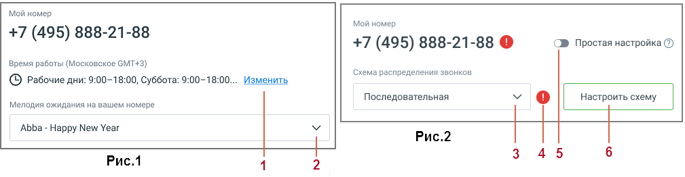

# 1.8.1.3.1. Блок 1. Расписание и схема распределение звонков

> Трассировка: PDF §1.8.1.3.1 · сквозные стр. 18-19 · источники: ч.1 `kb/mango-product-docs/sources/mango-lk-manual/LK_manual_v-121часть-1.pdf` с.18-19.

Рис.1 Схема распределения звонков "Простая настройка". 1. Изменить информацию о времени работы сотрудников; 2. Изменить мелодию ожидания, которую слышит клиент. В схеме «Простая настройка» пользователю доступны: выбор дня и времени приема звонков (без выбора периода), одно звуковое приветствие, переадресаций на сотрудников не более трех. Переадресация на внешний номер недоступна.

По клику на пиктограмму открывается информационное сообщение об ошибке. ВНИМАНИЕ При первом использовании ВАТС в Блоке 1 по умолчанию используется схема распределения звонков "Простая настройка". Рис.2 Схема распределения звонков "Сложная настройка". 3. Изменить схему распределения звонков;

4. Пиктограмма - сообщение о наличии ошибки; 5. Вернуться к схеме «Простая настройка» 6. Настроить схему – по клику на кнопку пользователь переходит в раздел "Голосовое меню и распределение звонков", настройки для входящих линий. В схеме «Сложная настройка» пользователю доступны: настройка расписания приема звонков с множеством блоков или с конкретными периодами в расписании, выбор схемы распределения звонков из списка созданных в разделе "Голосовое меню и распределение звонков" схем, переадресация на внешний номер, два и более переадресаций на одного сотрудника, возможность переключения на «простую настройку».

<!-- изображение на стр. 19: байты не извлечены (PyMuPDF недоступен) -->

внимание Чтобы иметь возможность приёма звонков на ВАТС версии Виртуальный номер, установите настройки переадресации хотя бы на один номер (любой, включая внешние) в схеме распределения звонков.
