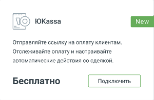
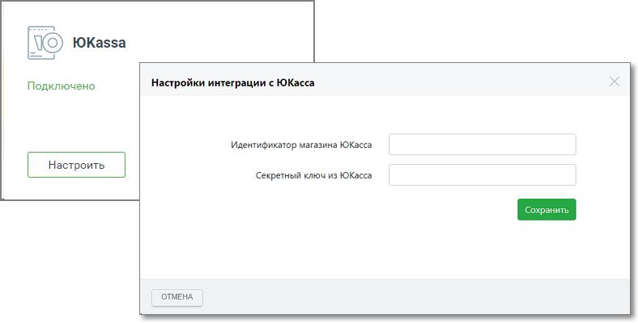

# 4.5.4.1. Юkassa

> Трассировка: PDF §4.5.4.1 · сквозные стр. 217-219 · источники: ч.3 `kb/mango-product-docs/sources/mango-lk-manual/LK_manual_v-121часть-3.pdf` с.15-17.

Подключите сервис Юkassa в Личном кабинете ВАТС и отправляйте клиентам ссылки на оплату ваших товаров и услуг из Контакт-центра MANGO OFFICE.

Для подключения откройте вкладку «Дополнительные сервисы» в разделе Контакт- центр и кликните по кнопке «Подключить» в блоке Юkassa.

внимание Для подключения вам понадобится зарегистрировать аккаунт на https://yookassa.ru.

| После подключения блок Юkassa отобразится на вкладке «Подключенные сервисы». |
| --- |
| Переходите к настройке интеграции – нажмите на кнопку «Настроить». В открывшемся |
| окне введите данные, полученные в Личном кабинете Юkassa: |

• идентификатор магазина Юkassa • секретный ключ из Юkassa Сохраните внесенные изменения кликом по кнопке «Сохранить».

