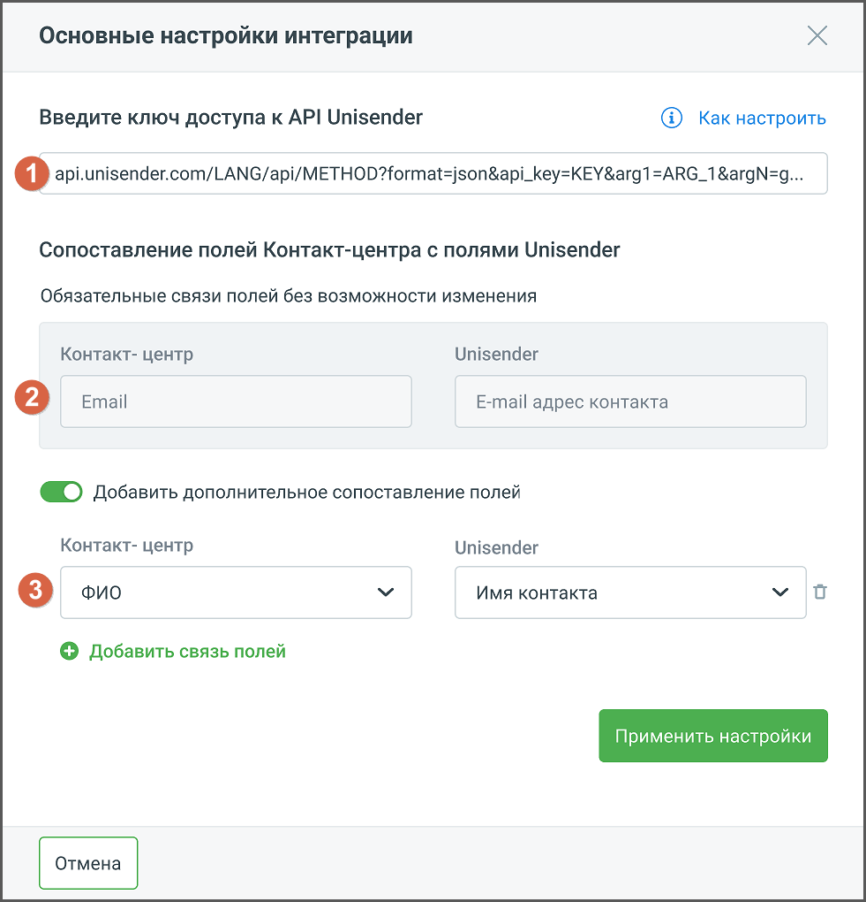

# 4.5.4.2. Unisender

> Трассировка: PDF §4.5.4.2 · сквозные стр. 219-221 · источники: ч.3 `kb/mango-product-docs/sources/mango-lk-manual/LK_manual_v-121часть-3.pdf` с.17-19.

Интеграция Контакт-центра Mango OFFICE с сервисом рассылок Unisender позволяет настроить синхронизацию списков рассылок в Unisender и списков клиентов в Адресной книге, вносить изменения в списки рассылок на стороне Unisender из Контакт-центра. внимание Для настройки интеграции необходимо иметь аккаунт в Unisender, а также роль в Контакт-центре, с правом настраивать интеграции. Кликните по кнопке Подключить в блоке Unisender.

Откроется окно Личного кабинета пользователя ВАТС, вкладка «Дополнительные сервисы». Найдите блок «Unisender» и нажмите кнопку Подключить. В открывшемся окне подтвердите согласие на подключение.

Далее на вкладке «Подключенные сервисы» в блоке «Unisender» необходимо произвести настройки интеграции. Нажмите кнопку Настроить.

Откроется окно основных настроек интеграции:

Окно настроек содержит следующие элементы: 1. Поле для ввода ключа доступа – ключ предоставляется на стороне Unisender. Чтобы получить ключ, пройдите по ссылке API-ключ UniSender и выполните указанные в инструкции действия. 2. Информационный блок обязательных связей – связь между указанными полями Контакт-центра и Unisender будет создана автоматически.

3. Блок дополнительной связи – открывается, если переключатель «Добавить дополнительное сопоставление полей» активен. Здесь можно настроить дополнительные связи между полями Контакт-центра и Unisender. Например, передавать в Unisender имя пользователя, для настройки персонализированного обращения в рассылке. Кнопка «Добавить связь полей» добавляет новую связку «Контакт-центр/Unisender». Сохраните внесенные изменения кликом по кнопке Применить настройки. После интеграции доступны следующие действия: • Отписать клиентов (email) – единичная и массовая отписка • Подписать клиентов (email) – единичная и массовая подписка • Создать новый список рассылки • Удалить список рассылки • Изменить наименование списка рассылки
