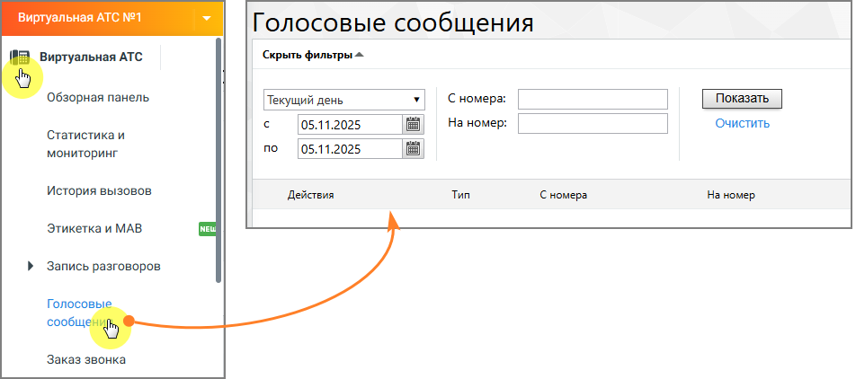

# 4.5.6. Голосовые сообщения

> Трассировка: PDF §4.5.6 · сквозные стр. 222-223 · источники: ч.3 `kb/mango-product-docs/sources/mango-lk-manual/LK_manual_v-121часть-3.pdf` с.20-21.

Инструмент предоставляет доступ к управлению содержимым облачного хранилища.

При необходимости можно указать даты (по умолчанию предлагается период «Текущий день»), нажав значок календаря, или ввести их в формате дд.мм.гггг в соответствующие поля. Кнопка «Очистить» позволяет вернуться к значению по умолчанию. В специальных полях можно указать, сообщения с какого и на какой номер вы хотите просмотреть. Нажмите кнопку «Показать», и в таблице будут отображены сообщения, которые удовлетворяют условиям выборки. Можно задать отображение 25, 50 или 100 элементов на 1 странице.

Для прослушивания сообщения нажмите кнопку слева от сообщения. Откроется окно проигрывателя.

Для загрузки одного сообщения нажмите кнопку слева от него, и появится стандартное диалоговое окно браузера, позволяющее открыть или сохранить файл. Для скачивания нескольких установите галочки в первом столбце таблицы. Вы можете выбирать для загрузки элементы разных типов. Если необходимо скачать все записи, установите галочку в верхней строке (заголовке) таблицы. Если отфильтрованные элементы невозможно отобразить на одной странице, появляется кнопка «Выбрать все ... записи, соответствующие фильтрам». Нажмите кнопку «Скачать», и появится стандартное диалоговое окно браузера, позволяющее открыть или сохранить файл. Загрузите архив ZIP, содержащий выбранные записи разговоров. Удаление записей происходит аналогично скачиванию. После подтверждения запроса выбранные элементы стираются без возможности их восстановления.

