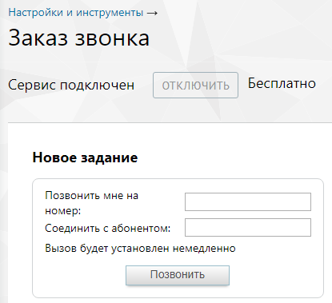

# 4.5.7. Заказ звонка

> Трассировка: PDF §4.5.7 · сквозные стр. 223-224 · источники: ч.3 `kb/mango-product-docs/sources/mango-lk-manual/LK_manual_v-121часть-3.pdf` с.21-22.

Инструмент «Заказ звонка» позволяет организовать вызов через Личный кабинет. Для этого нужно лишь ввести в соответствующие поля свой номер и номер, на который необходимо дозвониться. Виртуальная АТС отправит вызов на первый, и когда звонок будет принят, отправит вызов на второй.

Для ввода имени пользователя SIP требуется заполнить поле «Соединить с абонентом», причем необходимо ввести соответствующий идентификатор, разделив их двоеточием без пробела: sip:ivanov@mangosip.ru. Если введен только собственный номер, то после поднятия трубки можно набрать номер нужного абонента с использованием интерактивного голосового меню. Телефонные номера следует вводить в международном формате без пробелов и других знаков: 74951234567. Если необходимо указать номер офисной АТС, которая поддерживает донабор в тональном режиме, можно указать его вместе с добавочным местным номером, разделив их запятой или точкой без пробела, например, 74951234567,789. Запятая означает паузу перед донабором в 2, а точка — в 5 секунд. Нажмите кнопку «Позвонить». После этого Виртуальная АТС начинает дозвон.

