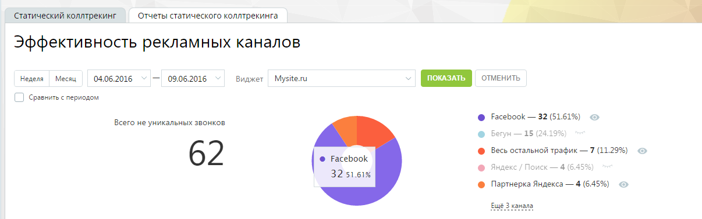
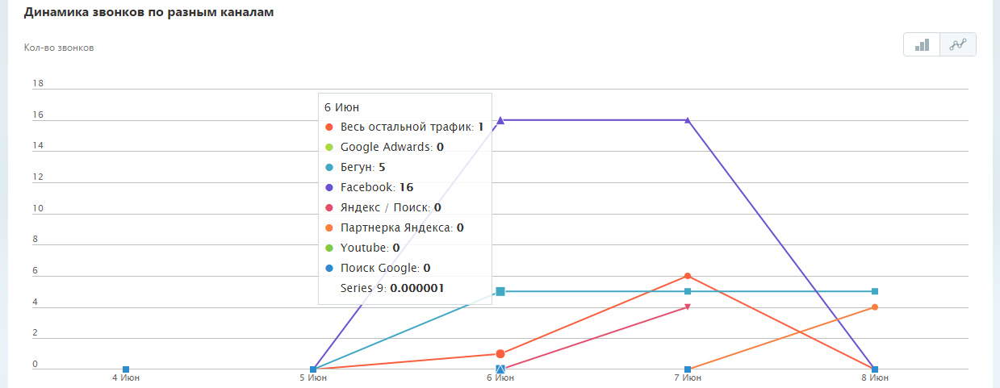
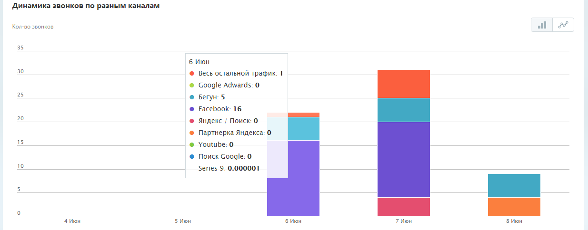
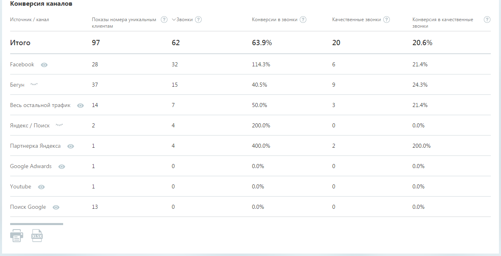
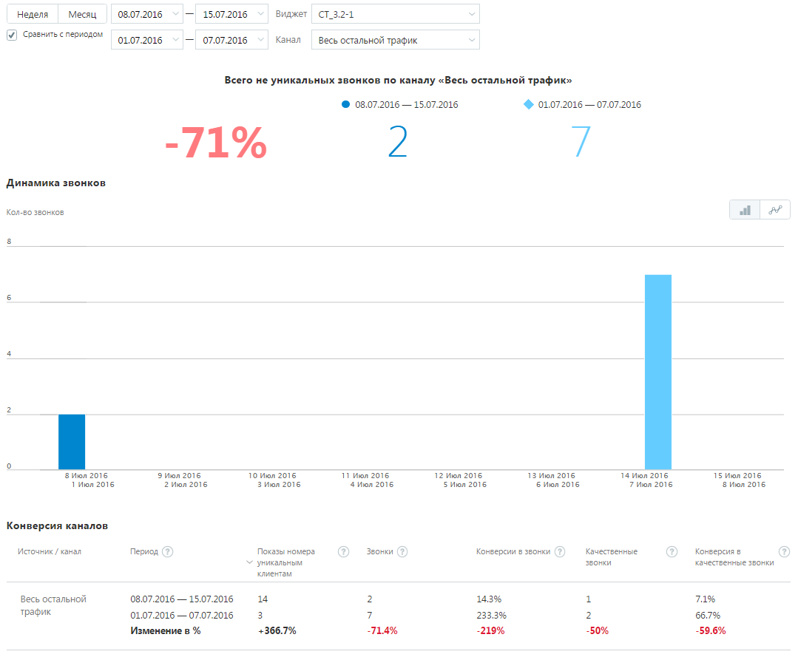

# 4.5.8.1. Отчеты статического коллтрекинга

> Трассировка: PDF §4.5.8.1 · сквозные стр. 224-229 · источники: ч.3 `kb/mango-product-docs/sources/mango-lk-manual/LK_manual_v-121часть-3.pdf` с.22-27.

Отчет статического коллтрекинга отображает статистику по определенным каналам рекламы виджета за выбранный период времени, в том числе, если канал рекламы был удален в течение периода или впоследствии. Для построения отчета воспользуйтесь следующими фильтрами: 1) Выберите период отчета: неделя, месяц, произвольный; 2) Из выпадающего списка выберите название сайта, соответствующее определенному виджету. Отчет формируется после нажатия кнопки Показать. После формирования отчета кнопка скрывается до момента, когда вы измените значение хотя бы одного из фильтров. Отчет состоит из трех частей: 1. общая информация за выбранный период, отображающая: • число не уникальных звонков; • круговую диаграмму по каналам виджета с легендой; 2. блок с календарным графиком показов виджета; 3. таблица с данными о показах каналов рекламы для виджета. Общая информация Примерный вид этой части отчета приведен на рисунке ниже:

Блок «Всего не уникальных звонков» показывает суммарное значение количества всех входящих звонков на телефоны, указанные в настройках каналов рекламы в выбранном виджете, за текущий выбранный период, за исключением звонков от виджета «Обратный звонок». Учитываются следующие типы звонков: • пропущенные входящие; • принятые входящие. Если для какого-либо канала рекламы в течение периода менялся номер с A на B, то в подсчет числа звонков для данного канала рекламы попадает точное число звонков на номер А и B, за периоды, когда они участвовали в настройках канала рекламы. Круговая диаграмма по каналам виджета отображает вклад каждого канала виджета согласно процентному соотношению числа входящих звонков на номер канала рекламы к общему числу всех входящих звонков. При наведении курсора на сектор отображается подсказка, содержащая: • название канала рекламы; • число входящих звонков для данного канала рекламы; • процентный (относительный) вклад канала рекламы в общее значение. В правой части расположена т.н. легенда, которая содержит: • цвет, соответствующий каналу рекламы; • название канала рекламы; • число входящих звонков для данного канала рекламы; • процентный (относительный) вклад канала рекламы; • элемент «глазок», при нажатии на который данные по выбранному каналу рекламы не отображаются в круговой диаграмме и в блоке с календарным графиком. В легенде по умолчанию показывается первые 5 каналов рекламы. При их большем количестве отображается ссылка «Еще N каналов». Для просмотра всего списка щелкните по ссылке и воспользуйтесь вертикальным скроллингом.

Блок «Динамика звонков по разным каналам» Примерный вид блока с календарным графиком показов виджета приведен на рисунке ниже:

Реализовано два вида графика: столбчатый и линейный. Для переключения вида щелкните по соответствующей пиктограмме в правом верхнем углу блока. Переключение между видами графика не является формированием нового отчета Выше приведен пример линейного графика. Примерный вид столбчатого графика приведен на рисунке ниже.

График содержит данные о количестве звонков по каналам рекламы в выбранный период времени для выбранного виджета. При наведении курсора на график показывается всплывающее прозрачное окно с информацией по данному дню для канала рекламы. При щелчке на включенный элемент «глазок» на графике не показываются данные о канале – скрываются столбцы или линия, в зависимости от вида отображения графика.

Блок «Конверсия каналов» Блок содержит таблицу с данными о показах каналов рекламы для виджета. Примерный вид блока приведен на рисунке ниже:

Таблица содержит следующие данные: • Источник / канал - название канала рекламы; • Показы номера уникальным клиентам – количество показов номера телефона по каналу рекламы (параметр S); • Звонки – количество входящих звонков на номер телефона, отображаемый при посещениях по каналу рекламы (параметр N). Включает все входящие принятые и пропущенные звонки; • Конверсии в звонки – S/N, конверсия посещений по каналу рекламы в звонки; • Качественные звонки – количество качественных звонков на номер телефона, отображаемый при посещениях по каналу рекламы (параметр NK). Качественные звонки - входящие звонки, для которых длительность разговора вашего сотрудника с посетителем сайта не менее 30 сек; • Конверсия в качественные звонки – S/NK, конверсия посещений по каналу рекламы в качественные звонки. Данные в таблице (включая шапку таблицы) можно выделить курсором мыши с нажатой левой кнопкой, скопировать в буфер обмена и вставить в произвольный документ. Смена состояния элемента «глазок» не влияет на содержимое таблицы с данными, а также на содержимое, выгружаемое в файл формата Excel, так как данный элемент предусмотрен только для управления отображением канала рекламы в графической части отчета, но не его данными.

При клике на пиктограмму (Печать) производится переход к мастеру печати

документов, встроенному в браузер. При клике на пиктограмму (Сохранить в Excel) формируется и производится выгрузка документа типа Excel. Сравнение с периодом Предусмотрена возможность сравнения количества звонков за два периода по определенным рекламным каналам. Для формирования отчета установите флаг «Сравнить с периодом», укажите периоды и выберите рекламные каналы, данные по которым вы хотите сравнить. Отчет формируется после нажатия кнопки Показать. Вид сформированного отчета приведен на изображении ниже.

При сравнении периодов блок с общей информацией содержит данные о количестве не уникальных звонков по определенным каналам за указанные периоды, а также относительное изменение этого количества. График содержит данные о количестве звонков по каналам рекламы для каждого периода времени. При наведении курсора на график показывается всплывающее прозрачное окно с информацией по данному дню. В блоке «Конверсия каналов» таблица с данными дополнительно включает сведения об относительном изменении каждого параметра в процентном соотношении.

