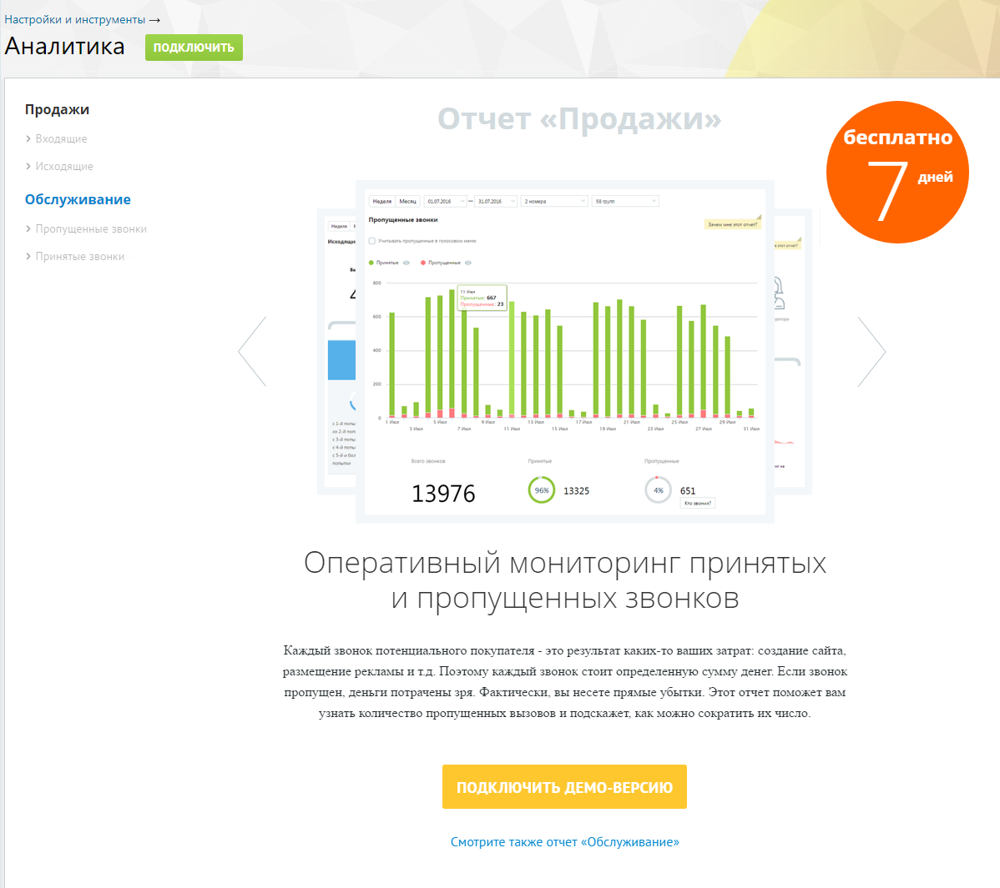
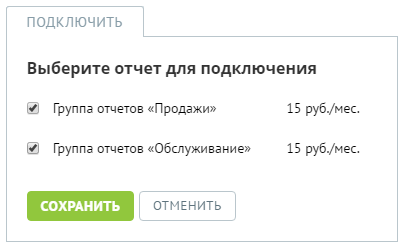
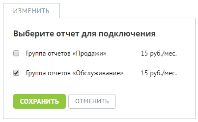
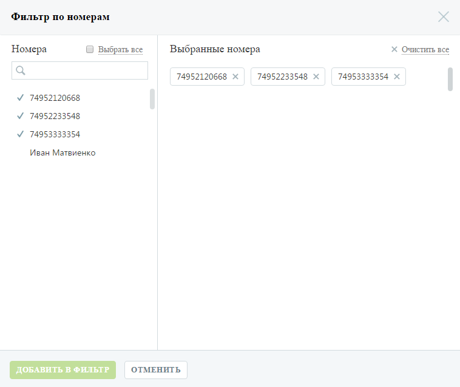
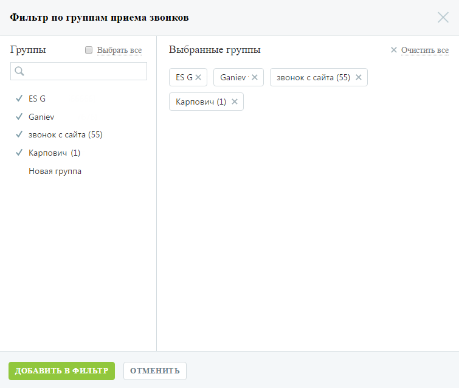

# 4.5.9. Аналитика

> Трассировка: PDF §4.5.9 · сквозные стр. 229-233 · источники: ч.3 `kb/mango-product-docs/sources/mango-lk-manual/LK_manual_v-121часть-3.pdf` с.27-31.

Инструмент «Аналитика» позволяет формировать статистические отчеты, отображающие данные по работе сотрудников ВАТС, а также сведения о звонках в разных разрезах. Инструмент включает две группы отчетов, разделенные на подгруппы в зависимости от типа вызова: • Продажи o Входящие o Исходящие; • Обслуживание o Пропущенные звонки; o Принятые звонки. Подключение отчетов Перейдите на страницу инструмента «Аналитика» и ознакомьтесь с описанием отчетов, входящих в определенную группу.

Вы можете воспользоваться бесплатной демо-версией групп отчетов на протяжении 7 дней с момента подключения. Для этого выберите нужную группу отчетов и нажмите Подключить демо-версию. Для получения полноценного доступа к группам отчетов без ограничений по времени нажмите Подключить и установите флаги напротив наименований групп отчетов, которые вы хотите подключить.

Ознакомьтесь с условиями оплаты и нажмите Сохранить. Если ранее вы уже подключали одну из групп отчетов, на экране будет отображаться кнопка Изменить. Нажмите кнопку, установите флаг напротив наименования не подключенной группы отчетов и нажмите Сохранить. Отключение отчетов Для отключения групп отчетов нажмите Изменить и снимите флаги, установленные напротив наименований групп отчетов, которые вы хотите отключить.

Нажмите Сохранить. Работа с отчетами Для построения любого из отчетов воспользуйтесь следующими фильтрами: 1. Выберите период отчета: неделя, месяц, произвольный; 2. Выберите линию АТС. Для этого в форме выбора линий АТС в списке в левой части окна щелкните по нужным линиям либо установите флаг «Выбрать все» для выбора всех номеров и нажмите Добавить в фильтр;

3. Выберите группу сотрудников. Для этого в форме выбора групп в списке в левой части окна щелкните по нужным группам и нажмите Добавить в фильтр;

Нажмите Показать для формирования отчета. Настройки фильтров "Линии" и "Группы" для всех отчетов группы “Продажи” сохраняются отдельно от отчетов группы “Обслуживание”.

