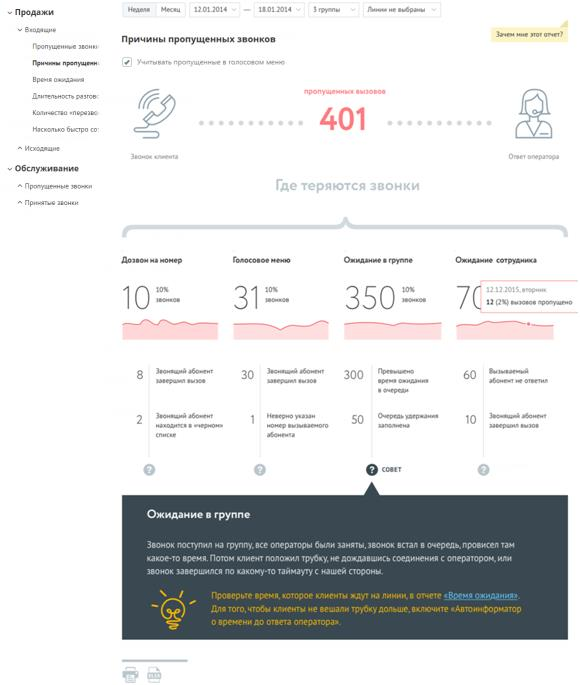
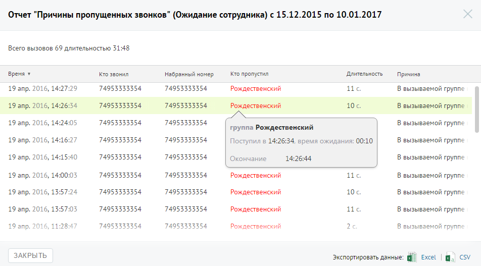

# Отчет «Причины пропущенных звонков»

> Трассировка: PDF §4.5.9.1.1 · сквозные стр. 234-236 · источники: ч.3 `kb/mango-product-docs/sources/mango-lk-manual/LK_manual_v-121часть-3.pdf` с.32-34.

Отчет «Причины пропущенных звонков» отображает информацию о количестве и процентном соотношении внешних входящих пропущенных вызовов за определенный период в зависимости от причины, по которой они были пропущены. Отчет условно состоит из трех частей. В первой части приведено общее количество пропущенных вызовов в соответствии с условиями фильтрации. Во второй части отчета указывается количество и процентное соотношение пропущенных вызовов в зависимости от стадии вызова. Каждая стадия сопровождается мини-графиком, отражающим распределение пропущенных звонков по дням на протяжении выбранного периода. При наведении курсора на линию графика

отображается всплывающее окно, содержащее информацию о дате и количестве пропущенных вызовов в соответствующий день. Третья часть отражает распределение звонков, пропущенных на каждой стадии дозвона, по причинам пропуска вызова. Если флаг «Учитывать звонки, пропущенные в голосовом меню» не установлен, то из подсчета общего числа пропущенных звонков исключаются вызовы, пропущенные в IVR меню.

Для получения детальной информации о пропущенных вызовах предусмотрена дополнительная форма «Кто звонил», содержащая данные из отчета «Истории вызовов» согласно установленным значениям фильтра. Чтобы открыть форму, следует щелкнуть по определенному элементу отчета. Содержание данных зависит от того, по какому элементу было совершено нажатие: • Диаграмма «Пропущенных вызовов» – общее количество вызовов за установленный период ни всех стадиях дозвона; • Диаграмма «Дозвон на номер» – количество пропущенных вызовов на стадии дозвона «Дозвон на номер» за установленный период; • Диаграмма «Голосовое меню» – количество пропущенных вызовов на стадии дозвона «Голосовое меню» за установленный период; • Диаграмма «Ожидание в группе» – количество пропущенных вызовов на стадии дозвона «Ожидание в группе» за установленный период; • Диаграмма «Ожидание сотрудника» – количество пропущенных вызовов на стадии дозвона «Дозвон на номер» за установленный период; • Область с описанием причины завершения вызова. В этом случае отчет будет отображать пропущенные звонки, завершившиеся с выбранной причиной на соответствующей стадии дозвона за установленный период. При щелчке по названию группы в столбце «Кто пропустил» отображается подсказка, содержащая подробную информацию по вызову.

