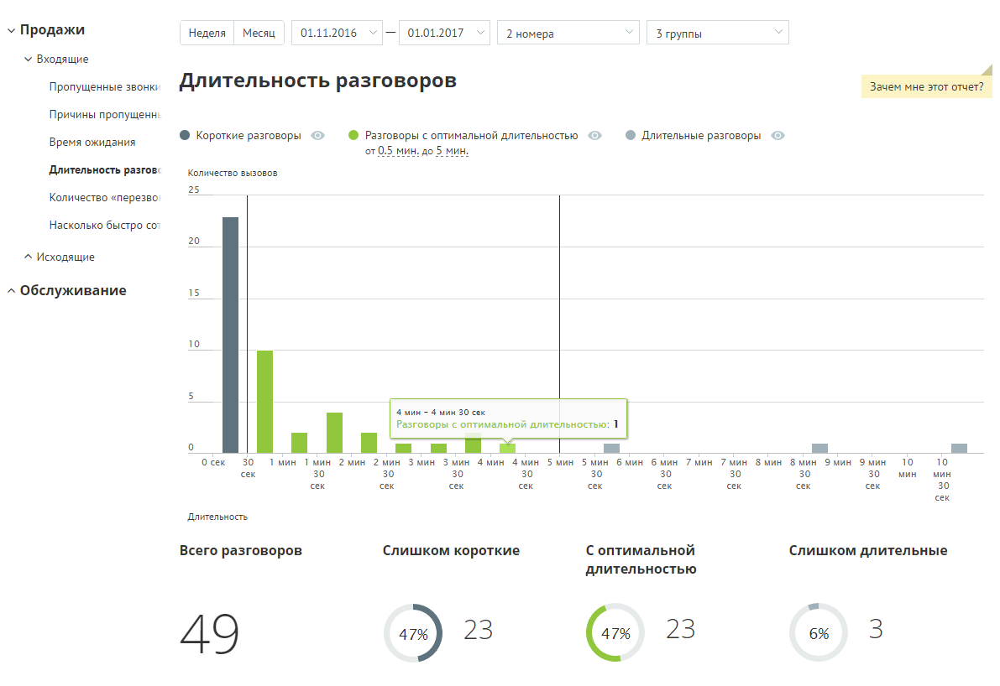
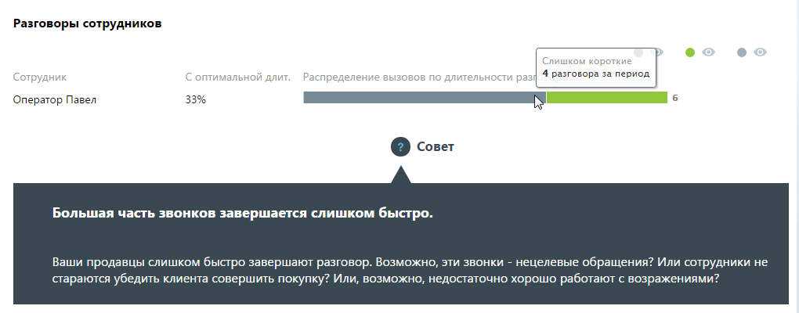
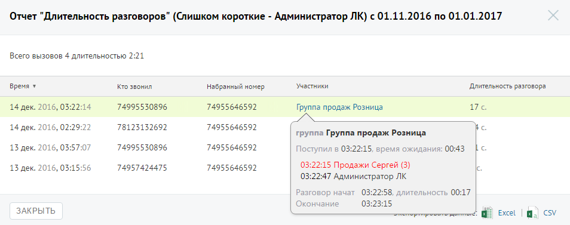

# Отчет «Длительность разговора»

> Трассировка: PDF §4.5.9.1.1 · сквозные стр. 238-240 · источники: ч.3 `kb/mango-product-docs/sources/mango-lk-manual/LK_manual_v-121часть-3.pdf` с.36-38.

Отчет «Длительность разговора» отображает информацию о количестве входящих звонков на группу сотрудников, распределенных в зависимости от длительности разговора за определенный период. По умолчанию оптимальной длительностью разговора с клиентом считается период от 30 секунд до 5 минут. При необходимости измените этот период самостоятельно, установив другое значение в поле «С оптимальной длительностью от… до» после формирования отчета. Пример сформированного отчета приведен на рисунке ниже.

Отчет позволяет увидеть детализацию по звонкам не только для группы в целом, но и для каждого сотрудника группы в отдельности.

Для того, чтобы скрыть/отобразить различные категории вызовов зависимости от указанной длительности, щелкните по кнопке нужного цвета. Для получения детальной информации о вызовах предусмотрена дополнительная форма, содержащая данные из отчета «Истории вызовов» согласно установленным значениям фильтра. Чтобы открыть форму, следует щелкнуть по определенному элементу отчета. Содержание данных зависит от того, по какому элементу было совершено нажатие: • Столбец "Слишком короткие" основной диаграммы – общее количество «слишком коротких» звонков за указанный день; • Диаграмма «Слишком короткие» – общее количество «слишком коротких» звонков за установленный период; • Диаграмма сотрудника, область «слишком коротких» звонков – общее количество принятых выбранным сотрудником «слишком коротких» звонков за установленный период; • Диаграмма сотрудника, область звонков «с оптимальной длительностью» – общее количество принятых выбранным сотрудником звонков «с оптимальной длительностью» за установленный период; • Диаграмма сотрудника, область «слишком длительных» звонков – общее количество принятых выбранным сотрудником «слишком длительных» звонков за установленный период. При щелчке по названию группы в столбце «Участники» отображается подсказка, содержащая подробную информацию по вызову.

