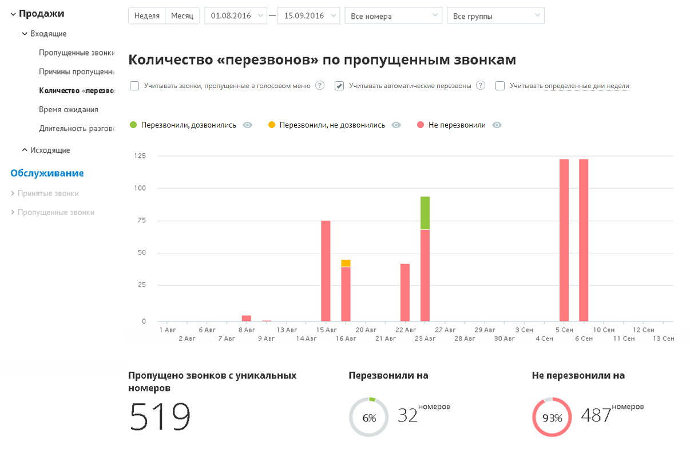
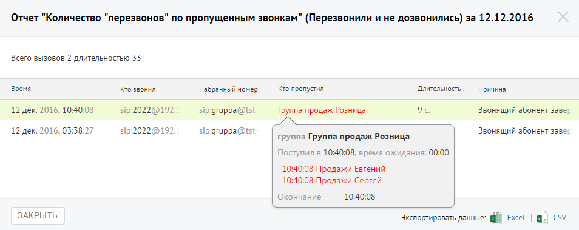

# Отчет «Количество перезвонов по пропущенным звонкам»

> Трассировка: PDF §4.5.9.1.1 · сквозные стр. 240-242 · источники: ч.3 `kb/mango-product-docs/sources/mango-lk-manual/LK_manual_v-121часть-3.pdf` с.38-40.

Отчет «Количество перезвонов по пропущенным звонкам» в графическом виде отображает информацию о перезвонах по пропущенным вызовам. Перезвоном в данном случае считается исходящий внешний звонок на номер, с которого был зафиксирован пропущенный внешний входящий вызов, в течение 24 часов с момента получения пропущенного вызова. Если флаг «Учитывать звонки, пропущенные в голосовом меню» не установлен, то из подсчета общего числа пропущенных звонков исключаются вызовы, пропущенные в IVR меню. При установленном флаге «Учитывать автоматические перезвоны» в отчет дополнительно попадают те вызовы, по которым состоялась попытка автоперезвона, с учетом заданных параметров фильтрации. При установленном флаге «Учитывать определенные дни недели» в отчете учитываются только указанные вами дни недели. По умолчанию данный флаг не устанавливается.

Отчет условно состоит из двух частей. В первой части в виде графика и круговых диаграмм содержится детальная информация с учетом параметров фильтрации: • о количестве пропущенных звонков с уникальных номеров; • о количестве уникальных номеров из числа пропущенных, на который был выполнен перезвон; • о количестве уникальных номеров из числа пропущенных, на который перезвон не был осуществлен. Для того, чтобы скрыть/отобразить вызовы определенного типа, щелкните по соответствующим переключателям над графиком. Во второй части отчета в виде круговых диаграмм приводятся данные о количестве уникальных номеров, на которые были совершены успешные и неуспешные перезвоны соответственно. Для получения детальной информации о пропущенных вызовах предусмотрена дополнительная форма, содержащая данные из отчета «Истории вызовов» согласно установленным значениям фильтра. Чтобы открыть форму, следует щелкнуть по определенному элементу отчета. Содержание данных зависит от того, по какому элементу было совершено нажатие: • Столбец "Перезвонили, не дозвонились" основной диаграммы – пропущенные звонки с уникальных номеров за данный день, по которым

выполнялись попытки перезвона, причем ни одна из этих попыток не была успешной; • Столбец "Не перезвонили " основной диаграммы – пропущенные звонки с уникальных номеров за данный день, по которым не было выполнено перезвонов; • Диаграмма «Не перезвонили на» – пропущенные звонки с уникальных номеров за весь выбранный период, по которым не было выполнено перезвонов; • Диаграмма «Перезвонили и не дозвонились на» – пропущенные звонки с уникальных номеров за весь выбранный период, по которым выполнялись попытки перезвона, причем ни одна из этих попыток не была успешной. При щелчке по названию группы в столбце «Кто пропустил» отображается подсказка, содержащая подробную информацию по вызову.

