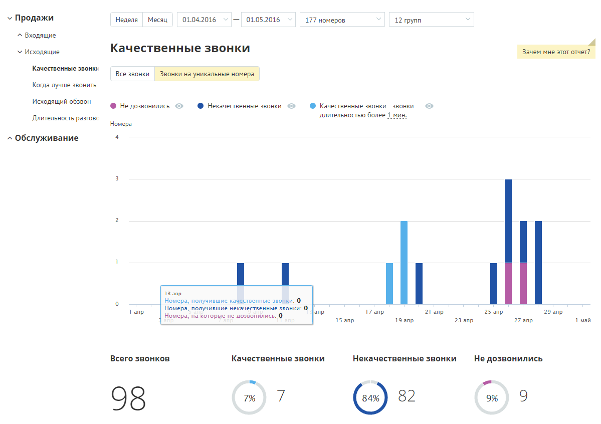
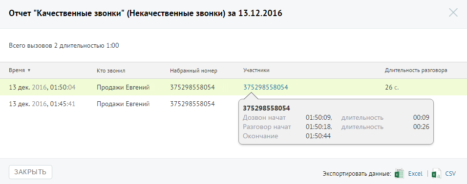

# Отчет «Качественные звонки»

> Трассировка: PDF §4.5.9.1.2 · сквозные стр. 246-248 · источники: ч.3 `kb/mango-product-docs/sources/mango-lk-manual/LK_manual_v-121часть-3.pdf` с.44-46.

Отчет «Качественные звонки» отображает информацию о количестве качественных исходящих звонков в соответствии с заданными параметрами фильтрации. Качественным звонком считается принятый вызов с определенной длительностью. Как правило, длительность разговора должна быть достаточной для того, чтобы продавец смог найти точку контакта с клиентом. По умолчанию качественным вызовом считается принятый вызов с длительностью не менее 30 секунд. Вы можете изменить длительность самостоятельно, установив другое значение в поле «Качественные звонки - звонки длительностью свыше … мин.» после формирования отчета. Если переключатель установлен в положение «Звонки на уникальные номера», то отчет содержит только информацию об исходящих внешних вызовах, совершенных за выбранный календарный период через выбранные линии сотрудниками, входящими в состав выбранных групп на уникальные номера. Пример сформированного отчета приведен на рисунке ниже. Отчет содержит детальную информацию о количестве качественных вызовов в соответствии с заданными параметрами фильтрации, а именно: • графическое отображение динамики изменений количества вызовов определенных типов в течение выбранного периода; • круговые диаграммы с информацией о процентном соотношении количества вызовов определенного типа от общего количества звонков. Для того, чтобы скрыть/отобразить различные категории вызовов зависимости от указанной длительности, щелкните по пиктограмме в виде глаза нужного цвета. Если вы хотите узнать, кем были совершены некачественные или неудавшиеся звонки, нажмите на кнопку «Кто звонил» под соответствующей диаграммой, чтобы перейти к странице отчета «История вызовов».

Отчет позволяет увидеть детализацию по звонкам не только для групп в целом, но и для каждого сотрудника группы, совершавшего вызовы, в отдельности.

Для того, чтобы скрыть/отобразить различные категории вызовов зависимости от указанной длительности, щелкните по пиктограмме в виде глаза нужного цвета. Для получения детальной информации о вызовах предусмотрена дополнительная форма, содержащая данные из отчета «Истории вызовов» согласно установленным значениям фильтра. Чтобы открыть форму, следует щелкнуть по определенному элементу отчета. Содержание данных зависит от того, по какому элементу было совершено нажатие: • Столбец «Качественные звонки» основной диаграммы – общее количество исходящих «качественных» звонков за указанный день;

• Столбец «Некачественные звонки» основной диаграммы – общее количество исходящих «некачественных» звонков за указанный день; • Столбец «Не дозвонились» основной диаграммы – общее количество исходящих звонков со статусом «Не дозвонились» за указанный день; • Диаграмма сотрудника, область «Качественных» звонков – общее количество исходящих “качественных” звонков, совершенных выбранным сотрудником за установленный период; • Диаграмма сотрудника, область «Некачественных» звонков – общее количество исходящих “некачественных” звонков, совершенных выбранным сотрудником за установленный период; • Диаграмма сотрудника, область звонков «Не дозвонились» – общее количество исходящих звонков со статусом «Не дозвонились», совершенных выбранным сотрудником за установленный период; При щелчке по названию группы в столбце «Участники» и «На номер» (для истории вызовов для успешных и неуспешных звонков соответственно) отображается подсказка, содержащая подробную информацию по вызову.

