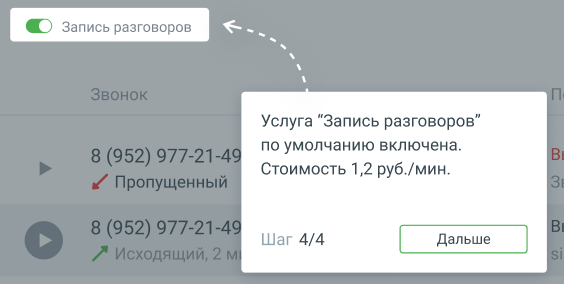

# 1.8.1.3.3. Блок 3. Звонки

> Трассировка: PDF §1.8.1.3.3 · сквозные стр. 20-21 · источники: ч.1 `kb/mango-product-docs/sources/mango-lk-manual/LK_manual_v-121часть-1.pdf` с.20-21.

Блок «Звонки» содержит следующие элементы: • Время - дата и время (Московское) звонка;

• Статус записи разговора – записанный разговор отмечен иконкой ;

• Звонок – номер телефона, тип вызова (входящий , исходящий ,

пропущенный , не дозвонились ), длительность вызова; • Пользователь – пользователи или список пользователей, которые совершили/приняли вызов; • Все звонки – переход в раздел История вызовов; • Фильтр Пропущенные – по клику на кнопку отображаются звонки с типом

Пропущенный , пропущенные с момента последнего просмотра данной страницы администратором. • Тумблер Запись разговоров – отвечает за включение/отключение записи разговоров.

Нажатие кнопки Дальше завершает знакомство с интерфейсом Главной страницы ВАТС (сценарий МИКРО).

Если модуль Онбординг не завершен, в любой момент работы с Личным кабинетом

<!-- изображение на стр. 21: байты не извлечены (PyMuPDF недоступен) -->

пользователь может нажать на иконку в шапке ЛК и продолжить обучение.
