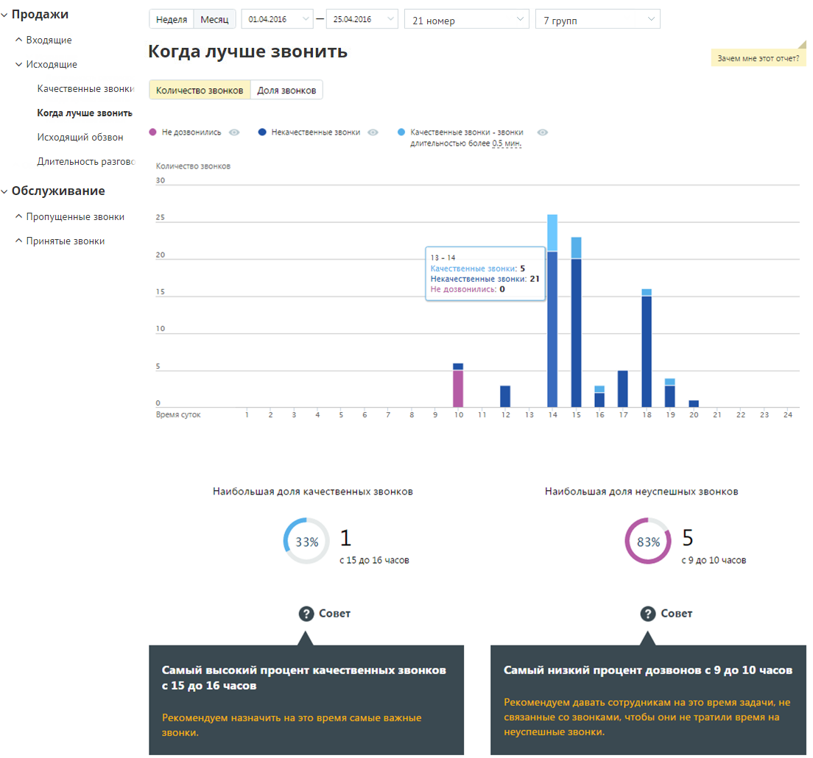
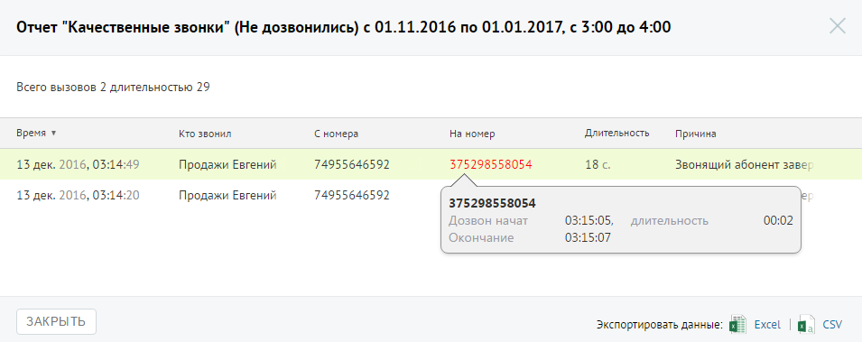

# Отчет «В какое время лучше совершать звонки»

> Трассировка: PDF §4.5.9.1.2 · сквозные стр. 248-250 · источники: ч.3 `kb/mango-product-docs/sources/mango-lk-manual/LK_manual_v-121часть-3.pdf` с.46-48.

Отчет «В какое время лучше совершать звонки» отображает информацию о количестве исходящих звонков в течение дня, распределенных в зависимости от качества обслуживания. Качественным вызовом считается принятый вызов с определенной длительностью. Пример сформированного отчета приведен на рисунке ниже. Отчет позволяет получить детальную информацию о количестве вызовов за день, а именно: • отображение динамики изменений количества вызовов определенных типов в течение дня; • информацию о времени, на которое приходится наибольшая доля качественных и неуспешных звонков соответственно.

В случае, если переключатель "Количество звонков/Доля звонков» установлен в значение "Количество звонков", то на странице отчета отображается диаграмма, содержащая абсолютные значения количества звонков, совершенных в течение того или иного часа. В случае, если переключатель установлен в значение "Доля звонков", на странице отчета отображается нормированная диаграмма, содержащая распределение долей звонков по категориям за тот или иной час. Для того, чтобы скрыть/отобразить различные категории вызовов зависимости от указанной длительности, щелкните по кнопке нужного цвета. При изменении длительности звонка, считающегося качественным, отчет будет сформирован заново автоматически. Для получения детальной информации о вызовах предусмотрена дополнительная форма, содержащая данные из отчета «Истории вызовов» согласно установленным значениям фильтра.

Чтобы открыть форму, следует щелкнуть по определенному элементу отчета. Содержание данных зависит от того, по какому элементу было совершено нажатие: • Столбец «Некачественные звонки» основной диаграммы – общее количество исходящих «некачественных» звонков за выбранный интервал; • Столбец «Не дозвонились» основной диаграммы – общее количество исходящих звонков со статусом «Не дозвонились» за выбранный интервал; При щелчке по названию группы в столбце «Участники» и «На номер» (для истории вызовов для успешных и неуспешных звонков соответственно) отображается подсказка, содержащая подробную информацию по вызову.

