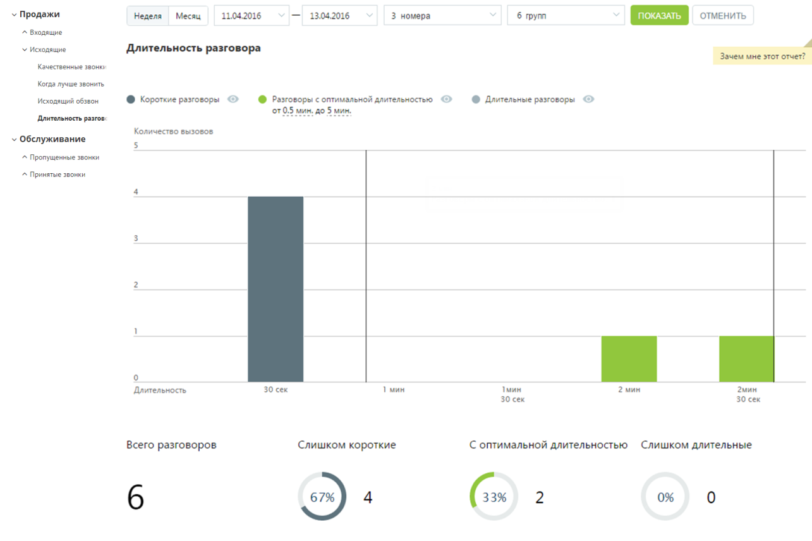
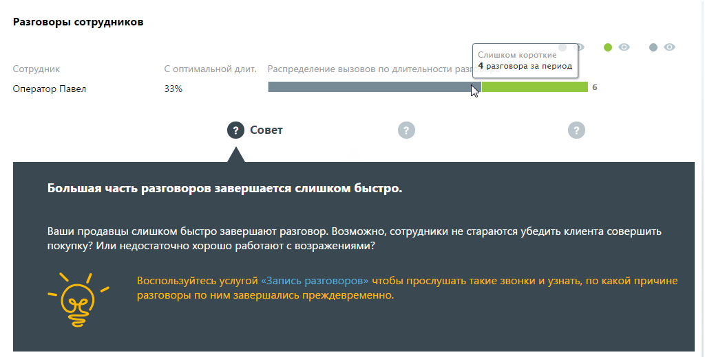
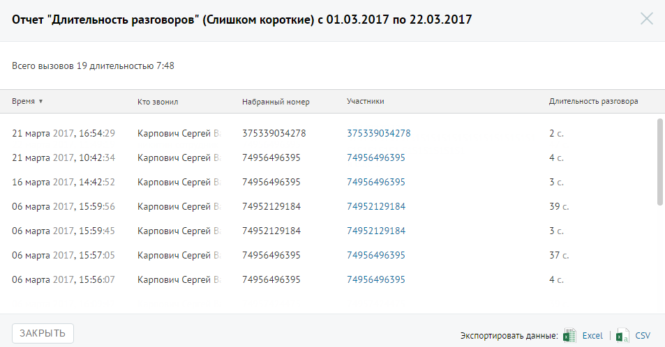

# Отчет «Длительность разговора»

> Трассировка: PDF §4.5.9.1.2 · сквозные стр. 253-255 · источники: ч.3 `kb/mango-product-docs/sources/mango-lk-manual/LK_manual_v-121часть-3.pdf` с.51-53.

Отчет «Длительность разговора» отображает информацию о количестве исходящих вызовов, распределенных в зависимости от длительности разговора за определенный период. По умолчанию оптимальной длительностью разговора считается период от 30 секунд до 5 минут. Для изменения периода установите другое значение в поле «С оптимальной длительностью от… до» после формирования отчета.

Отчет позволяет увидеть детализацию по звонкам не только для группы в целом, но и для каждого сотрудника группы в отдельности.

Для того, чтобы скрыть/отобразить различные категории вызовов зависимости от указанной длительности, щелкните по кнопке нужного цвета. Для получения детальной информации о вызовах предусмотрена дополнительная форма, содержащая данные из отчета «Истории вызовов» согласно установленным значениям фильтра. Чтобы открыть форму, следует щелкнуть по определенному элементу отчета. Содержание данных зависит от того, по какому элементу было совершено нажатие: • Столбец "Короткие разговоры" основной диаграммы – общее количество исходящих звонков категории «Короткие разговоры» определенной длительности за установленный период; • Столбец "Длительные разговоры" основной диаграммы – общее количество исходящих звонков категории «Длительные разговоры» определенной длительности за установленный период; • Диаграмма «Слишком короткие» – общее количество исходящих звонков категории «Слишком короткие» за установленный период; • Диаграмма «Слишком длительные» – общее количество исходящих звонков категории «Слишком длительные» за установленный период; • Диаграмма сотрудника, область «слишком коротких» звонков – общее количество исходящих звонков категории «Слишком короткие», совершенных выбранным сотрудником за установленный период; • Диаграмма сотрудника, область звонков «с оптимальной длительностью» – общее количество исходящих звонков категории «С оптимальной

длительностью», совершенных выбранным сотрудником за установленный период; • Диаграмма сотрудника, область «слишком длительных звонков» – общее количество исходящих звонков категории «Слишком длительные», совершенных выбранным сотрудником за установленный период; Пример отчета Истории вызовов приведен на рисунке ниже.

