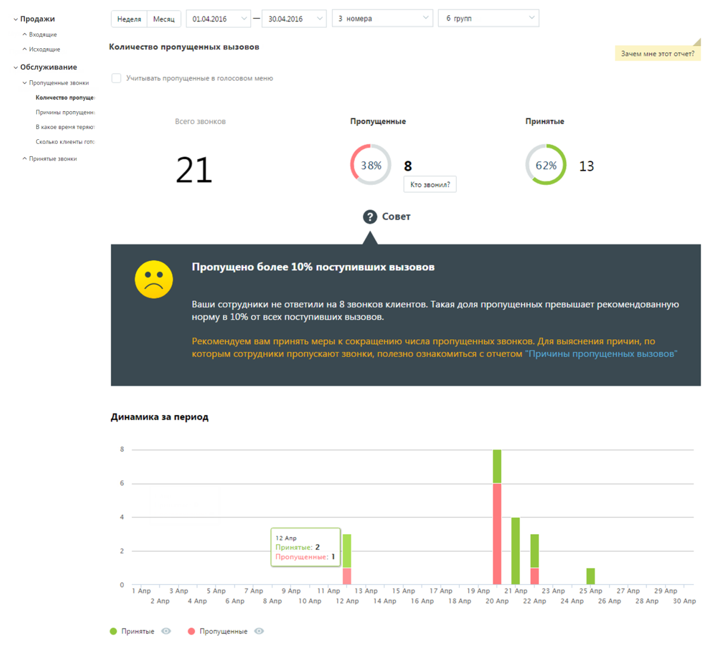
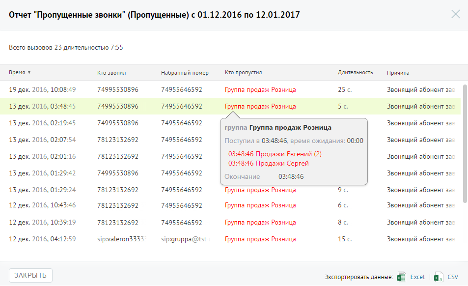

# Отчет «Количество пропущенных вызовов»

> Трассировка: PDF §4.5.9.2.1 · сквозные стр. 255-257 · источники: ч.3 `kb/mango-product-docs/sources/mango-lk-manual/LK_manual_v-121часть-3.pdf` с.53-55.

Отчет «Количество пропущенных вызовов» отображает информацию о количестве и процентном соотношении принятых и пропущенных вызовов за определенный период. Если флаг «Учитывать звонки, пропущенные в голосовом меню» не установлен, то из подсчета общего числа пропущенных звонков исключаются вызовы, пропущенные в IVR меню. Данные о количестве и процентном соотношении звонков приведены в верхней части окна в виде инфографики, включающей три диаграммы. Для получения детальной информации о пропущенных вызовах нажмите ссылку «Кто звонил». В результате будет выполнен переход на страницу отчета «Пропущенные звонки». Динамические изменения количества звонков за указанный период приведены в виде графика в нижней части отчета. Для получения более детальной информации о количестве вызовов в течение дня наведите курсор на любой столбец графика.

Для того, чтобы скрыть/отобразить принятые или пропущенные вызовы на графике, щелкните по кнопкам Принятые и Пропущенные соответственно. Для получения детальной информации о пропущенных вызовах предусмотрена дополнительная форма «Кто звонил», содержащая данные из отчета «Истории вызовов» согласно установленным значениям фильтра. Чтобы открыть форму, следует щелкнуть по определенному элементу отчета. Содержание данных зависит от того, по какому элементу было совершено нажатие: • Диаграмма «Всего звонков» - общее количество вызовов за установленный период; • Диаграмма «Принятые» - общее количество принятых вызовов за установленный период; • Диаграмма «Пропущенные» - общее количество пропущенных вызовов за установленный период,

• Столбец диаграммы отчета (принятые вызовы) – количество принятых вызовов за указанный день; • Столбец диаграммы отчета (пропущенные вызовы) – количество пропущенных вызовов за указанный день При щелчке по названию группы в столбце «Участники» или «Кто пропустил» отображается подсказка, содержащая подробную информацию по вызову.

