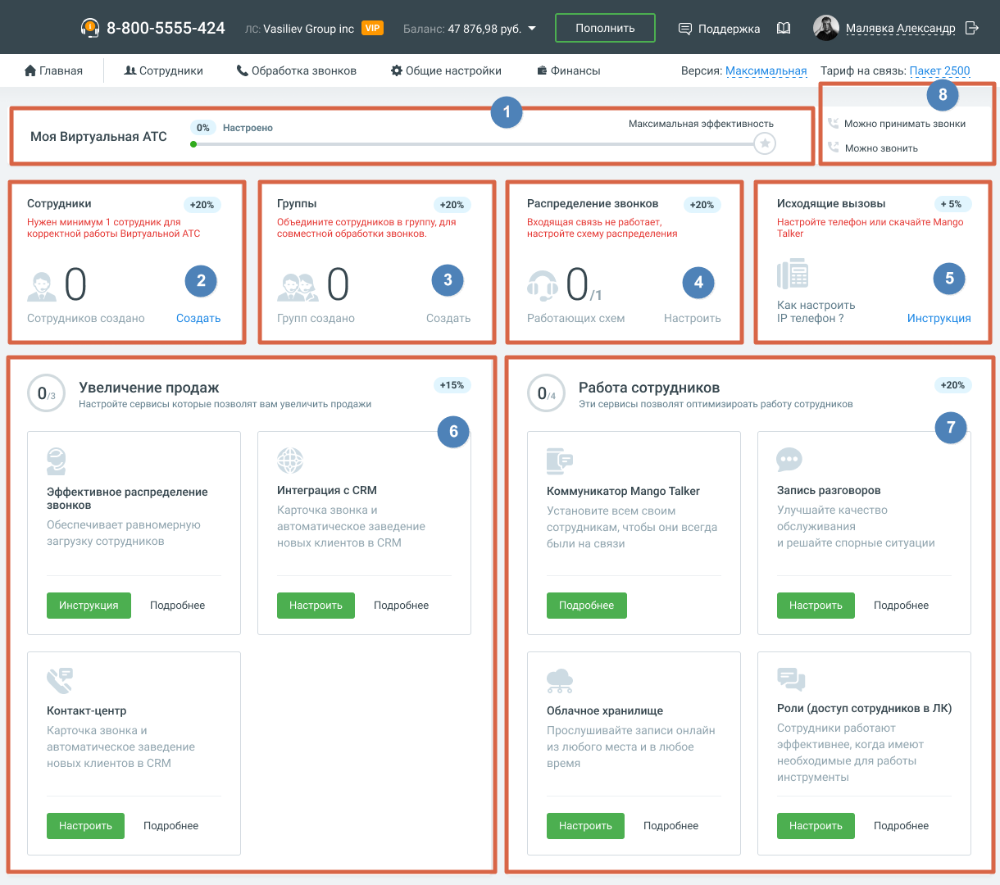

# 1.8.2. Сценарий МАЛЫЙ + СРЕДНИЙ

> Трассировка: PDF §1.8.2 · сквозные стр. 21-22 · источники: ч.1 `kb/mango-product-docs/sources/mango-lk-manual/LK_manual_v-121часть-1.pdf` с.21-22.

Сценарий Малый + Средний по умолчанию предназначен для пользователей тарифных планов ВАТС «Базовый» или «Расширенный». Следуя сценарию, пользователь настроит отображение данных на главной панели ВАТС.

