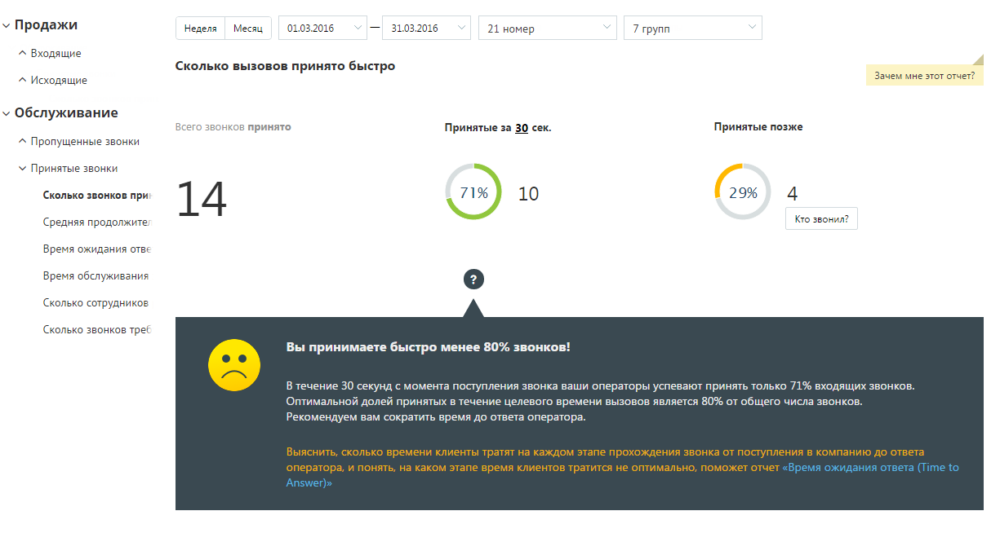
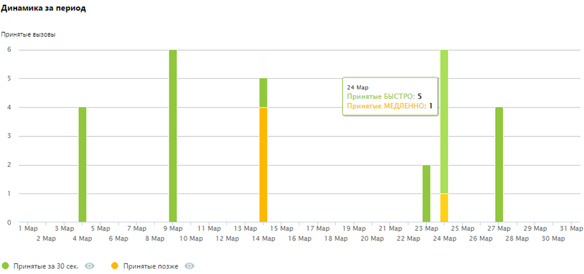
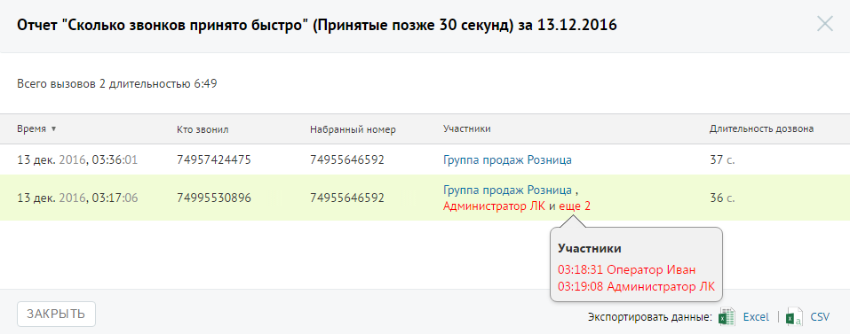

# Отчет «Сколько звонков принято быстро»

> Трассировка: PDF §4.5.9.2.2 · сквозные стр. 262-264 · источники: ч.3 `kb/mango-product-docs/sources/mango-lk-manual/LK_manual_v-121часть-3.pdf` с.60-62.

Отчет «Сколько звонков принято быстро» содержит информацию о количестве входящих вызовов, принятых «быстро», то есть за определенное время. По умолчанию быстро принятым вызовом считается вызов, принятый в течение 30 секунд. При необходимости измените это время самостоятельно, установив другое значение в поле «Принятые за n секунд» после формирования отчета. В верхней части отчета приведены данные о принятых звонках в виде инфографики.

В нижней части окна отображается детальная информация по заданному периоду. Щелкните по кнопкам Принятые за n сек и Принятые позже для того, чтобы скрыть/отобразить соответствующие показатели на графике.

Для получения детальной информации о пропущенных вызовах предусмотрена дополнительная форма «Кто звонил», содержащая данные из отчета «Истории вызовов» согласно установленным значениям фильтра. Чтобы открыть форму, следует щелкнуть по определенному элементу отчета. Содержание данных зависит от того, по какому элементу было совершено нажатие:

|  | звонков за |
| --- | --- |
| установленный период, время ожидания по которым превышает |  |
| заданное пользователем значение пороговой длительности |  |

|  | звонков |
| --- | --- |
| за данный день, время ожидания по которым превышает заданное |  |
| пользователем значение пороговой длительности |  |

При щелчке по названию группы в столбце «Кто пропустил» отображается подсказка, содержащая подробную информацию по вызову.

