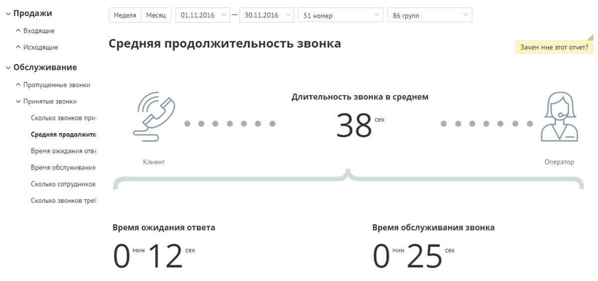
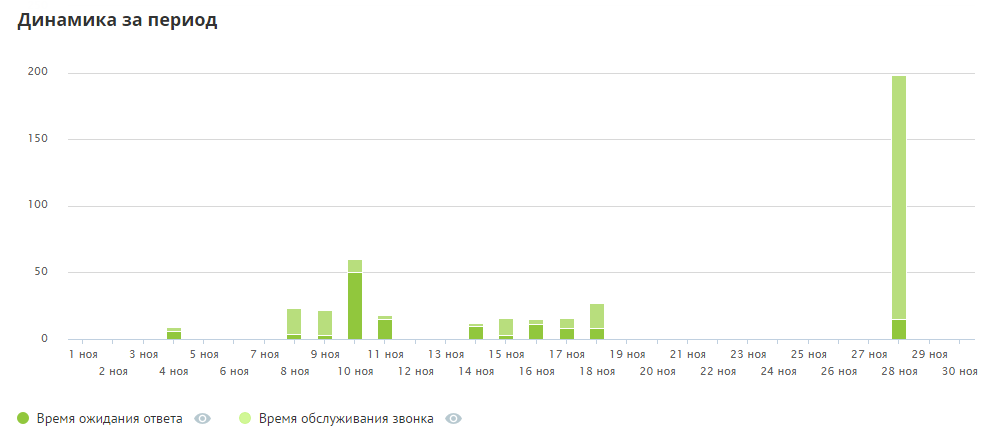
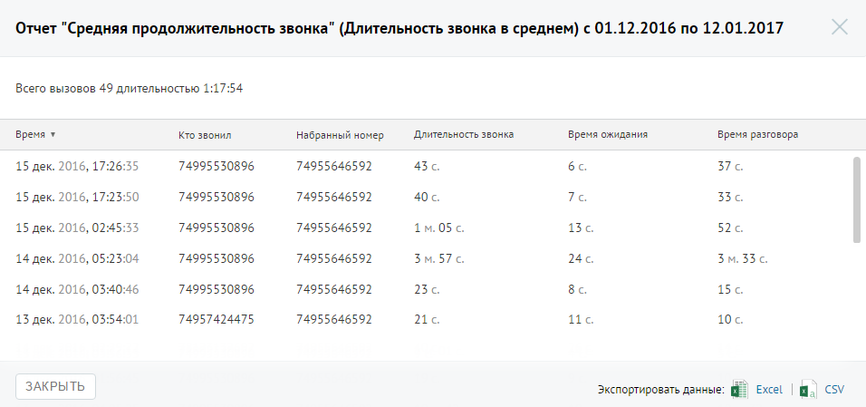

# Отчет «Средняя продолжительность»

> Трассировка: PDF §4.5.9.2.2 · сквозные стр. 264-265 · источники: ч.3 `kb/mango-product-docs/sources/mango-lk-manual/LK_manual_v-121часть-3.pdf` с.62-63.

Отчет «Средняя продолжительность звонка» в графическом виде отображает информацию о средней продолжительности звонка. Показатель имеет две составляющие — среднее время ожидания ответа и среднее время обслуживания вызова. В верхней части отчета приведены данные о средней продолжительности вызовов в виде инфографики. В зависимости от значения показателя «Время ожидания ответа» формируется текст совета.

В нижней части окна отображается детальная информация по заданному периоду.

Для получения детальной информации о вызовах предусмотрена дополнительная форма «Кто звонил», содержащая данные из отчета «Истории вызовов» согласно установленным значениям фильтра. Чтобы открыть форму, следует щелкнуть по определенному элементу отчета. Содержание данных зависит от того, по какому элементу было совершено нажатие. В данном случае дополнительный отчет формируется при щелчке по диаграмме «Длительность звонка в среднем».

