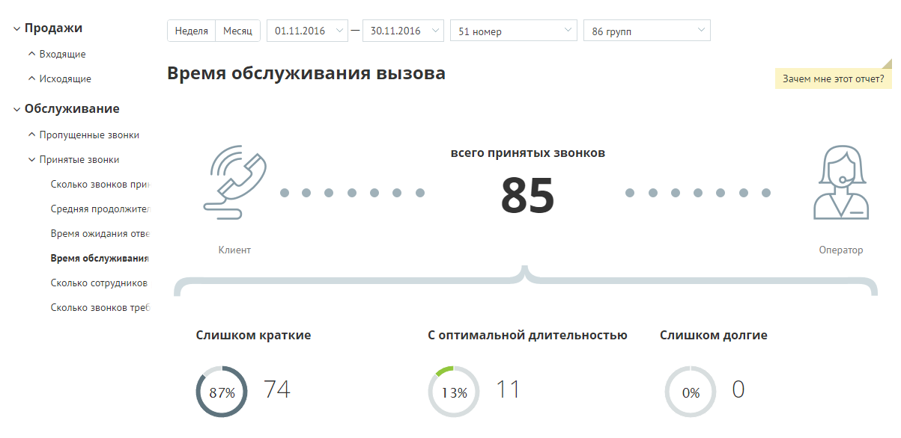
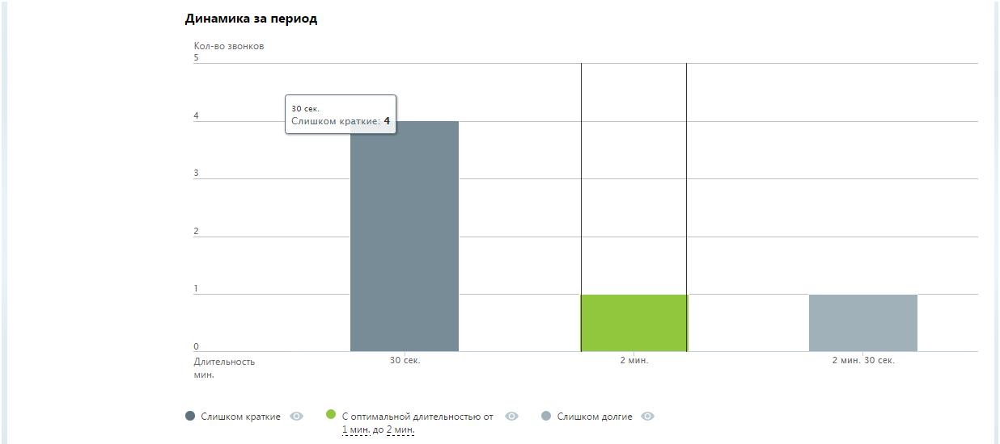
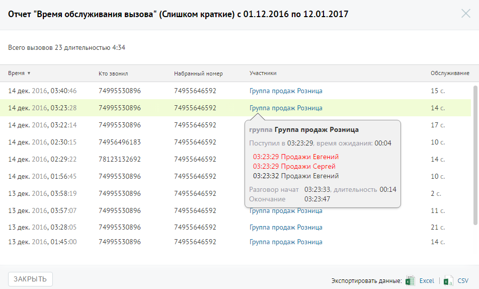

# Отчет «Время обслуживания вызова»

> Трассировка: PDF §4.5.9.2.2 · сквозные стр. 267-269 · источники: ч.3 `kb/mango-product-docs/sources/mango-lk-manual/LK_manual_v-121часть-3.pdf` с.65-67.

Отчет «Время обслуживания вызова» содержит информацию о количестве входящих вызовов, обслуженных за определенный период. По умолчанию оптимальной длительностью обслуживания вызова считается период от 30 секунд до 2 минут. При необходимости измените этот период самостоятельно, установив другое значение в поле «С оптимальной длительностью от… до» после формирования отчета. В верхней части отчета приведены данные о принятых звонках в виде инфографики.

В нижней части окна отображается детальная информация о количестве вызовов, относящихся к определенному периоду.

Щелкните по кнопкам Слишком короткие, С оптимальной длительностью и Слишком долгие для того, чтобы скрыть/отобразить соответствующие показатели на графике. Для получения детальной информации о вызовах предусмотрена дополнительная форма, содержащая данные из отчета «Истории вызовов» согласно установленным значениям фильтра. Чтобы открыть форму, следует щелкнуть по определенному элементу отчета. Содержание данных зависит от того, по какому элементу было совершено нажатие:

|  | принятые звонки за установленный |
| --- | --- |
| период, длительность разговора по которым меньше установленного |  |
| нижнего порога оптимальной длительности |  |

|  | принятые звонки за установленный |
| --- | --- |
| период, длительность разговора по которым больше установленного |  |
| верхнего порога оптимальной длительности. |  |

При щелчке по названию группы в столбце «Участники» отображается подсказка, содержащая подробную информацию по вызову.

