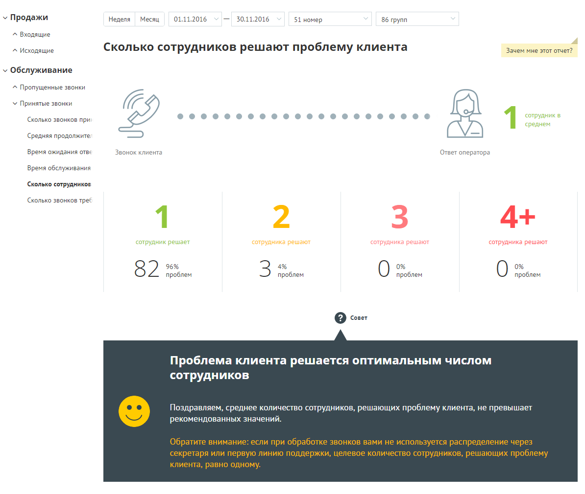
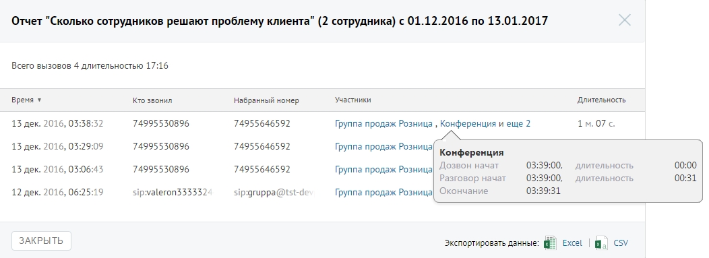

# Отчет «Сколько сотрудников решают проблему клиента»

> Трассировка: PDF §4.5.9.2.2 · сквозные стр. 269-270 · источники: ч.3 `kb/mango-product-docs/sources/mango-lk-manual/LK_manual_v-121часть-3.pdf` с.67-68.

Отчет «Сколько сотрудников решают проблему клиента» отображает информацию о количестве сотрудников, участвующих в решении вопроса клиента.

По умолчанию оптимальным количеством сотрудников, участвующих в разговоре, является количество от одного до двух. Для получения детальной информации о вызовах предусмотрена дополнительная форма «Кто звонил», содержащая данные из отчета «Истории вызовов» согласно установленным значениям фильтра. Чтобы открыть форму, следует щелкнуть по определенному элементу отчета. Содержание данных зависит от того, по какому элементу было совершено нажатие. В данном случае дополнительный отчет формируется при щелчке по диаграмме с определенным количеством сотрудников, участвующих в разговоре. При щелчке по названию группы в столбце «Кто пропустил» отображается подсказка, содержащая подробную информацию по вызову.

