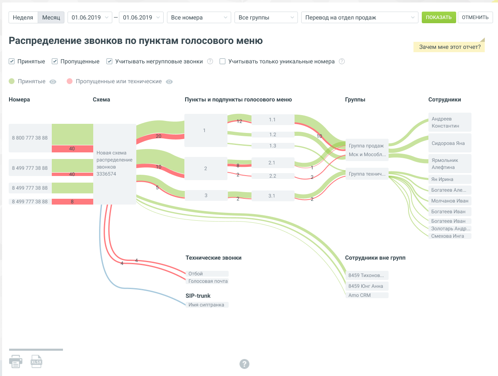

# Отчет «Распределение звонков по пунктам голосового меню»

> Трассировка: PDF §4.5.9.2.2 · сквозные стр. 272-275 · источники: ч.3 `kb/mango-product-docs/sources/mango-lk-manual/LK_manual_v-121часть-3.pdf` с.70-73.

Отчет показывает информацию о пути внешнего входящего вызова на номера АТС, участвующие в схеме распределения звонка.

На отчете отображен путь поступившего внешнего входящего звонка от номера АТС, на который поступил звонок, до конечного этапа обработки звонка. Чтобы сформировать отчет, установите фильтры периода, номера и группы согласно инструкции подраздела «Работа с отчетами» раздела Аналитика. Далее воспользуйтесь дополнительными элементами фильтрации: Схема распределения звонка – содержит список активных и не активных существующих схем распределения звонков на ВАТС (кроме удаленных схем и схем из кампаний исходящего обзвона). Доступен выбор нескольких вариантов. Чекбокс «Принятые» - если выбран, все этапы отчета показывают суммарное количество принятых звонков, по которым произошло соединение с сотрудником и состоялся разговор, включая: • звонки на удержании сотрудником или внешним абонентом; • перехваченный звонок (из Контакт-центра, API ВАТС, c помощью комбинации «*8*» и внутреннего номера сотрудника); • переведённый звонок; • донабор по внутреннему номеру группы или сотрудника; Чекбокс «Пропущенные» - если выбран, все этапы отчета показывают суммарное количество пропущенных звонков от клиентов, учитывая звонки из «черного списка». Чекбокс «Учитывать негрупповые звонки» - если выбран, все этапы отчета показывают количество полученных и пропущенных звонков от клиентов, распределившихся на оператора. Чекбокс «Учитывать только уникальные номера» - если выбран, все этапы отчета показывают звонки только с уникальных номеров.

По клику на строке «Принятые» или «Пропущенные или технические» (или нажатии

соответствующую пиктограмму ) вызовы (ветки звонка), исключаются или включаются к отображению на отчете. Отчет содержит следующие элементы: - звонок статуса «принят» – путь звонка зеленого цвета; - звонок статуса «пропущенный» или «технический» – путь звонка красного цвета; - звонок, статуса «другие» – путь звонка синего цвета. Список звонков, статуса "другие": • звонок переведен на sip транк; • звонок переведен на комнату конференций; • звонок переведен на внешний номер;

Номера – список номеров АТС (DID, SIP UAK, SIP Trunk и т.д.) ВАТС, на которые поступают звонки, согласно выбранной схеме распределения. В случае, если получен внешний входящий звонок, то в отчете отображается номер звонящего. Схема – название выбранной в фильтрах схемы распределения. Пункты и подпункты голосового меню – последовательные этапы обработки звонка в порядке возрастания уровня. Группы – список групп, на которые распределился звонок. Если были переводы вызова от группы к группе, то на отчете отображаются все группы-участники.

Сотрудники – список сотрудников, на которых распределился звонок и разговор состоялся. На этом этапе отображаются только зеленые ветки, т.к. если звонок был пропущен всеми сотрудниками группы, то звонок считается пропущенным на группе. В отличие от групп, если были переводы вызова от сотрудника к сотруднику, отображается только последний сотрудник, принявший звонок. На путях звонков отображается количество звонков для каждого из этапов обработки выбранного типа звонка. При наведении на этап обработки звонка отображается окно количества пропущенных, принятых и возвратных звонков. При клике на любую часть ветки, отображается окно пропущенных или принятых звонков, в зависимости от типа звонка, на которой кликнул пользователь. Блок Технические звонки Блок «Технические звонки», ветки только красного цвета. статус «отбой» - абонент вернулся в главное меню; статус «Голосовая почта» - абонент попал на голосовую почту; статус «Черный список» - номер абонента содержится в «черном списке» ВАТС; статус «Ошибочный ввод» - ошибочный набор номера; Блок SIP Trunk Отображает список транков, на которые производился перевод, в рамках выбранной схемы распределения звонка. Ветки звонка синего цвета.

Блок Комната конференций Содержит список коротких номеров комнат конференций, на которые производился перевод, в рамках выбранной схемы распределения звонка. Ветки звонка синего цвета. Отчет можно скачать в формате CSV или отправить на печать, нажав на соответствующую пиктограмму нижнем правом углу страницы отчета. Блок Внешний номер Содержит список внешних номеров с названием комнаты (если названия нет, то отображается только номер), на которые производился прямой перевод, в рамках выбранной схемы распределения звонка. Ветки только синего цвета.
