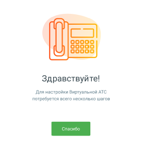

# 1.8.2.1. Блок 1. Начало обучения. Шкала прогресса Онбординга.

> Трассировка: PDF §1.8.2.1 · сквозные стр. 22 · источники: ч.1 `kb/mango-product-docs/sources/mango-lk-manual/LK_manual_v-121часть-1.pdf` с.22.

Обучающая система поможет настроить Главную страницу Личного кабинета пользователя ВАТС. Переход к обучению происходит по нажатию на кнопку «Спасибо». Прогресс обучения отражается на Шкале прогресса Онбординга (Блок 1) В процессе обучения пользователь будет видеть пиктограммы с подсказками. По итогам обучения на шкале Онбординга отобразятся возможности пользователя ЛК ВАТС.
