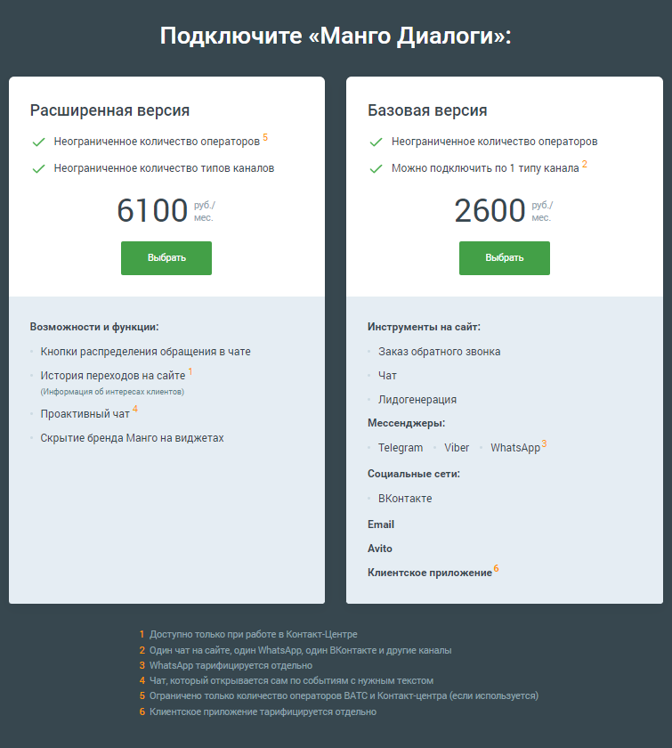
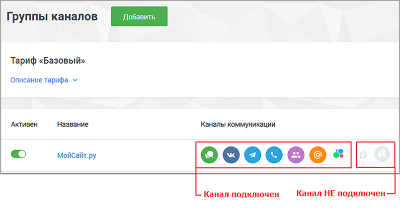

# 4.5.11.2. Мои группы каналов

> Трассировка: PDF §4.5.11.2 · сквозные стр. 279-282 · источники: ч.3 `kb/mango-product-docs/sources/mango-lk-manual/LK_manual_v-121часть-3.pdf` с.77-80.

При отсутствии ранее созданных групп каналов на экране отобразится описание возможностей «Текстовые коммуникации» . Для создания новой группы щелкните по кнопке Подключить и выберите тариф. Тарифы «Текстовые коммуникации» Базовая версия - рекомендуется пользователям, у которых не более одной активной группы каналов. Расширенная версия - позволяет пользователю создать и активировать больше групп каналов.

Ознакомьтесь с подробным описанием тарифов, а также условиями подключения, и нажмите кнопку Подключить. При наличии ранее созданных групп каналов на экране отобразится их список и перечень подключенных каналов коммуникации. Для создания новой группы каналов следует щелкнуть по кнопке Добавить.

Каждая запись списка содержит: • Переключатель активности группы каналов; • Название группы каналов. При щелчке по названию выполняется переход к настройкам группы; • Список активных каналов коммуникации. Для каждого отдельно используемого сайта рекомендуется создавать отдельную группу каналов. Подключение каналов коммуникации в группу допускается также после создания группы. Выберите каналы коммуникации и нажмите Подключить для перехода к настройке группы. Настройка распределена по следующим разделам: • Настройки группы каналов; • Настройки каналов коммуникации; • Расписание; • Код для сайта. Для удаления группы каналов откройте настройки группы, пройдите к нижней части экрана и нажмите кнопку УДАЛИТЬ.

ВНИМАНИЕ Если группа каналов была подключена из раздела «Настройки» Контакт- центра MANGO OFFICE, то при удалении Контакт-центра группу необходимо переподключить в Личном кабинете ВАТС.
