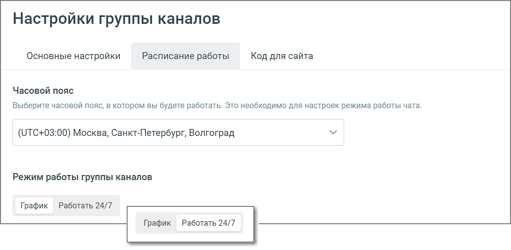
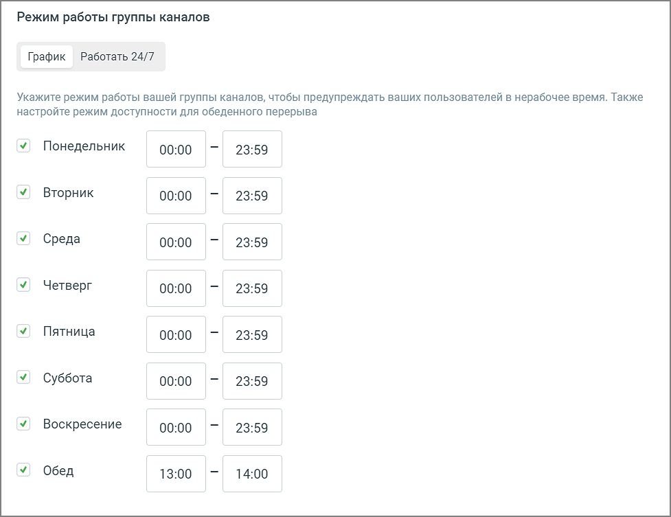
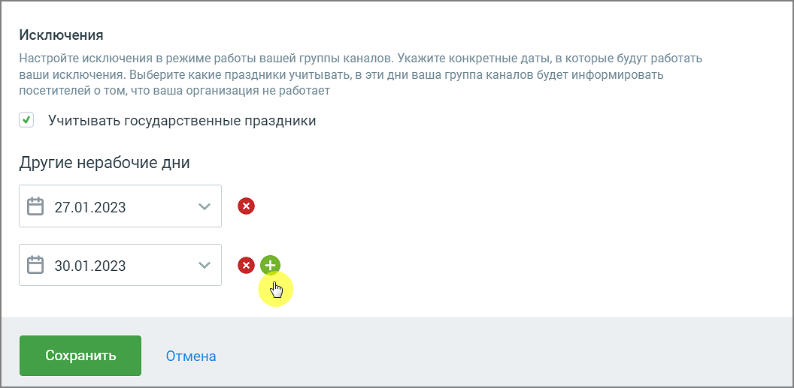

# 4.5.11.2.2.2. Расписание работы

> Трассировка: PDF §4.5.11.2.2.2 · сквозные стр. 286-289 · источники: ч.3 `kb/mango-product-docs/sources/mango-lk-manual/LK_manual_v-121часть-3.pdf` с.84-87.

Настройте Расписание работы виджетов «Чат на сайте», «Заказ обратного звонка», Лидогенерация». В настройках расписания укажите: Часовой пояс – часовой пояс, в котором будет работать виджет. В зависимости от выбранного часового пояса определяются остальные настройки расписания виджета; Режим работы виджета: График, Работать 24/7

• График – для каждого из дней недели можно задать рабочее время.

• Работать 24/7 – круглосуточная работа без выходных

Исключения: • если чекбокс «государственные праздники» отмечен, государственные праздники считаются нерабочими днями; • другие нерабочие дни – можно добавлять/удалять дни, которые также считаются нерабочими.

