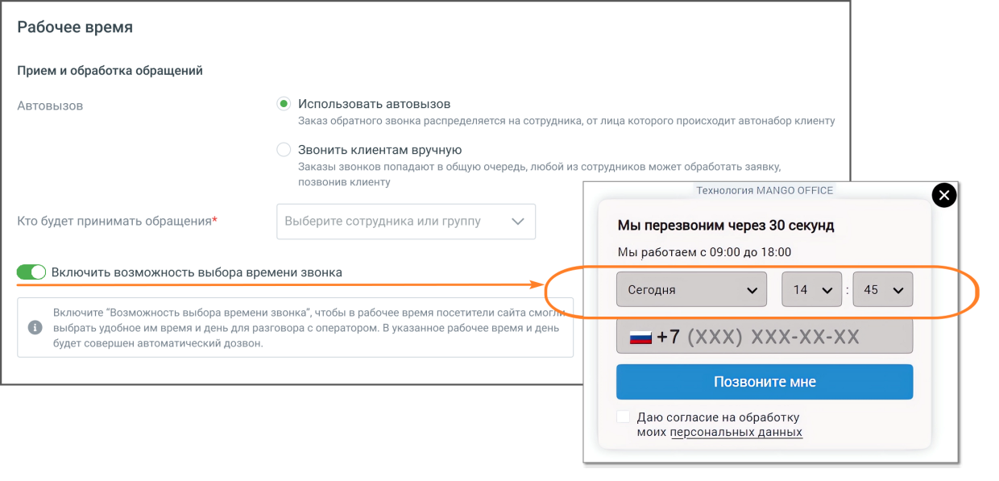
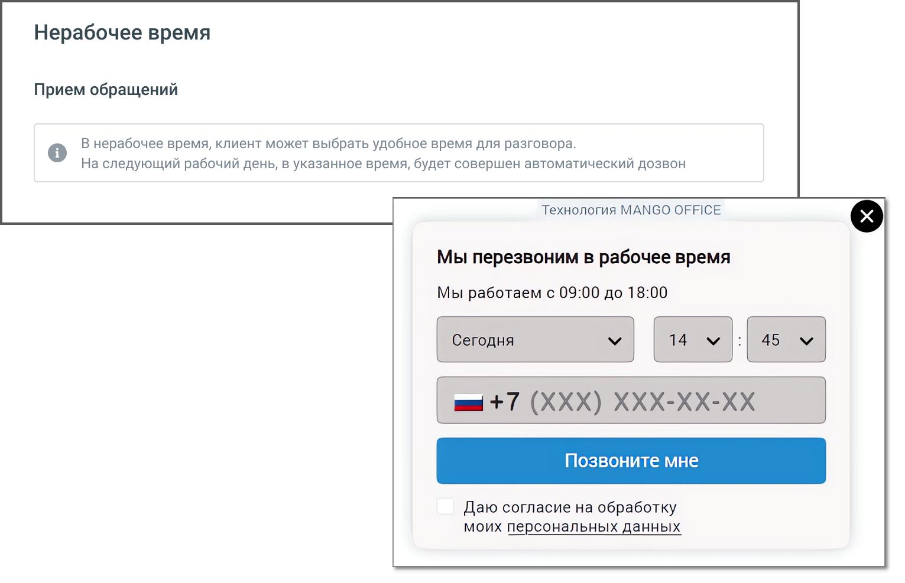
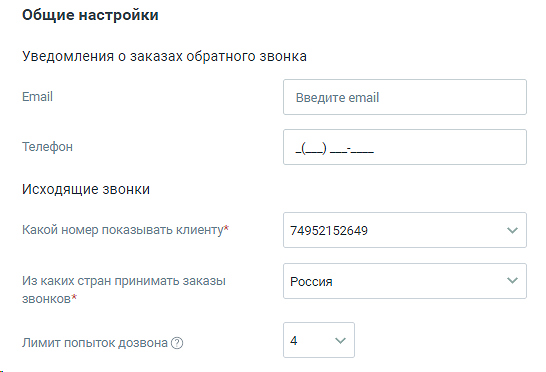
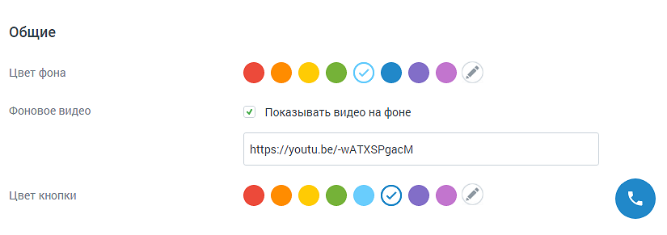
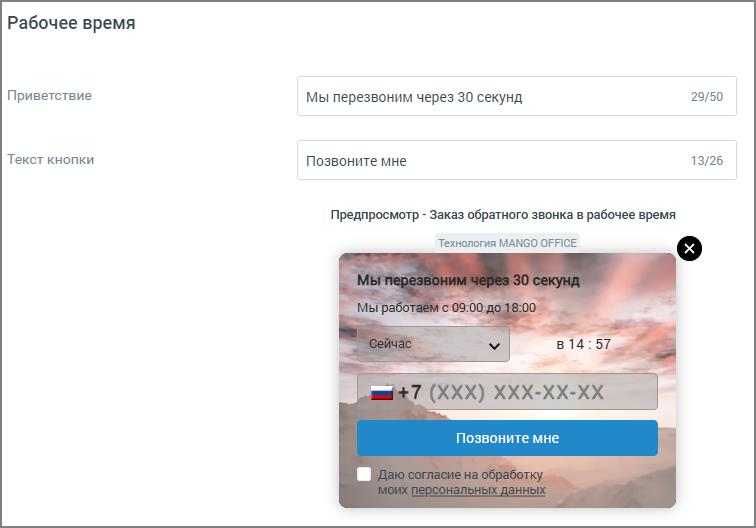

# Заказ обратного звонка

> Трассировка: PDF §4.5.11.2.2 · сквозные стр. 291-296 · источники: ч.3 `kb/mango-product-docs/sources/mango-lk-manual/LK_manual_v-121часть-3.pdf` с.89-94.

Вкладка «Настройка канала»

Расписание сотрудников - настройка рабочего времени и выходных дней сотрудников. Нажатие на кнопку Настроить открывает окно управления расписанием. См. раздел инструкции «Расписание работы». ВНИМАНИЕ Настроенное на вкладке расписание будет действовать для всех каналов коммуникации. Далее переходите к индивидуальным настройкам канала. Для рабочего времени установите правила Приема и обработки обращений, выбрав режим дозвона до абонента, заказавшего обратный звонок: • Автовызов o Использовать автовызов - соединение абонента и свободного сотрудника компании выполняется сразу и автоматически; o Ручной – сотрудники компании получают уведомление о запросе обратного звонка и сами выбирают время для вызова. • Кто будет принимать обращения – выбор сотрудника или группы сотрудников для обработки звонков. Возможен выбор только одного сотрудника или одной группы. Если необходимо выбрать более одного сотрудника для обработки звонков, объедините их в группу. В качестве сотрудника можно выбрать чат-бот (если в ЛК ВАТС подключена услуга «Чат-бот»). Настройка доступна только для варианта «Использовать автовызов». В этом случае поле является обязательным для заполнения. В окне предпросмотра отображается внешний вид виджета так, как его видит клиент.

Включить возможность выбора времени звонка – если переключатель включен, в виджете отображается дополнительный блок с настройками времени.

Для нерабочего времени дополнительных настроек не предусмотрено. В окне предпросмотра отображается внешний вид виджета так, как его видит клиент.

В блоке Общие настройки предусмотрен следующий набор настроек: • Уведомления о заказах обратного звонка o E-mail – адрес электронной почты для получения уведомлений. Если включен прием обращений в нерабочее время, поле является обязательным для заполнения; o Телефон – мобильный номер телефона для получения уведомлений о заказах обратного звонка в виде SMS-сообщений. Если указать e-mail и телефон, уведомления будут приходить на оба контакта. • Исходящие звонки (настройки доступны только для варианта «Использовать автовызов») o Какой номер показывать клиенту – номер телефона, который отобразится у посетителя, заказавшего звонок. Поле является обязательным для заполнения; o Из каких стран принимать заказы звонков – ограничения на направления исходящего дозвона. По умолчанию установлены звонки только в регионе «Россия»; o Лимит попыток дозвона – максимальное количество попыток дозвона клиенту, которое осуществляет система, пока не удастся связать оператора и клиента. ВАЖНО: При дозвоне сначала система звонит оператору, потом клиенту. Лимит дозвонов до оператора – 4. Если клиент сбросит звонок, новая

попытка дозвона будет осуществлена через 15 минут. Если клиент не возьмёт трубку, новая попытка дозвона будет через 100 секунд. Вкладка «Внешний вид» Во вкладке Внешний вид осуществляется настройка внешнего вида виджета «Заказ обратного звонка» в рабочее и нерабочее время. В процессе настройки меняется внешний вид виджета в окне предпросмотра.

На вкладке указываются: • Цвет фона – цвет основного окна виджета. Можно выбрать произвольный цвет,

кликнув по иконке ; • Фоновое видео – если опция включена, в окне виджета транслируется указанный в ссылке видеоролик. На скриншоте ниже опция включена, видео транслируется; • Цвет кнопки – цвет кнопки виджета. Можно выбрать произвольный цвет, кликнув

по иконке . Заполняя настройки вкладки, важно следить за читаемостью текста в окне виджета. Выбирайте подходящие цвета кнопок и текста.

Для рабочего времени: • Приветствие – текст, который видит посетитель сайта в рабочее время; • Текст кнопки – текст, расположенный на кнопке виджета. Для нерабочего времени: • Приветствие - текст, который видит посетитель сайта в нерабочее время. Сохраните настройки виджета кнопкой Сохранить. Отключить канал – после дополнительного согласия на отключение канал связи отключается. ВНИМАНИЕ На канале существует ряд ограничений (список ограничений смотрите ниже). Учитывайте это, когда знакомитесь с работой канала. Ограничения канала Заказ обратного звонка. • Не более двух заказов ОЗ в течении двух минут с одного ip-адреса в рамках одного виджета; • Не более двух заказов ОЗ в течении 30 минут с одного ip-адреса в рамках одного виджета;

<!-- изображение на стр. 296: байты не извлечены (PyMuPDF недоступен) -->

• Не более двух заказов ОЗ на один и тот же номер в течении двух минут в рамках одного виджета; • Не более трех заказов ОЗ на один и тот же номер в течении 30 минут в рамках одного виджета; • Не более трех заказов ОЗ во всех виджетах на один и тот же номер в течении трех минут. Если номер пользователя добавлен в «черный список» ВАТС, то звонок не осуществляется.
