# Чат на сайте

> Трассировка: PDF §4.5.11.2.2 · сквозные стр. 301-313 · источники: ч.3 `kb/mango-product-docs/sources/mango-lk-manual/LK_manual_v-121часть-3.pdf` с.99-101; ч.4 `kb/mango-product-docs/sources/mango-lk-manual/LK_manual_v-121часть-4.pdf` с.1-10.

Вкладка «Настройка канала»

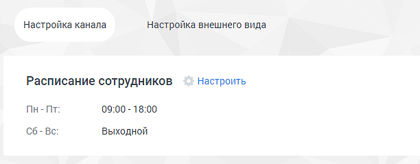

Расписание сотрудников - настройка рабочего времени и выходных дней сотрудников. Нажатие на кнопку Настроить открывает окно управления расписанием. См. раздел инструкции «Расписание работы». ВНИМАНИЕ Настроенное на вкладке расписание будет действовать для всех каналов коммуникации. Далее переходите к индивидуальным настройкам канала. Настройте работу канала в рабочее время, указав подходящие параметры.

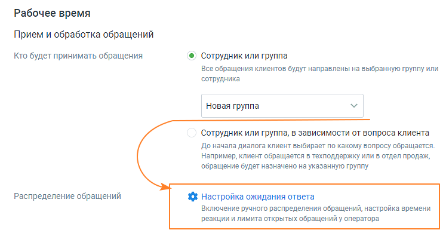

Прием и обработка обращений • Кто будет обрабатывать обращения: o сотрудник или группа – сотрудник либо группа, которые будут обрабатывать поступившие звонки. - При выборе варианта «группа» доступна настройка «Распределение обращений». Настройка устанавливается в соответствующих разделах Личного кабинета пользователя ВАТС. - При выборе варианта «сотрудник» ниже становится доступна настройка Проактивного чата. В качестве сотрудника можно выбрать чат-бот (если в ЛК ВАТС подключена услуга «Чат-бот»). В этом случае необходимо будет также выбрать резервного сотрудника или группу, на которых будут распределяться обращения в случае недоступности чат-бота. o сотрудник или группа в зависимости от вопроса клиента – при выборе этого варианта доступна настройка до 10-ти правил распределения звонка.

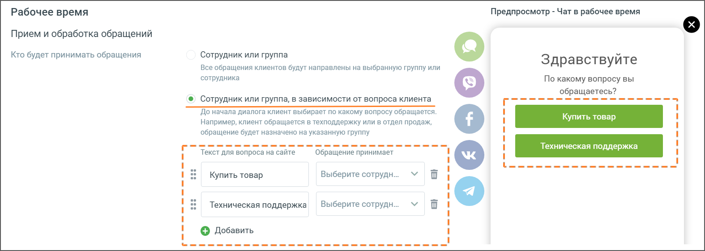

При подключенном чат-боте в чате на сайте можно настраивать кнопки быстрых ответов. Кнопки отображаются в чате пользователя, а также в Контакт-центре сотрудника, ведущего диалог. Максимально возможная длина сообщения в чате на сайте 1000 символов. Приветствия Для повышения лояльности клиентов и удобства работы операторов следует указать один или несколько Автоматических ответов.

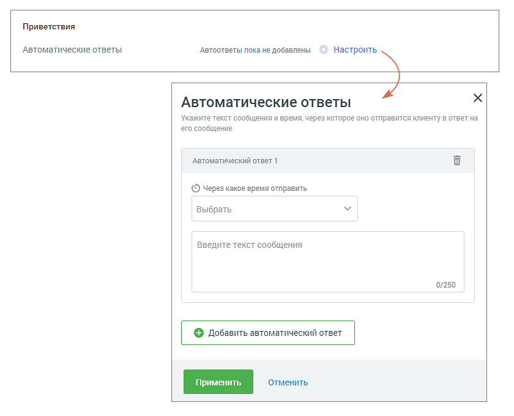

Рекомендуется использовать автоответы, чтобы убедить клиента дождаться ответа оператора в пиковые часы нагрузки (когда все сотрудники заняты) или когда оператор отсутствует на рабочем месте. o Автоматические ответы - нажатие на кнопку Настроить открывает окно настроек автоматического ответа; o Через какое время отправить - время с момента обращения пользователя и до отображения ему автоответа; o Текст сообщения – максимальное количество символов 250. Пользователь может добавить несколько автоматических ответов и настроить периодичность отображения каждого. Сообщения автоответов сохраняются в истории обращения, только если пользователь написал в чате свое сообщение.

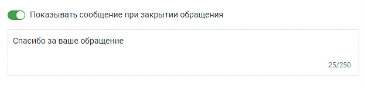

• Показывать сообщение при закрытии обращения При активации опции «Показывать сообщение при закрытии обращения» клиенту будет отображаться установленное сообщение при завершении обращения. o Текст сообщения: Введите текст в поле под переключателем. Сообщение будет отправлено клиенту после закрытия обращения. Максимальная длина текста — 250 символов. o Сообщение будет показано в случаях закрытия обращения оператором, автоматического завершения чат-ботом или по истечении тайм-аута. Активно приглашайте клиента вступить в диалог: • Использовать проактивный чат Переключатель «Использовать проактивный чат» в положении «включен» - когда клиент заходит на сайт, где размещен Мультиканальный виджет с каналом «чат на сайте», проактивный чат инициирует общение с клиентом. Проактивный чат действует в связке с Автоматическими ответами. Чат работает для сессии в целом и отображается в той вкладке, которая в текущий момент активна на мониторе пользователя. Пример работы Автоматических ответов в связке с Проактивным чатом: 1. Пользователь зашёл на сайт, сработали правила проактивного чата;

2. Пользователь что-то пишет в появившийся проактивный чат; 3. Оператор в данный момент занят и не может отреагировать на обращение; 4. Автоматический ответ создаёт сообщения в чате, тем самым удерживая пользователя в чате; 5. Оператор освободился и взял в работу обращение;

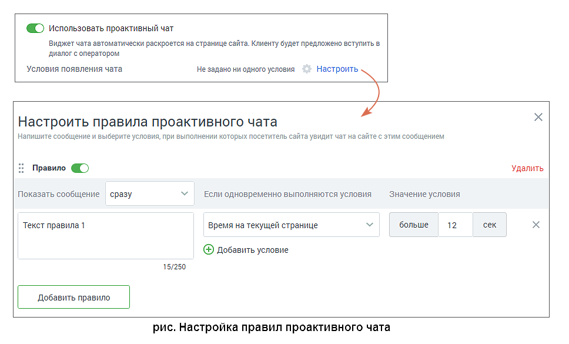

Для этого настройте правила, при которых чат начнет диалог:

o Переключатель активности правила – правило активно, если переключатель установлен в положение «включено»; o Показать сообщение - период, по истечении которого отображается свернутый чат на сайте, и через одну секунду отображается Текст правила. При этом должны выполняться условия, задаваемые ниже; o Текст правила – текст сообщения, которым чат инициирует диалог. Максимальное количество символов – 250; o Условия и значение условия – список условий и их значений, при выполнении

которых чат инициирует диалог. Условия можно удалять и добавлять . Если условий несколько, они объединены по принципу «И». Таким образом, правило сработает, если одновременно выполнены все условия. Также пользователю доступны следующие действия с правилами:

✓ Для перемещения правил в порядке приоритета перетяните правило вверх или

вниз, удерживая левой кнопкой мыши курсор на пиктограмме ; ✓ Для добавления нового правила нажмите кнопку Добавить правило; ✓ Для удаления правила кликните по ссылке Удалить. Сохраните внесенные изменения кнопкой Сохранить. Сообщения проактивного чата сохраняются и отражаются в истории переписки по данному обращению, только если пользователь ответил на сообщение чата.

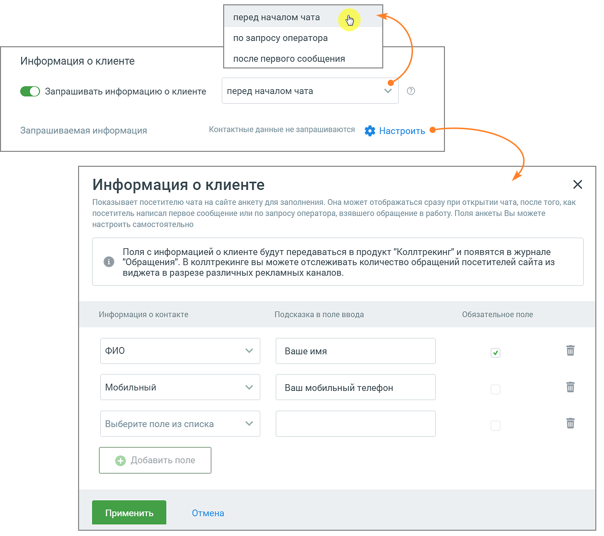

Для повышения качества и результативности работы с клиентом имеются настройки сбора информации о клиенте. • Информация о клиенте o выберите время запроса контактных данных клиента;

o выберите из выпадающего списка те данные, которые вы хотели бы запрашивать у клиента. Старайтесь запрашивать только необходимый минимум данных. Подсказка в поле ввода – подсказка, которую увидит клиент.

Галочка в чекбоксе отмечает выбранное поле, как обязательное. Клик по пиктограмме «корзина» удаляет поле. Кнопка «Добавить» добавляет новое поле данных. Если фунция «Информация о клиенте» включена, перед началом диалога клиенту отображается виджет следующего вида:

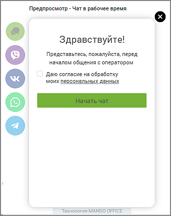

• Редактирование сообщений – если чекбокс «разрешать редактировать сообщения в чате» отмечен, оператор Контакт-центра и посетитель виджета на сайте имеют возможность редактировать свое сообщение в течение заданного периода времени.

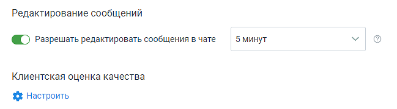

• Клиентская оценка качества – нажатие на кнопку «Настроить» открывает окно «Настройки группы каналов» для продолжения настроек оценки качества работы оператора по заданным правилам. Клиентская оценка качества будет доступна, если в Личном кабинете подключен модуль «Контроль качества». Нерабочее время – настройте работу канала в нерабочее время, указав подходящие параметры.

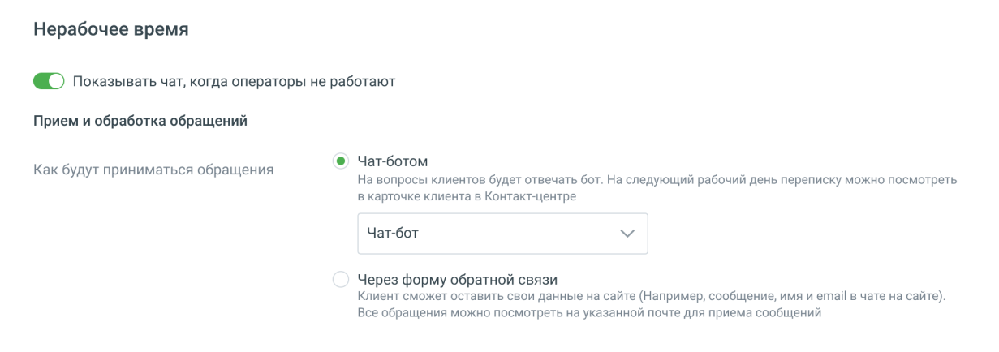

На вкладке указываются: • Переключатель отображения чата o Показывать чат, когда операторы не работают – если переключатель включен иконка чата показывается на сайте и в нерабочее время. При клике по иконке виджет отображается с пометкой «Нерабочее время» и предложением оставить заявку. Если переключатель выключен, то в развёрнутом списке каналов иконка "Чат на сайте" отсутствует. Внешний вид настроенного виджета отображается в окне справа; • Прием и обработка обращений o Чат-бот – если в ЛК ВАТС подключена услуга «Чат-бот», то в нерабочее время также можно выбрать диалог клиента с чат-ботом. o Через форму обратной связи – при выборе откроется форма ввода адреса электронной почты для получения сообщений. Каждое сообщение придет в отдельном письме. Сообщение, поступающее на группу, отображается у

всех ее участников. Сотрудники, не включенные в группу, не получают сообщения. Если переключатель «показывать чат» в положении «включен», поле является обязательным для заполнения.

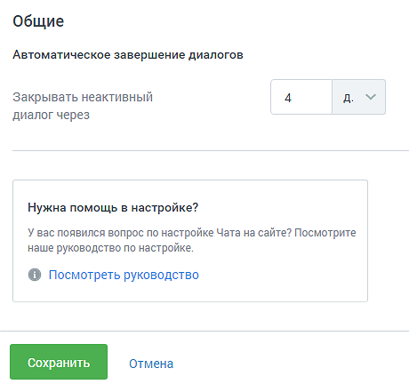

На вкладке указываются: • Автоматическое завершение диалогов o Закрывать неактивный диалог через – время в часах или днях, по истечении которого обращение автоматически закрывается. Значение поля должно быть больше нуля. Вкладка «Внешний вид» Общие Во вкладке указываются: • Тема, в которой отображается основное окно виджета чата: светлая или темная; • Цвет кнопки чата. По умолчанию установлен зеленый цвет. Можно выбрать

произвольный цвет, кликнув по иконке ;

• Текст кнопки – текст, отображаемый на кнопке чата на сайте. Можно выбрать

произвольный цвет, кликнув по иконке . Внешний вид настроенного виджета отображается в окне справа.

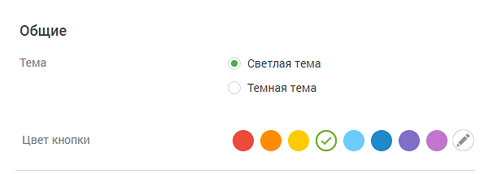

Чат на сайте в рабочее время.

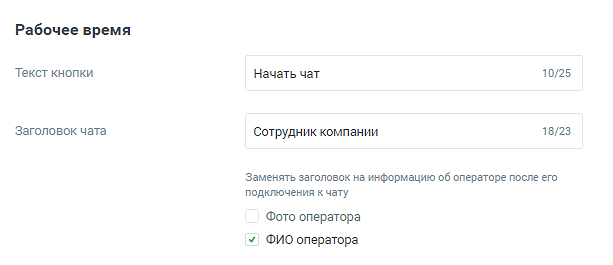

• Текст кнопки – максимум 25 символов; • Заголовок чата – наименование в соответствии со стандартом сайтов пользователя. Для того, чтобы пользователям отображалась информация об операторах чата, следует отметить: • Фото оператора – фотография из аватара сотрудника в M.Talker или Контакт- центра; • ФИО оператора – данные загружаются из справочника сотрудников ВАТС.

Внешний вид настроенного виджета отображается в окне справа. Чат на сайте в нерабочее время

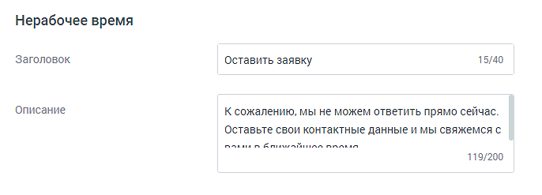

Во вкладке Внешний вид для канала коммуникации «Чат на сайте (в нерабочее время)» указываются: • Заголовок - отображается в форме чата в нерабочее время; • Описание - поясняющий текст, отображающийся в форме чата в нерабочее время. Внешний вид настроенного виджета отображается в окне справа. Сохраните настройки виджета кнопкой Сохранить. Отключить канал – после дополнительного согласия на отключение канал связи отключается. Изменение расположения виджета Чтобы расположить открытый виджет в другой части экрана, достаточно зафиксировать

курсор на иконке и переместить виджет.

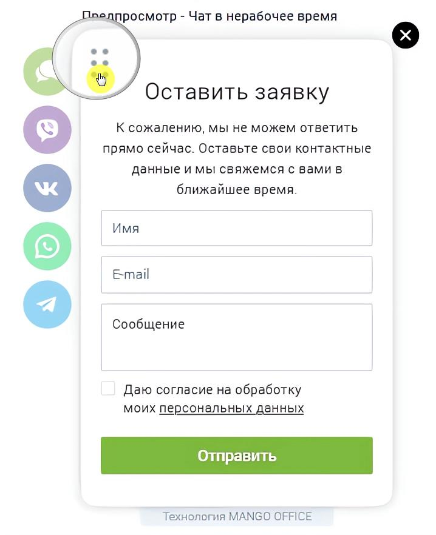

Вы можете отслеживать количество обращений по виджету «Текстовые коммуникации» в канале "Чат на сайте". Для использования данной опции виджеты динамического коллтрекинга и мультиканального чата должны быть связаны между собой. Таким образом пользователь может получить полную аналитику по обращениям посетителей сайта из виджета в разрезе рекламных кампаний и источников.

Для настройки интеграции последовательно перейдите в раздел Коллтрекинг → Обзорная панель → Блок Интеграции → «Текстовые коммуникации» и добавьте один или несколько виджетов Диалогов.

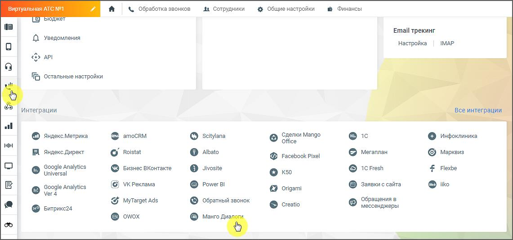

ВНИМАНИЕ На канале существует ряд ограничений (список ограничений смотрите ниже). Учитывайте это, когда знакомитесь с работой канала. Ограничения канала Чат на сайте • не более 10 сообщений в минуту с одного IP-адреса в рамках одного виджета; • не более трех стартов общения (отправка первого сообщения) в чатах с одного ip-адреса в течении двух минут.
