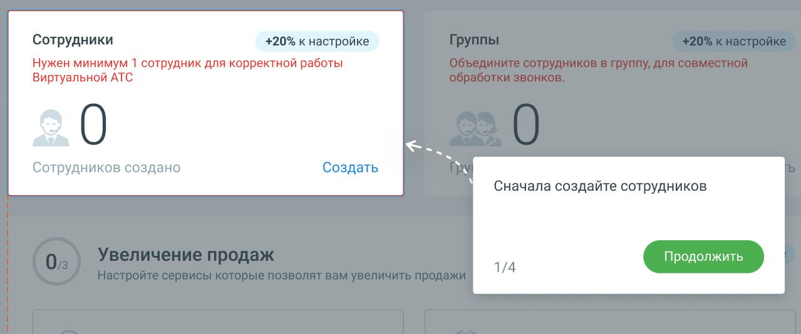

# 1.8.2.2. Блок 2. Добавление сотрудников

> Трассировка: PDF §1.8.2.2 · сквозные стр. 22-23 · источники: ч.1 `kb/mango-product-docs/sources/mango-lk-manual/LK_manual_v-121часть-1.pdf` с.22-23.

Кликните по кнопке Создать и добавьте в Личный кабинет нового сотрудника. Информационные подсказки модуля Онбординг рассказывают о последовательности переходов для создания сотрудника. Если хотя бы один сотрудник уже создан, нажатие на кнопку открывает страницу ЛК со списком сотрудников. После завершения этапа количество созданных сотрудников отобразится на Главной панели в Блоке 2 «Сотрудники». Создание трех сотрудников увеличивает шкалу прогресса Онбординга на 20%. Чтобы перейти к созданию групп сотрудников, нажмите кнопку Продолжить.
