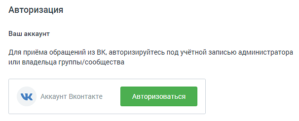
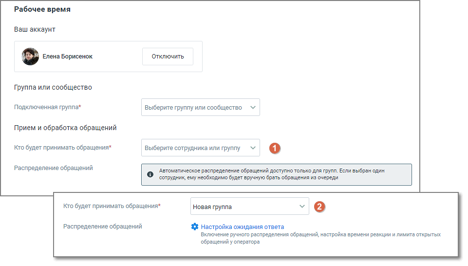
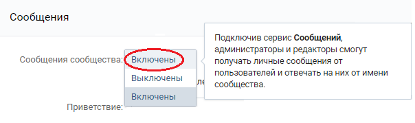
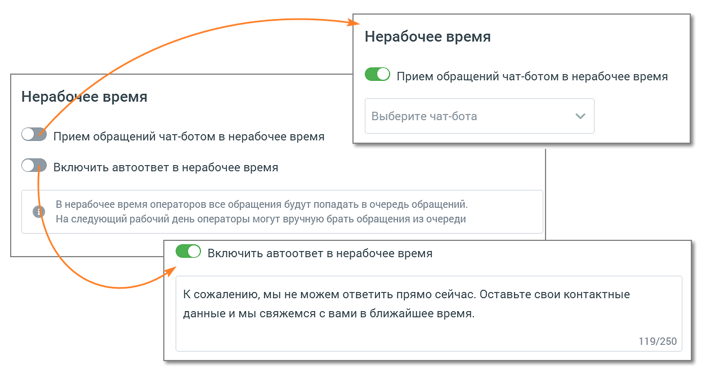

# ВКонтакте

> Трассировка: PDF §4.5.11.2.2 · сквозные стр. 313-319 · источники: ч.4 `kb/mango-product-docs/sources/mango-lk-manual/LK_manual_v-121часть-4.pdf` с.10-16.

Вы можете настроить прием сообщений, которые клиенты отправляют вашей группе ВКонтакте. Для этого нажмите «Авторизоваться».

В открывшейся форме нужно авторизоваться под администратором той группы, сообщения из которой необходимо обрабатывать. В случае, когда учетная запись не является записью администратора, дальнейшая настройка будет невозможна.

После успешной авторизации ВКонтакте, в настройках виджета в выпадающем списке отобразится перечень всех групп данного администратора. Переходите к настройкам канала. Задайте расписание работы сотрудников - настройку рабочего времени и выходных дней сотрудников. Нажатие на кнопку Настроить открывает окно управления расписанием. См. раздел инструкции «Расписание работы».

ВНИМАНИЕ Настроенное на вкладке расписание будет действовать для всех каналов.

Далее переходите к индивидуальным настройкам канала.

На вкладке указываются: • Группа или сообщество o Подключенная группа - Выберите группу или сообщество, которые необходимо подключить. В настройках подключаемой группы/сообщества должна быть включена опция приема сообщений;

• Прием и обработка обращений o Кто будет принимать обращение – сотрудник, чат-бот или группа, которые будут обрабатывать поступившие звонки. При выборе варианта «группа» доступна настройка «Распределение обращений»; В качестве сотрудника можно выбрать чат-бот (если в ЛК ВАТС подключена услуга «Чат-бот»). В этом случае необходимо будет также выбрать резервного сотрудника или группу, на которых будут распределяться обращения в случае недоступности чат-бота. o Распределение обращений - распределение обращений и настройки ожидания ответа устанавливаются в соответствующих разделах Личного кабинета пользователя ВАТС. При подключенном чат-боте в ВКонтакте можно настраивать кнопки быстрых ответов. Кнопки отображаются в ленте диалога пользователя, а также в Контакт- центре сотрудника, ведущего диалог. Как настраиваются кнопки чат-бота узнайте в Справке Роботов MANGO OFFICE, пункт «Задать несколько вариантов ответа» → Кнопки в тексте и Кнопки клавиатуры. • Автоматические ответы

o Количество автоответов – количество настроенных для канала автоматических ответов. o Нажатие на кнопку «Настроить» открывает окно настройки автоответов.

В окне настроек необходимо ввести текст автоответа и отметить время, через которое клиент увидит автоответ в окне чата с оператором. Нажатие на кнопку «Добавить автоматический ответ» открывает окно добавления следующего автоматического ответа. Сохраните внесенные изменения кнопкой Применить.

• Показывать сообщение при закрытии обращения При активации опции «Показывать сообщение при закрытии обращения» клиенту будет отображаться установленное сообщение при завершении обращения. o Текст сообщения: Введите текст в поле под переключателем. Сообщение будет отправлено клиенту после закрытия обращения. Максимальная длина текста — 250 символов.

o Сообщение будет показано в случаях закрытия обращения оператором, автоматического завершения чат-ботом или по истечении тайм-аута. • Клиентская оценка качества Нажатие на кнопку «Настроить» открывает окно «Настройки группы каналов» для продолжения настроек оценки качества работы оператора по заданным правилам. Клиентская оценка качества будет доступна, если в Личном кабинете подключен модуль «Контроль качества». • Нерабочее время Если на ВАТС подключена услуга «Чат-боты», в блоке "Нерабочее время" отображается выпадающий список доступных чат-ботов. Также в блоке настраивается возможность отправлять автоответы в нерабочее время, чтобы оставаться на связи с посетителями на сайте.

Ознакомьтесь с информационным уведомлением о правилах работы с сообщениями в нерабочее время. Невозможно одновременно использовать оба переключателя – чат-бот и автоответы. На вкладке «Общие настройки» проставьте период для автоматического завершения диалогов:

• Автоматическое завершение диалогов o Закрывать неактивный диалог через – время в часах или днях, по истечении которого обращение автоматически закрывается. Значение поля должно быть больше нуля. Сохранить – кликом по кнопке сохраните внесенные изменения. Отключить канал – после дополнительного согласия на отключение канал связи отключается.
