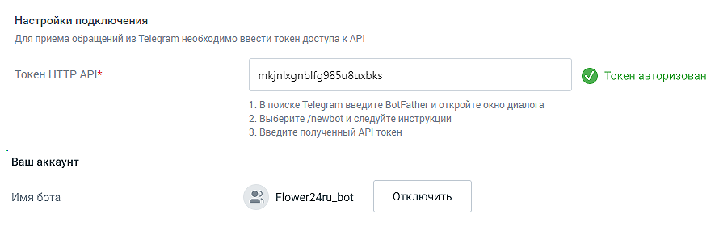
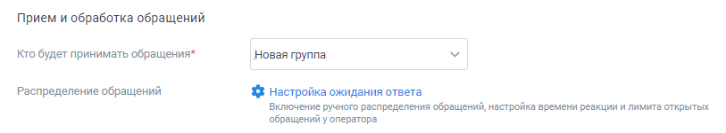

# Telegram

> Трассировка: PDF §4.5.11.2.2 · сквозные стр. 324-330 · источники: ч.4 `kb/mango-product-docs/sources/mango-lk-manual/LK_manual_v-121часть-4.pdf` с.21-27.

В данном блоке осуществляется настройка приема сообщений, которые клиенты отправляют через мессенджер Telegram.

Задайте расписание работы сотрудников - настройку рабочего времени и выходных дней сотрудников. Нажатие на кнопку Настроить открывает окно управления расписанием. См. раздел инструкции «Расписание работы». ВНИМАНИЕ Настроенное на вкладке расписание будет действовать для всех каналов коммуникации. Далее переходите к индивидуальным настройкам канала.

Чтобы принимать сообщения из Telegram, укажите: • Настройки подключения o Токен HTTP API – в данное поле следует вставить токен, полученный в Telegram; Для получения токена выполните следующие действия: • Откройте Telegram, найдите бота @botfather и откройте с ним диалог; • В диалоговом окне нажмите кнопку СТАРТ; • В появившемся списке выберите команду /newbot; • Далее последовательно укажите имя и юзернейм Вашего бота. Юзернейм должен быть уникальным и оканчиваться на "bot" (например, MangoBot или mango_bot); • После создания бота вы получите токен для HTTP API. Скопируйте полученный токен для HTTP API в соответствующее поле формы настроек подключения канала Telegram виджета. • Ваш аккаунт

o Имя бота – появится автоматически после указания токена и нажатия клавиши Enter. Если вы указали неверный токен, то появится надпись "Бот не найден".

• Прием и обработка обращений o Кто будет принимать обращение – сотрудник, чат-бот или группа, которые будут обрабатывать поступившие звонки. При выборе варианта «группа» доступна настройка «Распределение обращений». При выборе варианта «чат-бот» система предложит выбрать сотрудника или группу для приема обращений при недоступности чат-бота. o Распределение обращений» – настройка устанавливается в соответствующем разделе Личного кабинета пользователя ВАТС. При подключенном чат-боте в Telegram можно настраивать кнопки быстрых ответов. Кнопки отображаются в ленте диалога пользователя, а также в Контакт-центре сотрудника, ведущего диалог. Как настраиваются кнопки чат-бота узнайте в Справке Роботов MANGO OFFICE, пункт «Задать несколько вариантов ответа» → Кнопки в тексте и Кнопки клавиатуры. Если ответ оператора не отправляется по причине блокирования чат-бота пользователем, оператор Контакт-центра уведомляется об этом системным сообщением. • Автоматические ответы o Количество автоответов – количество настроенных для канала автоматических ответов. o Нажатие на кнопку «Настроить» открывает окно настройки автоответов.

В окне настроек необходимо ввести текст автоответа и отметить время, через которое клиент увидит автоответ в окне чата с оператором. Нажатие на кнопку «Добавить автоматический ответ» открывает окно добавления следующего автоматического ответа. Сохраните внесенные изменения кнопкой Применить.

• Показывать сообщение при закрытии обращения При активации опции «Показывать сообщение при закрытии обращения» клиенту будет отображаться установленное сообщение при завершении обращения. o Текст сообщения: Введите текст в поле под переключателем. Сообщение будет отправлено клиенту после закрытия обращения. Максимальная длина текста — 250 символов.

o Сообщение будет показано в случаях закрытия обращения оператором, автоматического завершения чат-ботом или по истечении тайм-аута. • Редактирование сообщений – в канале Telegram. реализована возможность редактирования сообщений оператора. Переключатель активации позволяет включить или отключить возможность редактирования. При активации редактирование становится доступным в заданном временном интервале.5, 10, 15, 30 и 60 минут.

• Клиентская оценка качества Нажатие на кнопку «Настроить» открывает окно «Настройки группы каналов» для продолжения настроек оценки качества работы оператора по заданным правилам. Клиентская оценка качества будет доступна, если в Личном кабинете подключен модуль «Контроль качества». Вы можете отслеживать количество обращений по виджету «Текстовые коммуникации» в канале Telegram. Для использования данной опции виджеты динамического коллтрекинга и мультиканального чата должны быть связаны между собой. Таким образом они смогут обмениваться данными. Для настройки интеграции последовательно перейдите в раздел Коллтрекинг → Обзорная панель → Блок Интеграции → «Текстовые коммуникации» и добавьте один или несколько виджетов Диалогов. • Нерабочее время Если на ВАТС подключена услуга «Чат-боты», в блоке "Нерабочее время" отображается выпадающий список доступных чат-ботов. Также в блоке настраивается возможность отправлять автоответы в нерабочее время, чтобы оставаться на связи с посетителями на сайте.

Ознакомьтесь с информационным уведомлением о правилах работы с сообщениями в нерабочее время. Невозможно одновременно использовать оба переключателя – чат-бот и автоответы. На вкладке «Общие настройки» проставьте период для автоматического завершения диалогов:

• Автоматическое завершение диалогов o Закрывать неактивный диалог через – время в часах или днях, по истечении которого обращение автоматически закрывается. Значение поля должно быть больше нуля. Сохранить – кликом по кнопке сохраните внесенные изменения. Отключить канал – после дополнительного согласия на отключение канал связи отключается.

