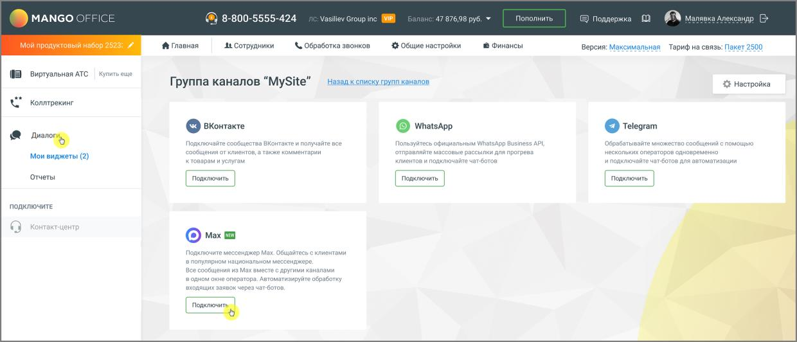

# 2. Открытие страницы каналов

> Трассировка: PDF §2 · сквозные стр. 330-331 · источники: ч.4 `kb/mango-product-docs/sources/mango-lk-manual/LK_manual_v-121часть-4.pdf` с.27-28.

1. Авторизуйтесь в Личном кабинете Mango Office. 2. В панели навигации выберите: Инструменты → «Текстовые коммуникации» . 3. На странице «Группы каналов» найдите плитку «Max».

Откроется страница «О канале». Здесь пользователь может ознакомиться с назначением канала Max, его преимуществами для общения с клиентами, стоимостью подключения, а также получить пошаговые указания по подготовке доступов, созданию чат-бота Max и вводу токена, необходимого для интеграции канала в систему.
