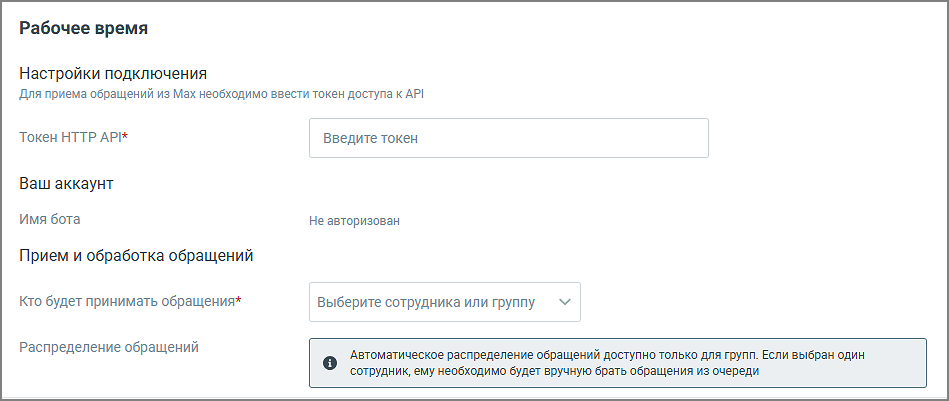

# 3. Переход к настройкам

> Трассировка: PDF §3 · сквозные стр. 331 · источники: ч.4 `kb/mango-product-docs/sources/mango-lk-manual/LK_manual_v-121часть-4.pdf` с.28.

Нажмите «Подключить и настроить». Откроется страница подключения.

