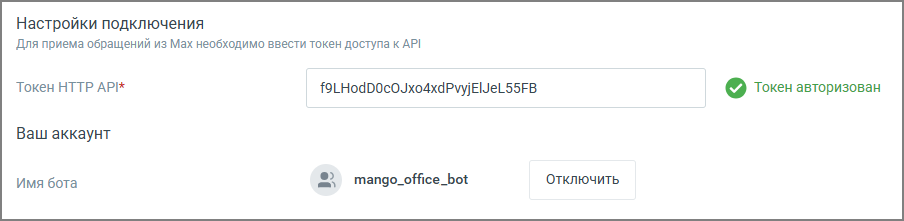

# 4. Подключение токена Max

> Трассировка: PDF §4 · сквозные стр. 331-332 · источники: ч.4 `kb/mango-product-docs/sources/mango-lk-manual/LK_manual_v-121часть-4.pdf` с.28-29.

1. В поле «Токен HTTP API» вставьте токен, полученный в MAX. 2. Нажмите «Сохранить». После проверки токена плашка канала перейдёт в состояние «Токен авторизован».

