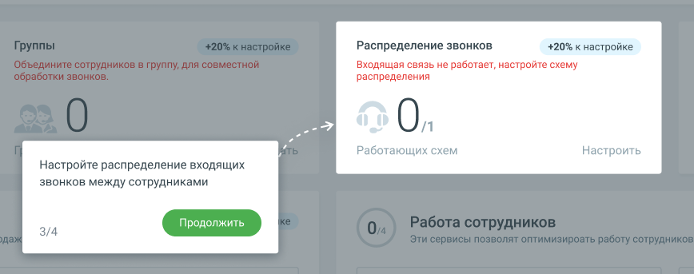

# 1.8.2.4. Блок 4. Настройка схем распределения звонков

> Трассировка: PDF §1.8.2.4 · сквозные стр. 24-25 · источники: ч.1 `kb/mango-product-docs/sources/mango-lk-manual/LK_manual_v-121часть-1.pdf` с.24-25.

Кликните по кнопке Настроить и добавьте в раздел «Голосовое меню и распределение звонков» Личного кабинета одну или несколько схем распределения входящих вызовов. Информационные подсказки рассказывают о последовательности переходов к разделу, наличии и работе схем распределения в рабочие и выходные дни, и др. Если хотя бы одна схема уже настроена, нажатие на кнопку открывает страницу ЛК «Распределение звонков, приветствие, голосовое меню». После завершения этапа количество созданных схем распределения отобразится на Главной панели в Блоке 4 «Распределение звонков» как [Количество активных / созданных на продукте схем распределения с переадресацией] [Количество активных созданных на продукте схем]. Шкала прогресса Онбординга увеличится на 20%. Чтобы перейти к настройке исходящих вызовов, нажмите кнопку Продолжить.

