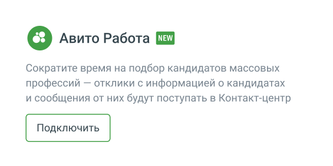
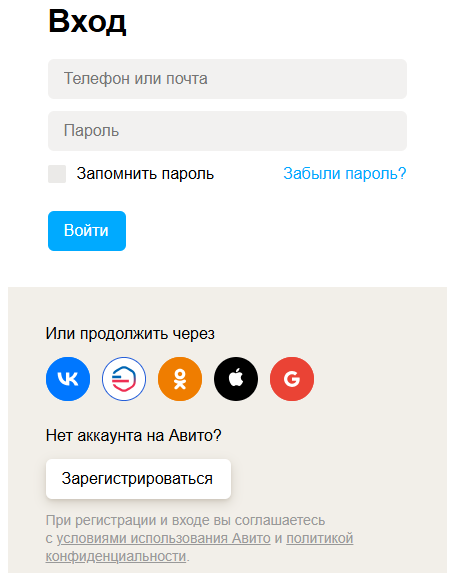
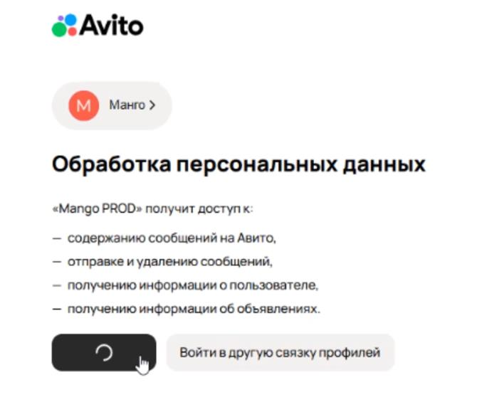
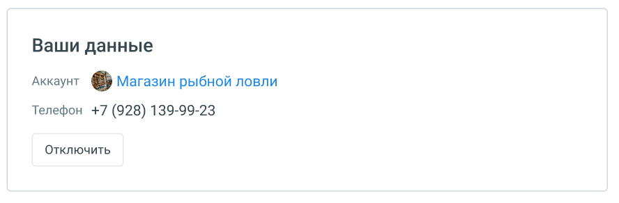
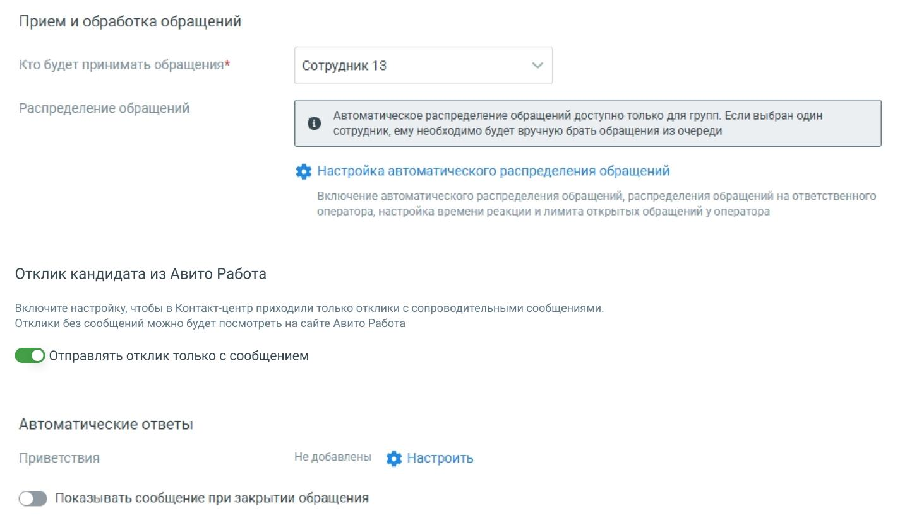

# Авито Работа

> Трассировка: PDF §4.5.11.2.2 · сквозные стр. 347-352 · источники: ч.4 `kb/mango-product-docs/sources/mango-lk-manual/LK_manual_v-121часть-4.pdf` с.44-49.

Интеграция с Авито Работа упрощает работу HR-специалистов и операторов: теперь все отклики с Авито попадают прямо в ваш Контакт-центр MANGO OFFICE. Это значит: • Не нужно каждый раз вручную проверять Авито. • Всё в одном месте: вакансия → отклик → чат с кандидатом. • Меньше рутины — больше времени на важные задачи. Чтобы настроить интеграцию, выполните следующие шаги: Шаг 1: Подключение канала 1. Перейдите в раздел Диалоги → Группы каналов → [ваша группа]. 2. Найдите виджет Авито Работа и нажмите Подключить.

Шаг 2: Авторизация в Авито 1. Нажмите Авторизоваться. 2. Введите логин (телефон или e-mail) и пароль от аккаунта Авито.

3. Разрешите доступ к: • Просмотру и отправке сообщений • Данных о пользователях и вакансиях

4. При отключении и повторном подключении потребуется заново авторизоваться. Шаг 3: Настройка обработчиков После авторизации появится информация о вашем аккаунте.

Далее задайте параметры так, как удобно вам. РАБОЧЕЕ ВРЕМЯ

Прием и обработка обращений: • Кто будет принимать обращение – укажите конкретного сотрудника, группу или чат-бота (если он подключён в ЛК ВАТС).

В качестве сотрудника можно выбрать чат-бот (если в ЛК ВАТС подключена услуга «Чат-бот»). В этом случае необходимо будет также выбрать резервного сотрудника или группу, на которых будут распределяться обращения в случае недоступности чат-бота. • Распределение обращений - распределение обращений и настройки ожидания ответа устанавливаются в соответствующих разделах Личного кабинета пользователя ВАТС. Настройка автоматического распределения обращений — произведите необходимые настройки на странице «Настройки дозвона и сообщений по умолчанию». Отклик кандидата из Авито Работа — включите переключатель, чтобы в работу к сотруднику Контакт-центра попадали только отклики с сообщениями. Автоматические ответы — нажатие на кнопку «Настроить» открывает окно настройки автоответов.

В окне настроек необходимо ввести текст автоответа и отметить время, через которое клиент увидит автоответ в окне чата с оператором. Нажатие на кнопку Добавить автоматический ответ открывает окно добавления следующего автоматического ответа. Сохраните внесенные изменения кнопкой Применить.

НЕРАБОЧЕЕ ВРЕМЯ Прием обращений чат-ботом в нерабочее время - если на ВАТС подключена услуга «Чат-боты», в блоке «Нерабочее время» отображается выпадающий список доступных чат-ботов. Включить автоответ в нерабочее время - в блоке настраивается возможность отправлять автоответы в нерабочее время, чтобы оставаться на связи с посетителями на сайте.

Ознакомьтесь с информационным уведомлением о правилах работы с сообщениями в нерабочее время. ОБЩИЕ НАСТРОЙКИ Проставьте период для автоматического завершения диалогов:

Автоматическое завершение диалогов • Закрывать неактивный диалог через – время в часах или днях, по истечении которого обращение автоматически закрывается. Значение поля должно быть больше нуля. Сохранить – кликом по кнопке сохраните внесенные изменения. С этого момента отклики начнут поступать операторам.
