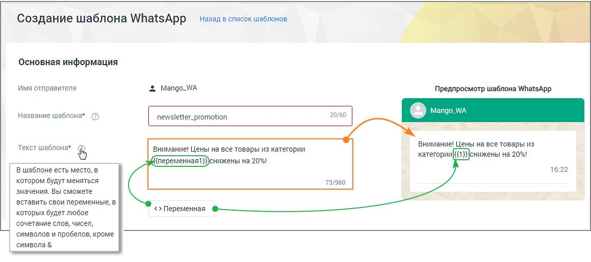
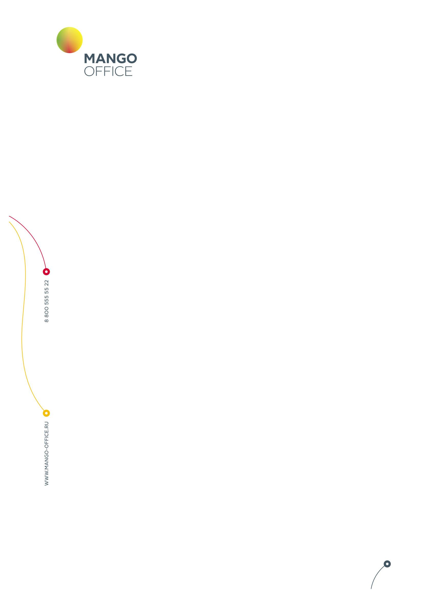
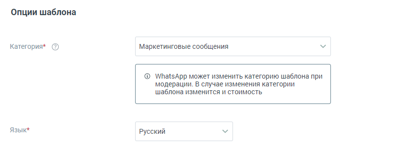
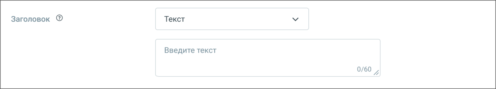
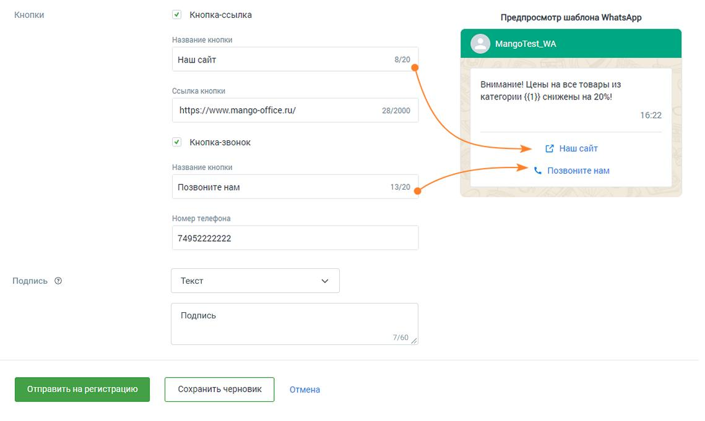
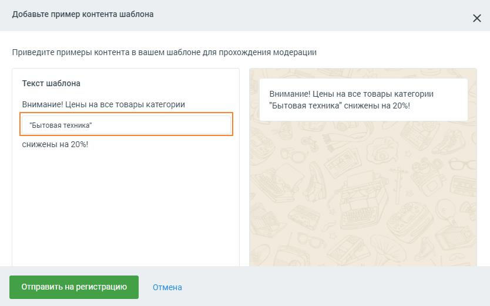

# 4.5.11.2.5.1. Создание шаблона WhatsApp

> Трассировка: PDF §4.5.11.2.5.1 · сквозные стр. 356-362 · источники: ч.4 `kb/mango-product-docs/sources/mango-lk-manual/LK_manual_v-121часть-4.pdf` с.53-59.

Чтобы создать новый HSM-шаблон нажмите на кнопку (8) «Добавить шаблон» на рабочей панели шаблонов WhatsApp. Шаги создания шаблона:

ШАГ-1: В открывшемся окне «Создание шаблона WhatsApp» необходимо заполнить поля будущего шаблона. При заполнении просматривайте системные подсказки,

размещенные под пиктограммой ШАГ-2: Отправьте созданный шаблон на модерацию и регистрацию. Статус шаблона отслеживайте на рабочей панели шаблонов. Шаблоны в статусе «активный» готовы к использованию. ШАГ-3: Используйте созданный шаблон в единичных сообщениях или в текстовых рассылках Контакт-центра.

ШАГ-1. ЗАПОЛНЕНИЕ ПОЛЕЙ ШАБЛОНА Название шаблона – можно использовать латинские буквы, цифры, нижнее подчеркивание. Использование заглавных букв, пробелов, кириллических символов не допускается. Не более 60 символов. Поле обязательно для заполнения. Название должно отражать смысл шаблона и быть понятным модератору, проверяющему его корректность. Это позволит шаблону успешно пройти модерацию. Пример корректного названия: action_bicycle; Примеры некорректного названия: Promotion 20, акция_20%, 84746466, Шаблон № 3. Текст шаблона – текст, который увидит абонент. Не более 960 символов. Поле обязательно для заполнения. Отображается справа, в окне предпросмотра шаблона. Рекомендуется составлять текст таким образом, чтобы модератору, проверяющему его корректность, было очевидно назначение сообщения. Это позволит шаблону успешно пройти модерацию. Пример корректного текста шаблона: Уважаемый {{переменная1}}, Ваше бронирование №{{переменная2}} находится в статусе {{переменная3}}. Для изменения бронирования пройдите по ссылке www.bronotelej.ru/{{переменная4}}

Пример некорректного текста шаблона: {{переменная1}}! Мы предлагаем {{переменная2}}. Для просмотра {{переменная3}}. Переменная – значение переменной может меняться. В дальнейшем в этом месте можно будет вставить любой свой текст и переменные, путем сопоставления в Контакт- центре. Переменные добавляются в текст шаблона в строгой числовой последовательности. Пример корректного текста шаблона: Здравствуйте, {{переменная1}}. Ваш заказ №{{переменная2}} оплачен. Справка по телефону {{переменная3}}. Пример некорректного текста шаблона: Здравствуйте, {{переменная1}}. Ваш заказ №{{переменная3}} оплачен. Справка по телефону {{переменная2}}.

Категория – доступные варианты: Маркетинговые сообщения, Транзакционные сообщения, Одноразовые пароли. От категории шаблона зависит стоимость рассылки сообщения. Поле обязательно для заполнения. • Маркетинговые сообщения – новости о компании и ее мероприятиях, акционные и рекламные предложения, напоминания о товарах в забытой корзине. Это самая дорогая категория сообщений. Пример текста шаблона: Внимание! Цены на все товары в категории {{переменная1}} снижены на {{переменная2}}. Приходите за покупками! • Транзакционные сообщения – информационные сообщения о смене статуса аккаунта, состоянии заказа, денежных транзакций и т.д. Пример текста шаблона: Здравствуйте, {{переменная1}}. Ваш заказ №{{переменная2}} доставлен в пункт самовывоза по адресу {{переменная3}}. • Одноразовые пароли – коды доступа к сервисам и учетным записям, уведомления о смене пароля, обновлении данных, настройках аккаунта. Это самая дешевая категория сообщений. Пример текста шаблона: Для смены пароля пройдите по ссылке {{переменная1}} и введите код {{переменная2}}. Код действителен в течение {{переменная3}} минут. Язык – язык текста шаблона. Варианты: русский или английский.

Заголовок – заголовок шаблона. При создании шаблона можно добавить заголовок с типами: • изображение – до 5 МБ , форматы .jpg, .jpeg, .png. • текст – если выбран этот вариант заголовка, отображается поле для ввода текста, до 60 символов, без учета переменных. • документ – до 5 МБ, формат .pdf. • видео – до 5 МБ, формат mp4. Абонент, получивший сообщение, увидит отображаемые изображение, видео или текст, а также сможет скачать документ. Для размещения видео или изображения при создании сообщения на основе шаблона в сообщение необходимо вставить прямую ссылку на файл. Это ссылка, на конце которой указано расширение файла - .jpg, .jpeg, .png для изображений и mp4 для видео. Например https://ltdfoto.ru/images/2024/08/20/cat548ba3aa37a77c1a.jpg Для получения прямой ссылки на изображение или видео можно использовать бесплатные облачные файловые хранилища: • imgur.com - для изображений и видео • ltdfoto.ru - для изображений • telegra.ph - для изображений внимание Ссылки на файл на Яндекс-диске не подходят, так как не являются прямыми ссылками. Если выбран заголовок с прикреплением (картинка, видео или документ), для регистрации понадобится пример файла. Вы сможете добавить пример файла после нажатия кнопки "Отправить на регистрацию".

Чекбокс Кнопка-ссылка – если чекбокс отмечен, доступны для заполнения поля «Название кнопки» и «Ссылка». Кнопка со ссылкой будет отображаться в сообщении, полученном абонентом. Пример корректного заполнения: http://www.mango-office.ru/, https://www.mango- office.ru/ Пример некорректного заполнения: mango-office.ru Чекбокс Кнопка-звонок – если чекбокс отмечен, доступны для заполнения поля «Название кнопки» и «Номер телефона». Кнопка с номером будет отображаться в сообщении, полученном абонентом. Пример корректного заполнения: 74955404444 Пример некорректного заполнения: (495) 540-44-44 Подпись – поле для добавления подписи, например слогана компании. Если выбран вариант «Текст», отображается поле для ввода подписи. Сохранить черновик – нажатие на кнопку сохраняет черновик шаблона, пользователь переходит к списку шаблонов. Отмена – нажатие на кнопку отменяет создание шаблона, пользователь переходит к списку шаблонов. ШАГ-2. ОТПРАВЛЕНИЕ ШАБЛОНА НА РЕГИСТРАЦИЮ Кнопка Отправить на регистрацию – нажатие на кнопку отправляет заполненный шаблон на модерацию и регистрацию WhatsApp. Если помеченные символом (*)

обязательные поля не заполнены или заполнены некорректно, об этом проинформирует системное сообщение. Если в шаблоне имеются переменные, система попросит предоставить пример содержимого переменной. Если переменных нет, этот дополнительный шаг не потребуется. Если был выбран заголовок с вложением (картинка, видео или документ), на этом этапе вам необходимо добавить ссылку на пример файла.

После отправки шаблона на регистрацию всплывает системное сообщение об успешной отправке. Время регистрации шаблона может занимать от нескольких минут до 1-2 дней. После регистрации статус шаблона сменится на «Активный» или «Отклонен». Шаблон с высокой долей вероятности будет отклонен модератором, если: • текст шаблона носит оскорбительный или угрожающий характер; • текст шаблона содержит орфографические или грамматические ошибки; • текст шаблона содержит сокращённые ссылки; • выбранный язык шаблона не совпадает с языком текста шаблона; • выбранная категория не соответствует названию и содержанию текста шаблона. ШАГ-3. ИСПОЛЬЗУЙТЕ СОЗДАННЫЙ ШАБЛОН В ИНТЕРЕСАХ БИЗНЕСА HSM-шаблон позволяет инициировать обращение к клиенту или продолжить диалог. Используйте созданный шаблон в единичных сообщениях или в текстовых рассылках Контакт-центра.

