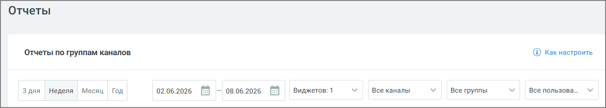

# 4.5.11.3.1.1. Блок фильтров

> Трассировка: PDF §4.5.11.3.1.1 · сквозные стр. 362-363 · источники: ч.4 `kb/mango-product-docs/sources/mango-lk-manual/LK_manual_v-121часть-4.pdf` с.59-60.

Блок фильтров включает в себя: • Отчетный период: 3 дня, неделя, месяц, год, а также произвольный период, задаваемый датой начала и датой окончания; • Виджеты – для составления отчета возможен выбор не более 3-х виджетов; • Каналы - возможен выбор любого из каналов обращений: Max, Чат, ВКонтакте, Telegram, E-mail, WhatsApp, Клиентское приложение, Авито и Авито Работа (или любой их комбинации); • Группы – группа сотрудников ВАТС, работавшая с обращением; • Пользователи – сотрудник ВАТС, работавший с обращением.

