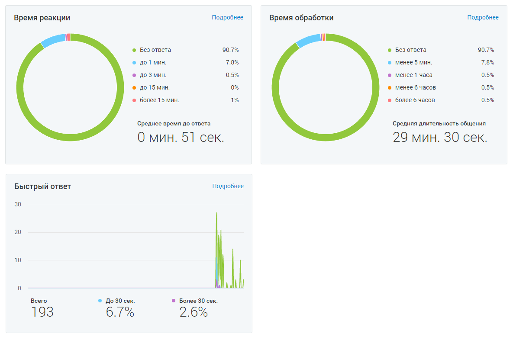

# 4.5.11.3.1.2. Блок графиков

> Трассировка: PDF §4.5.11.3.1.2 · сквозные стр. 363 · источники: ч.4 `kb/mango-product-docs/sources/mango-lk-manual/LK_manual_v-121часть-4.pdf` с.60.

Доступны три графика: • Время реакции • Время обработки • Быстрый ответ Для перехода из графика в детальный отчет кликните на кнопку Подробнее. Пользователю доступно три вида отчетов: • Время реакции – данные о времени реакции на обращение; • Время обработки – данные о времени обработки обращения; • Быстрый ответ - данные по проценту и количеству быстрых ответов на обращения. Отчеты состоят из блока визуализаций и табличной части.
